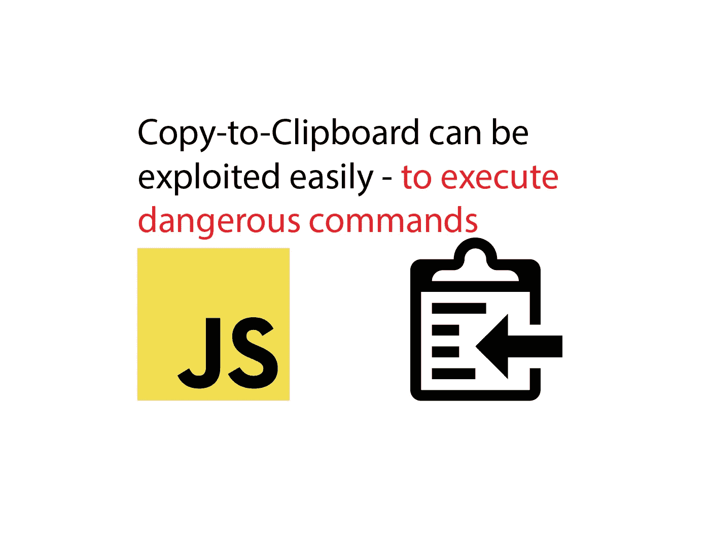
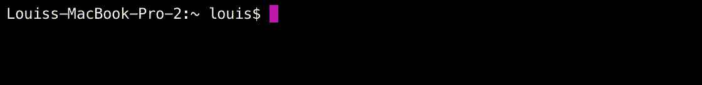

# 停止轻率地从网站上复制命令

> 原文：<https://javascript.plainenglish.io/why-you-should-never-rashly-copy-commands-from-websites-4ae476441530?source=collection_archive---------3----------------------->

## JavaScript 可以利用这一点来执行恶意命令

Source: the author

昨天，我在红迪网上看到了令我震惊的东西。

我们几乎每天都这样做——我们在互联网上寻找东西，找到一个网站，复制终端命令，以及直接从网站上进行其他操作。

然后，我们将它们直接粘贴到终端中来安装东西、编写代码或进行配置。

**但有一个巨大的问题:在网站上复制文本很容易被 JavaScript 利用。
JavaScript 可以对按下“ *copy* ”或组合键做出反应，并自己将一些东西写入剪贴板——完全独立于我们实际想要复制的文本。
这可能会导致我们将不想要的命令粘贴到终端中。**

更大的问题是，根据我们插入的命令，我们甚至不需要按 enter 键来确认执行。
如果命令包含新的一行`\n`，当我们将它插入终端时会立即执行。

**这里可以看到一个例子:**

Source: the author

[**您可以在这里自己试用。**](https://codingcheats.io/copy/)

正如您所看到的，我只是粘贴复制的代码，它将立即被执行。
如果此时您已经在会话中拥有根权限，几乎任何事情都有可能。一个您并不期望的命令就可以销毁重要文件或安装软件并立即执行。

我在 Windows PC 和 MacBook 上尝试过——在火狐、Safari、Chrome 和 Opera 上。它在任何地方都可以工作——无论您是点击上下文菜单中的*还是使用组合键来复制*。

## 这是多么容易

如前所述，整个过程都是用 JavaScript 来完成的。我们可以单独对浏览器中的复制事件做出反应。JavaScript 可以抑制标准反应(即复制实际文本)。如您所知，也可以将代码保存到剪贴板。
**两者结合便是剥削。**

通过`document.getElementById`我们选择要拦截和操纵复制事件的元素。首先，我们将事件侦听器添加到复制事件中。
然后我们调用一个函数将文本保存到剪贴板。
最后，我们阻止**默认事件**，浏览器将执行该事件——剪贴板的非操作副本在没有 JavaScript 的情况下工作。
浏览器复制文本本身现在被抑制。

## 也不要信任复制到剪贴板按钮。

我认为这是不言自明的。在许多网站上，提供了复制到剪贴板按钮。在这里，同样的功能被用来手动复制东西——当然，你可以操纵被复制的东西。

## 你如何保护自己

唯一真正的可能是先把你拷贝的所有东西粘贴到某个地方，比如，粘贴到一个文本文件中。然后你可以看到它是什么，并决定是否要运行它。

## **更新:**有一个开源的浏览器扩展可用。

它叫做**复制守卫**，当你的复制行动被劫持时会发出警告。你可以在 GitHub 上找到:[https://github.com/roedesh/copyguard](https://github.com/roedesh/copyguard)

非常感谢您的阅读！如果你对网络的极限感兴趣，这里有更多你可能感兴趣的东西:

# 总结

我认为整件事是一个巨大的安全问题。对于很多开发者来说，复制粘贴东西是很正常的套路。例如，为了从控制台安装和配置整个应用程序，我们经常要连续多次这样做。

我已经在 Twitter 上提到了这一点——我想不出有多少好的理由可以用 **preventDefault** 来抑制文本复制。

没有它，您仍然可以使用复制到剪贴板功能。
每个开发者也可以开发自己的**上下文菜单**，右键点击某个东西即可展开。这提供了在许多页面上复制和粘贴拖放元素的功能。

元素已被复制的事实保存在 app-state 中，不需要将任何内容保存到剪贴板。

据我所知， **preventDefault** 用于复制可见文本的情况是当页面作者想要自动添加一个链接或其他东西到复制的文本中。

 [## 仅使用 CSS 进行用户跟踪

### 设备类型、操作系统和动作

medium.com](https://medium.com/javascript-in-plain-english/tracking-with-css-ec98e3d81046) 

## [加入我的简讯保持联系](http://eepurl.com/hacY0v)