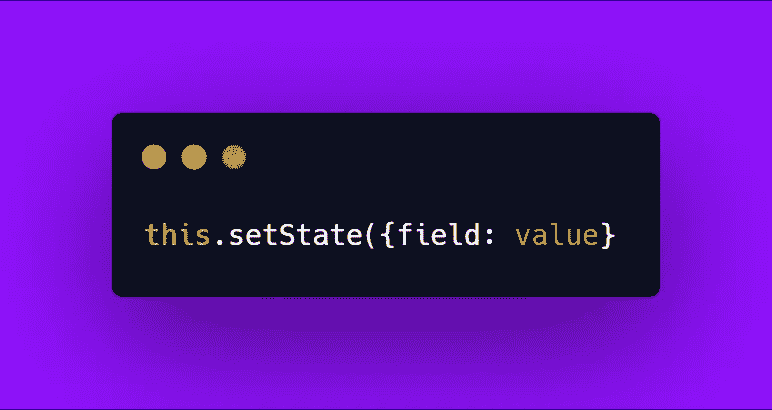
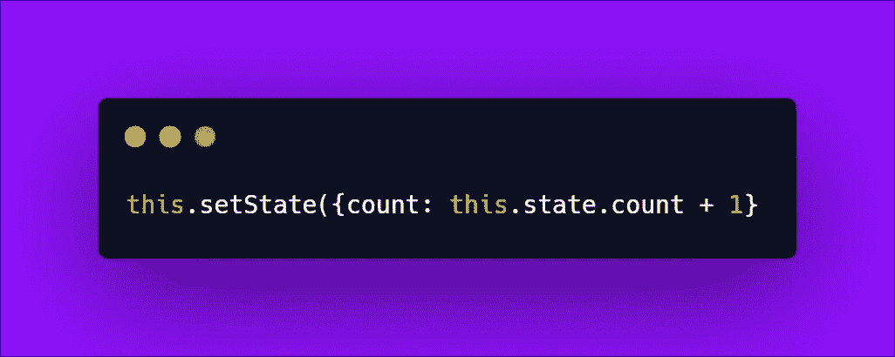
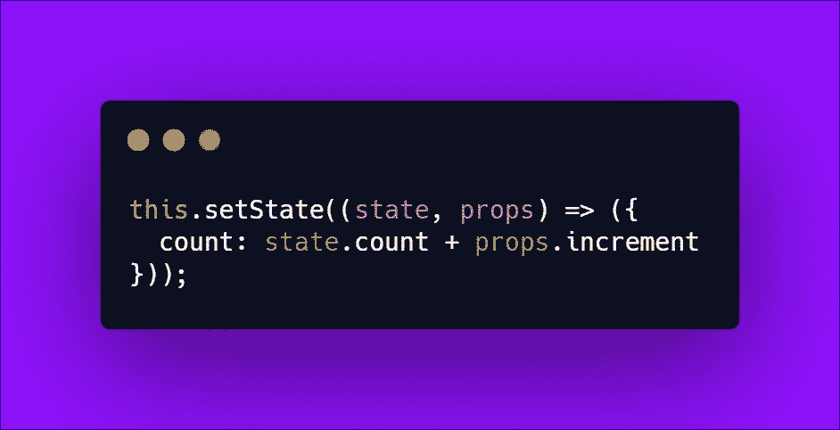

# 为什么应该停止使用 SetState()对象

> 原文：<https://javascript.plainenglish.io/why-you-should-stop-using-objects-with-setstate-ee7a6c7bcba3?source=collection_archive---------2----------------------->

## 用专业的方式代替

如果你熟悉 [**反应**](https://it.reactjs.org/) ，那么你几乎不可能没用过这种方法:

One of your best friends when using React.

**组件**是 React 库的**基础**。它们是**可重用的代码片段**，我们创建并管理它们来构建我们的 **UI** 。它们中的一些可以具有**状态**。

状态和**道具**是 React 应用程序的重要组成部分。我们用它来存储本地数据。或者在道具的情况下，用于**从其他组件接收数据。**

> 而且，每当我们希望我们的应用程序改变它的行为或外观时，state 是一个好去处，setState()是一个好方法。

但是有一点你们中的一些人可能从未想过。

## 当前价值问题

通常，我们只是通过传递一个对象来使用这个方法，这个对象带有我们提供给它的新状态值**，**，如上所示。但是通常我们可能希望**使用当前状态**计算下一个状态，例如在更新计数器时。

Your best friend can sometimes betray you.

你可以说这没什么不对。如果我们谈论**一个非常小的应用**，我甚至可能同意你的观点。但是在这个职业中，大多数情况下:

> **“你在小范围内认为好的东西，在大范围的环境下，很可能就要在你脸上爆炸了。”**——我失意的自己。

这里真正的问题是，你**永远不应该依赖**依靠`this.props`和`this.state`来计算你的下一个状态。因为它们可以异步更新**。**

当你使用这个方法时，对 DOM **的更新不会马上发生。所以在一个**非常大的应用**中，可能会发生对`this.setState()`的多次调用，我们应该避免像上面那样依赖`this.state`。**

What to do then?

## **你的新好友是一个函数**

React 已经思考了这个问题，并且为我们提供了一个**更好的方法来处理这个问题**。所以停止使用一个对象，取而代之的是，向`this.setState()`提供一个函数作为第一个参数，然后**可靠地**得到我们需要的当前状态位的值。

I love functions.

所以从现在开始，你可以把这种行为设定为新的规则。

> **每当您需要使用当前状态或道具来计算下一个状态时，提供一个函数作为第一个参数给** `**this.setState()**` **是一种很好的方法。**

关于其他 React 提示和技巧，敬请期待

—皮耶罗

## **用简单英语写的 JavaScript 笔记**

我们总是有兴趣帮助推广高质量的内容。如果你有一篇文章想用简单的英语提交给 JavaScript，用你的中级用户名发邮件到[**submissions@javascriptinplainenglish.com**](mailto:submissions@javascriptinplainenglish.com)给我们，我们会把你添加为作者。

我们还推出了三种新的出版物！请关注我们的新出版物，表达对它们的喜爱:[**AI in Plain English**](https://medium.com/ai-in-plain-english)，[**UX in Plain English**](https://medium.com/ux-in-plain-english)，[**Python in Plain English**](https://medium.com/python-in-plain-english)**——谢谢，继续学习！**