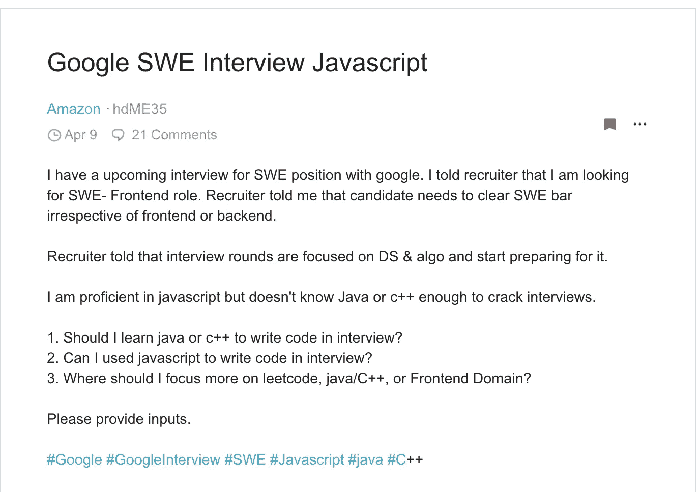

# 为什么你应该在技术面试中使用 JavaScript

> 原文：<https://javascript.plainenglish.io/why-you-should-use-javascript-for-your-technical-interviews-d3fb34cb0ba?source=collection_archive---------1----------------------->

## 有人联系你参加技术面试，你认为你需要学习一门真正的技术语言。

我在 blind 上看到这个帖子，有人问他们是否可以使用 JavaScript 进行编码面试，或者转而学习 Java/C++。

讨论还在继续，双方的意见都不一致。这是我在网上看到的一个常见话题，人们质疑在技术访谈中使用 JavaScript 的合法性，或者声称虽然你可以用 JavaScript 实现算法，但是像图和树这样的核心算法应该是做不到的。

在找新工作时，大多数软件开发人员必须通过的一大障碍是技术面试。在准备面试时，大多数人都希望在面试前优化自己的准备时间。比如应该关注哪些算法，应该重新学习哪些数据结构，甚至应该使用哪种语言进行面试。

大多数公司进行的技术面试是为了衡量你的批判性思维能力以及你解决问题和实施解决方案的能力，而不是你对特定语言的知识深度(同样，这是指编码部分，而不是系统设计或特定领域面试中可能会问你的问题)。

在这个高度紧张的面试过程中，你不想仅仅因为记不住语法、某些特定的功能/实现，或者忘记在行尾加上分号而失败。面试中你的大部分精力不应该花在记住特定语言的语法上，而应该花在讨论和构思你的算法上。

在我们深入了解 JavaScript 的优势并驳斥其中一些说法之前，让我们先澄清一下。

*   JS 是一种图灵完整语言，这意味着它可以用来解决任何计算问题——这使它进入了 Java、C、C++、Python 等语言的领域。虽然这不是 JS 的强项，但绝对能把工作做好。
*   基本上，你的面试官问你的任何算法问题都可以被解决，不管语言是什么。

# 用 JavaScript 进行采访有两个主要优势:

1.  语法简单、直观且易于掌握——与其花时间记住如何声明数组，不如花更多时间考虑解决方案的逻辑
2.  这种语言的灵活性有助于处理不同的情况或使用基本的数据结构，并很容易将它们转换成其他数据结构(如将地图/对象转换成数组等)

以下是你在大多数面试中会用到的核心数据结构:

**数组:**

Declaring an array JavaScript vs Java

向数组中添加值

Adding values to an array JavaScript vs Java

**对象/散列表/散列表:**

Declaring an object JavaScript vs Java

**琴弦:**

Declaring and modifying a string JavaScript vs Java

正如您所看到的大多数问题中使用的通用数据结构，Java 比 JavaScript 对等语言(我不确定其他语言)更加详细和具体。

这种灵活性是 JavaScript 的关键优势之一。当您不确定将在这些数据结构中存储什么或者最终结果是什么时，能够在其中存储任何内容并根据需要调整算法，而不是更改之前声明的类型或大小，可以节省您大量的时间。

因为你在面试中有时间限制(通常大约 30-45 分钟来解决 1-2 个问题)，你想优化花在思考和编写代码上的时间。

# **奖金**

我不确定我是否会认为这是使用 JavaScript 的一个优势，但是使用 JavaScript 而不是 Java 可以让你避免像多线程、异步或者处理代码中的死锁这样的问题。请注意，您仍然可能会被问到这些问题(因此您应该知道它们是什么以及如何解决它们)，但是您可能不会被要求实现它们，因为 JavaScript 本质上是一种单线程语言。

# 结论

我并不是说 JavaScript 是面试的最佳语言。实际上，我不认为面试有一种“最佳”语言。这是一个挑选你非常熟悉和舒服的东西的问题。

如果你对另一种语言感到舒服，并且觉得你可以用那种语言最好地解决问题，那么请这样做。如果你觉得 JavaScript 是你最强的语言，不要觉得用另一种语言有压力。归根结底，面试是对你编程技能的测试，而不是对语言能力的测试。

我希望这篇文章有助于澄清人们对 JavaScript 适合用于面试的一些误解。如果你在技术面试中使用过 JavaScript，请在下面评论。我总是很好奇想听听人们的经历。

# 简明英语笔记

你知道我们推出了一个 YouTube 频道吗？我们制作的每个视频都旨在教给你一些新的东西。点击 [**点击**](https://www.youtube.com/channel/UCtipWUghju290NWcn8jhyAw) 查看我们，并确保订阅该频道😎