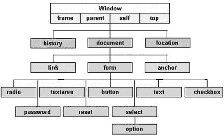
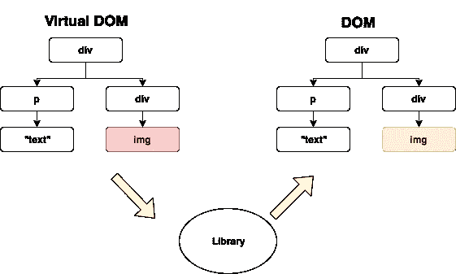
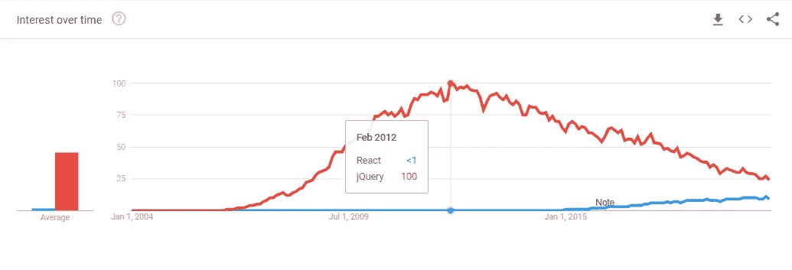
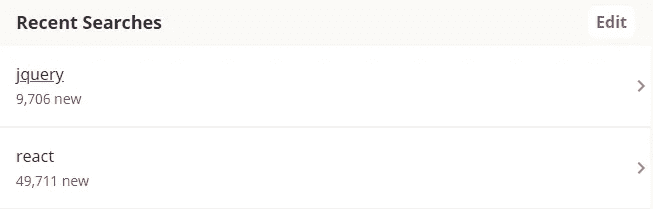

# 为什么应该学习 React 而不是 jQuery

> 原文：<https://javascript.plainenglish.io/why-you-should-use-react-instead-of-jquery-d68b5b129bbb?source=collection_archive---------0----------------------->

对于开发人员来说，使用 JavaScript 库和框架确实可以使 web 开发变得更容易、更快速、更愉快。话虽如此，React 和 jQuery 是两个最大的 Javascript 库，那么是什么让 React 成为比 jQuery 更好的选择呢？让我们看看 React 相对于 jQuery 的一些主要优势，以及为什么您应该使用它。

# 1.)React 比 jQuery 快

React 最大的优势之一是使用虚拟 DOM(文档对象模型)而不是传统的 DOM。虽然 jQuery 直接使用 DOM，但 React 使用虚拟 DOM，这使得 React 速度更快。

在讨论虚拟 DOM 之前，我们应该先讨论一下真实的 DOM。您可以将 DOM 想象成一棵大树，每一个分支都是您的 web 页面的对象。为了更好地理解这一点，请看下图。

[Source](https://www.tutorialspoint.com/javascript/javascript_html_dom.htm)

React 和 jQuery 的网页基本上都是这样构造的。然而，每当 DOM 上的某些内容需要更新时，真实 DOM 和虚拟 DOM 之间的区别就开始显现了。每当真正的 DOM 需要更新时，它必须从树的顶部一直向下更新。虽然这个过程并不复杂，但是如果您一遍又一遍地更新 DOM 或者树变得越来越大，那么事情真的会变慢。

虚拟 DOM 开始时和常规 DOM 一样，只是它保留了一个虚拟副本(比如用手机截图)，这样它就可以将这个副本与 DOM 的更新版本进行比较。这个过程被称为 diffing，它本质上使得 DOM 中唯一更新的部分是已经改变的部分，而不是更新整个 DOM。这是 React 比 jQuery 快得多的主要原因之一。

如果你想知道更多关于虚拟 DOM 和它是如何工作的，下面的视频很好地解释了正在发生的事情，并提供了一些视觉帮助。

# 2.)React 是现代的

在 2000 年代末到 2010 年代初，jQuery 帮助开发变得更加容易和快速，可以说是当时最好的东西，这也是它受欢迎的原因。事实上，今天仍然有更多的网站使用 jQuery 而不是 React，但这主要是因为 jQuery 已经存在了很长时间。

当然，没有理由仅仅因为某样东西是新的就使用它，然而，jQuery 衰落的原因并不在于它是旧的。一个很大的原因是 jQuery 不像以前那么必要了，现在大多数其他的库和框架都可以做 jQuery 做的事情。

今天的开发人员拥有比过去多得多的工具和资源，这也是 jQuery 逐渐变得无关紧要的原因之一。要自己看这些数字，请看下面的图表，它显示了 jQuery(红色)和 React(蓝色)之间的搜索流行度。

正如我们从谷歌趋势图中看到的，jQuery 在 2012 年达到了顶峰，那时候 React 还没有出现，从那以后它就一直在走下坡路。由于随着 React 继续攀升，jQuery 可能会继续下跌，React 在谷歌上的搜索人气超过 jQuery 只是时间问题。

也就是说，如果你的主要目标是找工作，那么 React 现在是，将来也可能是更好的选择。在 Indeed.com 上快速搜索之后，在我写这篇文章的时候，有 49711 个可用的 [React 相关工作](https://www.indeed.com/jobs?q=react&l=)，而只有 9706 个 [jQuery 相关工作](https://www.indeed.com/jobs?q=jquery&l=)。

Amount of available jobs when searching each term on Indeed.

# 3.)React 更适合较大的应用程序

人们谈论 jQuery 的一个主要原因是它易于学习和使用。即使这是真的，在大型甚至中型应用程序中使用 jQuery 的一个主要问题是直接使用 DOM 而不是使用虚拟 DOM。这意味着如果你的应用程序变得更大，将会有更多的 DOM 操作，因此速度将会变慢。

举个例子，你可以把 jQuery 想象成走路，把 React 想象成开车。想象一下，你被要求过马路，很有可能，你最终会走过去，因为这样更容易，而且和开车花的时间差不多。现在想象一下，你被要求去 5 英里以外的地方，当然任何人*都可以*步行，但是如果你只是开车，你的时间和精力会更好地利用。即使跑得最快的人也比跑得最慢的车慢。

[Source](https://hackernoon.com/make-react-fast-again-part-1-performance-timeline-b70176a1df5f)

当您开始处理较大的应用程序时，jQuery 中可能发生的另一个问题是，您可能会创建“意大利面条代码”(也就是变得非常难以管理或无法管理的代码)。

正如 [*理查德拉尔森*](https://www.webdesignerdepot.com/author/Richard-Larson/) *，*一个专业的网页设计师和前端开发人员所说的*，*

> 如果使用不当，尤其是 jQuery CSS 选择器，最终结果可能是代码越来越大。js 文件，直到它变得无法维护。

jQuery 并不打算只用于大型应用程序，这使得它很难用于小型应用程序之外的任何应用程序。然而，React 可以很容易地用于中型或大型应用程序，这使得它成为更好的选择，如果你计划制作除了小型应用程序以外的任何东西。React 比 jQuery 更具可伸缩性，会让您的生活更加轻松。

如果您想了解为什么 React 非常适合大型应用程序的更多信息，Chris Hawkes 的这个视频会做得更深入。

# 4.)支持 React Native 的移动应用

如果你曾经想开发移动应用，那么 React Native 就是适合你的。虽然 jQuery 只能帮助应用程序在移动设备上看起来更好，但 React Native 允许您为 IOS 和 Android 创建实际的移动应用程序。React 和 React Native 之间的语法也非常相似，这意味着您可以轻松地同时为移动和非移动设备进行开发。

[Source](https://hackernoon.com/react-native-for-beginners-fb3095968acf)

如果你曾经有兴趣将一个 web 应用程序转换成一个移动应用程序，那么无论如何你都必须使用 React。也就是说，只需编写一次代码会好得多！

*来源:*

[https://www . web designer depot . com/2012/09/jquery-the-good-the-bad-and-the-ugly/](https://www.webdesignerdepot.com/2012/09/jquery-the-good-the-bad-and-the-ugly/)

【https://addyosmani.com/blog/large-scale-jquery/ 

 [## 对初学者反应自然

### 学习 React Native:简介、导航、数据存储和本机模块

hackernoon.com](https://hackernoon.com/react-native-for-beginners-fb3095968acf)