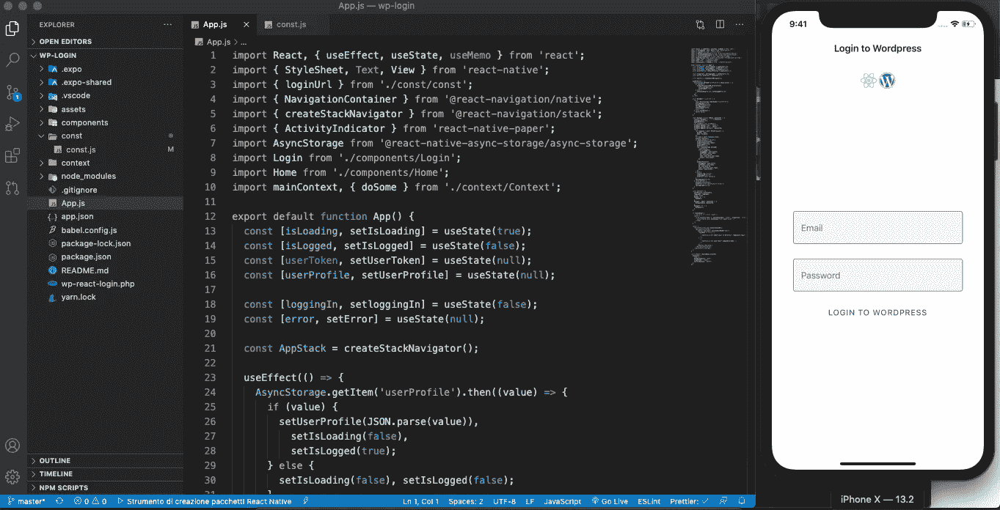
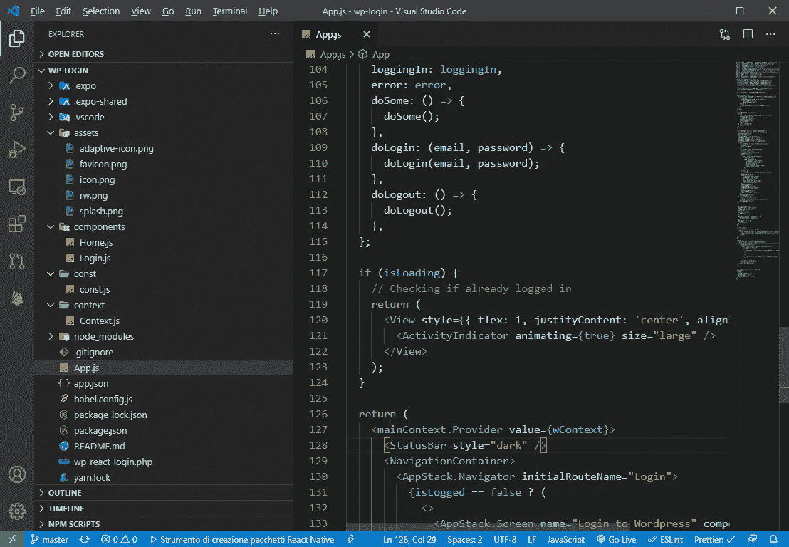
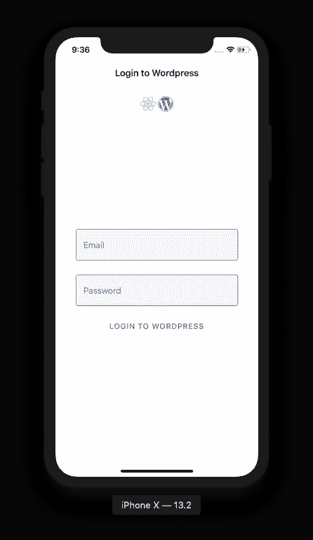
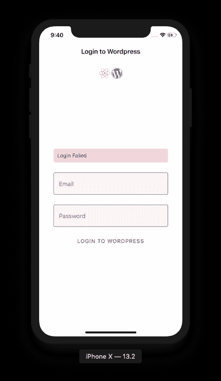
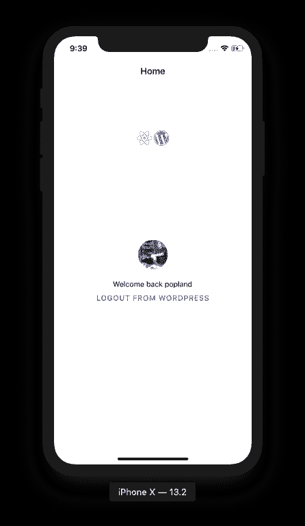

# 在 React Native 中创建 WordPress 登录

> 原文：<https://javascript.plainenglish.io/wordpress-login-in-react-native-3bee73c7537a?source=collection_archive---------2----------------------->



在我们最近的一个项目中，我们的客户要求我们提供一个应用程序，作为他们产品技术表单的前端。他们已经将内容和用户存储在 WordPress 站点中(内容使用自定义帖子),他们不想转移到其他平台，因为创建一个新的后端接口来添加数据和用户(例如，如果转移到 firebase)太费钱了，还因为他们的团队已经知道如何管理 WordPress。

其他要求是，内容只对注册和登录的用户(有访问级别)可用，并且登录应该是持久的；所以我们的第一个任务是在 React Native 中实现一个登录 WordPress 站点的系统。

下面是 React 中我们的 WordPress 登录系统的简化版本。

如果您想继续学习本教程，您可以在[https://github.com/popeating/wp-login](https://github.com/popeating/wp-login)克隆项目的存储库

## 我们要开发什么

一个简单的登录界面，使用电子邮件和密码将登录到一个远程 WordPress 网站，并将在设备上存储一些登录数据的持久性。
我们还将实现 PHP 登录脚本，该脚本将被添加到 Worpdress 中，以处理来自应用程序的登录请求。

## 警告信息

应用程序和 PHP 文件都是生产就绪文件的简化版本，它们没有考虑很多安全方面(尤其是 PHP 文件)，也没有处理它们可能遇到的所有错误。总之，它们只是演示了用 React Native 实现远程 WordPress 站点的登录是多么容易

## 概念

我们基本上要做的是创建一个 WordPress 登录脚本(在 PHP 中)，该脚本将接受电子邮件和密码作为 POST 输入，然后将使用它们在 WordPress 中进行身份验证，如果身份验证成功，我们将创建一个用户令牌，将其存储在用户元中(供将来使用)，并将用户数据和令牌发送回应用程序。该应用程序将如下工作:在启动时，它将检查用户是否存储在设备中，如果是，我们假设登录状态(或在更安全的情况下，我们根据 WordPress 重新检查数据)，如果用户没有存储在设备上，我们将提交一个登录表单，该表单将发布到我们创建的 WordPress 脚本，一旦 PHP 登录响应，我们将获得响应数据，并且(如果用户正确认证)我们存储用户数据并将设备设置为已登录，否则我们会显示一个错误。如果设备已登录(来自登录表单或设备数据)，我们向用户显示登录屏幕。

## 我们将跟随的一步

首先，我们将在 WordPress 上工作:

*   保护 WordPress 的访问权限，并且仅限于已登录的用户
*   编写一个用于认证的小 PHP

然后，我们将设置我们的应用程序:

*   使用 Expo 创建应用程序(但即使没有它也能工作)
*   安装我们将在应用程序中使用的模块和依赖项
*   定义我们将要使用的组件
*   编写函数
*   把一切都包起来

## WordPress 部分

首先，我们将禁止除登录用户之外的所有用户访问 WordPress，如果你只是想让 WordPress 只被应用程序访问，这可能会更加严格

将 functions.php 的这段代码放在你的主题文件夹中

然后我们将创建一个新的 PHP 文件(我们称之为 wp-react-login.php ),我们把它放在 WordPress 根文件夹中，如前所述，这个文件不能被认为是安全的:

## 应用程序部分

我们开始使用 Expo 构建我们的应用程序(但是我们也可以使用 npm create-react-app):

```
expo-init wp-login
```

我们安装了一些我们将要使用的模块: [React Navigation](https://reactnavigation.org/) ， [React Native Paper](https://callstack.github.io/react-native-paper/) (为了便于样式化)，AsyncStrorage(保存/读取设备):

```
npm install react-native-paper
npm install [@react](http://twitter.com/react)-navigation/native
npm install [@react](http://twitter.com/react)-navigation/stack
//navigation dependencies
expo install react-native-gesture-handler react-native-reanimated react-native-screens react-native-safe-area-context [@react](http://twitter.com/react)-native-community/masked-view
```

一旦一切都设置好了，我们进入项目文件夹，我们创建 3 个新文件夹:组件(我们将存储我们的屏幕组件)，上下文(我们将在这里保存上下文文件)，常量(杂项文件，喜欢配置)，树应该看起来像这样:



因为我们将在组件之间共享数据(用户状态、应用状态、用户数据),而不是在组件之间来回传递属性，所以我们使用上下文:

在上下文文件夹中创建一个新文件，并将其命名为 Context.js

该文件稍后将被导入 App.js，并用于包装所有子组件，以便它们共享上下文中的所有内容；doSome()函数这只是一个虚拟函数，我用它来检查一切是否正常。

我们在 const 文件夹中创建了一个 const.js，此时我们只在文件中保存了 WordPress 登录脚本的 URL。

我们在组件中创建两个空文件 Home.js 和 Login.js，它们将作为我们的屏幕:

我们现在可以开始构建我们的 App.js.
首先是所需的导入，除了标准和导航导入，我们还导入我们的 const、我们的组件和上下文:

在这之后，我们开始编码，在 useState 的帮助下，我们设置了一些可以在以后使用的状态:

然后，当运行应用程序时，我们希望检查用户是否登录(即。在设备上具有简档数据)；我们可以使用 useEffect 和 AsyncStorage 来实现它，这是非常基本的，并且假设如果我在设备上有数据，我就登录，当然，可以通过检查存储的令牌在服务器上是否仍然有效来改进它(例如，我们可以让登录在一段时间后过期，或者站点管理员可能删除了用户)。在此过程中，我们将 isLoading 状态设置为 true，在结束时，其他状态会根据状态进行更改。

现在我们需要一个登录函数和一个注销函数。最简单的是注销，我们只需要从存储器中删除条目并重置一些状态(比如清空用户配置文件)，我们也可以做一些远程操作(比如从 WordPress 上的用户 meta 中删除令牌，或者在用户 meta 上保存执行的时间和操作)。

登录只是稍微复杂一点，因为我们需要与服务器通信，并根据回复保存或不保存异步存储；我们还需要跟踪过程中可能发生的一些错误。在任何情况下，登录基本上都是设置或取消登录状态。

最后一部分是通过我们的上下文“公开”所有的状态和功能，这样我们就可以在 children 组件中访问它们(稍后将详细介绍)。

现在是渲染的时候了，使用状态我们可以有条件地渲染代码片段，向正确的用户显示正确的“屏幕”。开始时，应用程序将状态 isLoading 设置为 true，当应用程序(通过 useEffect 钩子)检查异步存储时，保持该状态；即使这几乎是即时的，当应用程序加载时，我们使用这段代码来呈现一个旋转的轮子:

一旦 isLoading 被设置为 false(在 useEffect hook 的末尾)，我们就可以向用户显示一个基于其状态的“真实”界面:如果注销，则显示一个登录表单，如果登录，则显示一个欢迎回来的屏幕；这可以通过条件渲染来实现；此外，该代码包含在上下文中，因此所有子组件都将访问上下文本身中定义的对象、变量和函数:

此时，我们只缺少登录和主页组件。

这两个组件都非常基础，都“导入”上下文(因此它们可以访问上下文数据)，登录将呈现一个 2 字段表单，按下按钮 doLogin(在 App.js 中)将被执行。该表单在登录过程中被禁用(通过登录状态)，如果状态错误有一些值，将出现一个错误文本。



登录呈现在几个组件里面:*touchablewithoutbeedback*和 *KeyboardAvoidingView* 第一个组件有一个附加的动作，允许在屏幕上点击时关闭键盘，第二个组件允许表单移动而不被键盘覆盖。它们都是标准的本地组件

Home 组件甚至更简单，它显示了一些用户数据(从 userProfile 状态获得)和一个执行 App.js doLogout 函数的注销按钮。



**下一步是什么**

如果内容仅针对经过身份验证的用户，我们可以考虑一种请求数据的机制，该机制将检查用户是否拥有令牌，以及令牌是否与有权阅读特定内容的用户相关联，等等。在我们的例子中，来自经过身份验证的用户的所有请求都会在请求的有效负载中包含令牌，因此在后端，根据令牌(我们从中派生出用户)我们可以决定用户可以看到或不能看到的内容，在所有情况下，如果令牌丢失，您总是会看到登录屏幕。
我们还实现了令牌过期和管理令牌刷新，如果用户拥有令牌，则不会自动进行身份验证(如示例所示),而是对令牌进行检查和重新验证。我们还在设备上存储来自远程服务器的一些内容(不会经常改变的内容，例如，一些类别)。

**更多登录方式**

您对使用远程服务实现登录的更多方法感兴趣吗？
check out**React Native:Firebase email authentic ation in a Expo project**=>[https://medium . com/React-Native-playground/React-Native-Firebase-email-authenticaton-in-an-Expo-project-2e 413 e 9 a 4890](https://medium.com/react-native-playground/react-native-firebase-email-authenticaton-in-an-expo-project-2e413e9a4890)和**添加****Google log in to Firebase in Expo project**=>[https://medium . com/@ popeating/React-Native-Firebase-Firebase](https://medium.com/react-native-playground/react-native-firebase-adding-google-authenticaton-in-an-expo-project-2-ed20cb440732)