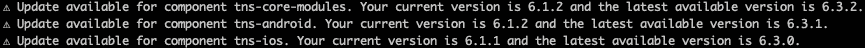
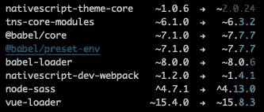
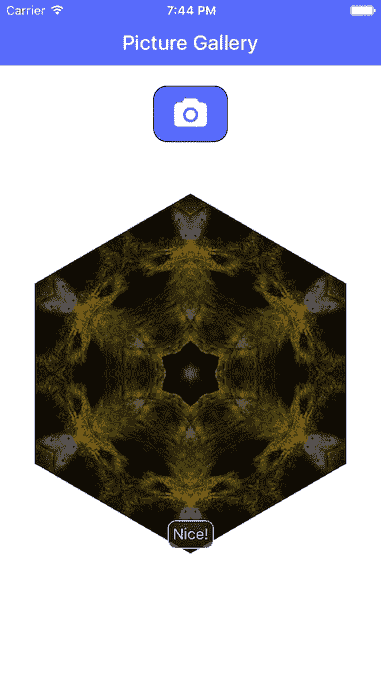
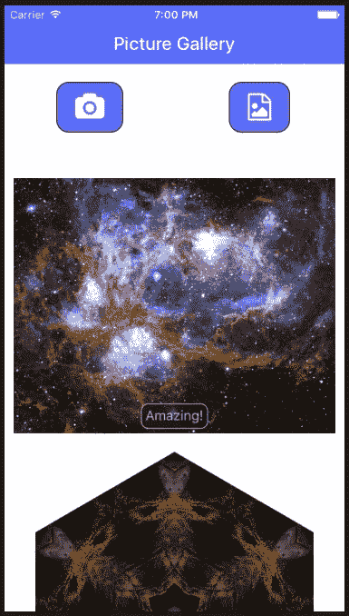
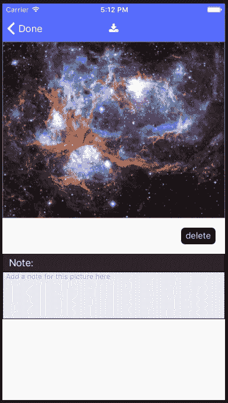
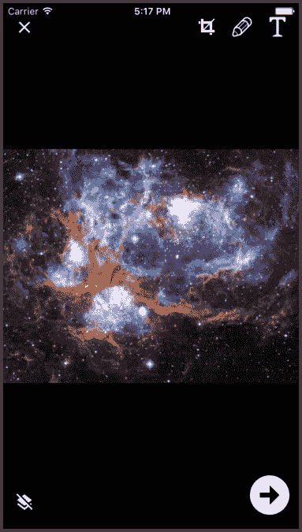

# 使用 Nativescript 中的图像

> 原文：<https://javascript.plainenglish.io/working-with-images-in-nativescript-4a7b64faaf38?source=collection_archive---------8----------------------->

在之前的一篇文章中，我讲述了如何创建一个 Nativescript Vue 图像库应用程序，该应用程序使用设备摄像头拍摄照片，在一个简单的图像库中显示这些照片，使用 Font Awesome 图标，并在应用程序运行期间维护图像库的状态。这篇文章将展示如何扩展该应用程序以允许从设备添加图像，以及如何使用 Nativescript 在您自己的应用程序中调整大小、保存和编辑图像。

Nativescript 6.3.2 是最近发布的，将是本文使用的版本(如果您要在这里编写自己的副本或 Github repo，请使用该版本，以避免因破坏版本更改而出错)。使用以下命令克隆上一篇文章中的相机图库应用程序:

```
git clone https://github.com/drangelod/nsimagegallery6 ns6images
```

更改该目录，并使用`tns doctor`确保您的 Nativescript 应用程序环境正常。您会收到一些警告，要求您更新 Nativescript 平台和核心模块包以匹配当前的 CLI 版本。



您可以通过编辑`package.json`来完成。使用像 [NCU](https://www.npmjs.com/package/npm-check-updates) 这样的工具，我们会看到一些其他的包可以更新:



对于这篇文章，我们将只更新`tns-core-modules`和`nativescript-dev-webpack`到他们的最新版本。编辑完 package.json 后，让 NPM 通过运行`npm i`来更新软件包。您会收到关于`nativescript-dev-webpack`某些更改的警告，因此您还需要运行`./node_modules/.bin/update-ns-webpack --configs`。完成所有这些后，在模拟器上运行该应用程序，以确保图像库正常工作。



# 在应用程序中使用设备图像

图库应用程序允许您使用设备摄像头拍摄新照片，但最好在设备上添加已有图像。为了使用设备图像，Nativescript 有[Nativescript-image picker](https://github.com/NativeScript/nativescript-imagepicker)插件，允许我们从设备中选择一个图像来使用。使用 CLI 命令安装此插件:

```
tns plugin add nativescript-imagepicker
```

首先，我们需要为安卓和 iOS 配置文件添加一些权限，因为在将应用程序发布到应用商店之前，您需要这些权限。编辑`app/App_Resources/Android/src/main/AndroidManifest.xml`并将以下权限请求添加到其他条目(如果尚未存在):

```
<uses-permission android:name="android.permission.CAMERA"/>
<uses-permission android:name="android.permission.READ_EXTERNAL_STORAGE"/>
<uses-permission android:name="android.permission.WRITE_EXTERNAL_STORAGE"/>
```

在新版本的 Android 上使用这个插件也会遇到问题，所以在`<application`标签中添加以下内容:

```
android:requestLegacyExternalStorage="true"
```

接下来，打开`app/App_Resources/iOS/Info.plist`文件，添加以下 iOS 权限(如果还没有的话):

```
<key>NSCameraUsageDescription</key> 
<string>Take pictures for the gallery</string>
<key>NSPhotoLibraryUsageDescription</key>
<string>Add images from your device</string>
```

添加了权限后，现在我们将编辑`Home.vue`组件来添加一个新按钮和它将调用的使用图像拾取器插件的函数。我们将修改`Home.vue`中的 XML 并删除原来的`Label`元素，然后添加一个新的`GridLayout`来并排显示两个按钮:

```
<GridLayout columns="*,*" rows="auto" verticalAlignment="center">
 	<Label col="0" row="0" text.decode="&#xf030; " @tap="takePicture" class="take-picture-icon fa" />
	<Label col="1" row="0" text.decode="&#xf1c5; " @tap="chooseImage" class="take-picture-icon fa" />
</GridLayout>
```

将新插件的导入添加到`<script>`部分的顶部:

```
const imagepicker = require("nativescript-imagepicker");
```

现在我们可以将`chooseImage`函数添加到`methods:{`对象中，它将调用插件让用户从设备中选择一幅图像，然后将所选图像添加到图库中:

```
chooseImage(){
    let that = this
    let context = imagepicker.create({ mode: "single" });
    context
        .authorize()
        .then(() => {
            return context.present();
        })
        .then(selection => {
            const imageAsset = selection.length > 0 ? selection[0] : null;
            imageSourceModule.fromAsset(imageAsset).then(
                savedImage => {
                    let filename = "image" + "-" + new Date().getTime() + ".png";
                    let folder = fsModule.knownFolders.documents();
                    let path = fsModule.path.join(folder.path, filename);
                    savedImage.saveToFile(path, "png");
                    var loadedImage = imageSourceModule.fromFile(path);
                    loadedImage.filename = filename;
                    loadedImage.note = "";
                    that.arrayPictures.unshift(loadedImage);
                    that.storeData();
                },
                err => {
                    console.log("Failed to load from asset");
                    console.log(err)
                }
            );
        })
        .catch(err => {
            console.log(err);
        });
}
```

运行应用程序，点击右侧按钮使用图像拾取器，并从您的设备中选择一幅图像添加到图库。你可以从像 NASA 这样的网站下载图片进行测试，尽管你会注意到大图片比小图片加载和渲染的时间要长得多。如果你将应用程序图像上传到服务器，或者稍后再次下载它们，大图像尺寸尤其成问题，因为你不需要在手机上显示大图像。相反，让我们努力减少从相机或设备获得的图像的大小/尺寸，以获得更流畅的应用程序体验。



# 使用 Nativescript 调整图像大小

在[的另一篇文章](https://blog.angelengineering.com/resizing-images/)中，我讨论了如何使用 Nativescript 的本地代码来更精确地控制图像尺寸/大小，以避免过大的图像文件，例如现代手机相机通常产生的图像文件。我们将在这里应用相同的概念，以确保来自相机和图像拾取器插件的图像在大于所选阈值时被缩小。在这篇文章中，我们将限制图库图像的大小，使较大的尺寸最大为 500 像素，而另一个尺寸缩小以保持原始图像的纵横比。如果两个维度都超过 500 像素，每个平台都需要适当的本机代码调用来调整图像拾取器插件返回的图像的大小。

对于 iOS 和 Android，我们需要检测两个维度是否都大于 500 像素，然后计算缩小宽度和高度所需的缩放比例，以使较大的维度为 500 像素。要在 Nativescript 中做到这一点，我们首先需要将插件返回的`ImageAsset`转换为`ImageSource`，从中我们可以获得图像的尺寸。对于每个平台，在保存到设备文件系统之前，将使用图形库的本地调用来调整`ImageSource`的大小，并像以前一样使用 Nativescript 调用来声明。新的`chooseImage`功能将如下所示:

```
 chooseImage() {
            let that = this
            let context = imagepicker.create({ mode: "single" });
            context
                .authorize()
                .then(() => {
                    return context.present();
                })
                .then(selection => {
                    const imageAsset = selection.length > 0 ? selection[0] : null;
                    imageAsset.options.autoScaleFactor = false;
                    imageAsset.options.keepAspectRatio = true;
                    imageSourceModule
                        .fromAsset(imageAsset)
                        .then(imageSource => {
                            var newheight = imageSource.height,
                                newwidth = imageSource.width
                            if (imageSource.width > 500 && imageSource.height > 500) {
                                if (imageSource.width > imageSource.height) {
                                    newwidth = 500
                                    newheight = Math.round(500 * (imageSource.height / imageSource.width))
                                } else {
                                    newheight = 500
                                    newwidth = Math.round(500 * (imageSource.width / imageSource.height))
                                }
                            }
                            if (imageSource.width > 500 && imageSource.height > 500) {
                                if (isAndroid) {
                                    try {
                                        var downsampleOptions = new android.graphics.BitmapFactory.Options();
                                        var bitmap = android.graphics.BitmapFactory.decodeFile(imageAsset.android, null);
                                        var newBitmap = android.graphics.Bitmap.createScaledBitmap(bitmap, newwidth, newheight, true);
                                        imageSource.setNativeSource(newBitmap);
                                        let filename = "image-" + new Date().getTime() + ".jpg";
                                        let folder = fsModule.knownFolders.documents();
                                        let path = fsModule.path.join(folder.path, filename);
                                        imageSource.saveToFile(path, "jpeg");
                                        imageSource.filename = filename;
                                        imageSource.note = "";
                                        that.arrayPictures.unshift(imageSource);
                                        that.storeData();
                                    } catch (err) {
                                        console.error(err);
                                    }
                                } else {
                                    let manager = PHImageManager.defaultManager();
                                    let options = new PHImageRequestOptions();
                                    options.resizeMode = PHImageRequestOptionsResizeMode.Exact;
                                    options.deliveryMode = PHImageRequestOptionsDeliveryModeHighQualityFormat;
                                    manager.requestImageForAssetTargetSizeContentModeOptionsResultHandler(
                                        imageAsset.ios, { width: newwidth, height: newheight },
                                        PHImageContentModeAspectFill,
                                        options,
                                        function(result, info) {
                                            let filename = "image" + "-" + new Date().getTime() + ".jpg";
                                            let folder = fsModule.knownFolders.documents();
                                            let path = fsModule.path.join(folder.path, filename);
                                            let newasset = new imageAssetModule.ImageAsset(result);
                                            newasset.options.autoScaleFactor = false;
                                            newasset.options.keepAspectRatio = true;
                                            newasset.height = newheight
                                            newasset.width = newwidth
                                            imageSourceModule
                                                .fromAsset(newasset)
                                                .then(newimageSource => {
                                                    newimageSource.saveToFile(
                                                        path,
                                                        "jpeg"
                                                    );
                                                    newimageSource.filename = filename;
                                                    newimageSource.note = "";
                                                    that.arrayPictures.unshift(newimageSource);
                                                    that.storeData();
                                                });
                                        }
                                    );
                                }
                            } else {
                                let folder = fsModule.knownFolders.documents();
                                let filename = "image-" + new Date().getTime() + ".jpg";
                                let path = fsModule.path.join(folder.path, filename);
                                imageSource.saveToFile(path, "jpeg");
                                imageSource.filename = filename;
                                imageSource.note = "";
                                that.arrayPictures.unshift(imageSource);
                                that.storeData();
                            }
                        })
                        .catch(err => {
                            console.error(err);
                        });
                });
        },
```

您将看到我们添加了一个新的部分，该部分检测两个维度是否都大于 500，并计算图像的缩放高度和宽度，以便较大的维度最大为 500 像素。然后，我们使用`isAndroid`和`isIOS`平台库函数来确定正在使用哪种类型的设备(将`import { isAndroid, isIOS } from "tns-core-modules/platform";`添加到您的导入部分以使用这些助手)。对于 Android 设备，我们本地调用`android.graphics.Bitmap.createScaledBitmap`来调整图像的大小。对于 iOS，我们调用`PHImageManager.requestImageForAssetTargetSizeContentModeOptionsResultHandler`来缩放图像。需要注意的一点是，iOS 库调用将返回缩放图像的文件名，而不是图像对象，因此我们有一个额外的步骤来从文件中加载图像，然后将其保存在我们自己的 app documents 文件夹中进行处理。

# 调整设备相机图像的大小

正如我在上一篇关于在 Nativescript 中处理图像的文章中提到的，相机插件通常可以很好地将相机图像调整到所要求的最大尺寸，特别是对于 iOS，尽管在 Android 上不太可靠。我们将在`takePicture`函数中添加类似的代码，用于缩放那些相机插件无法自动调整大小的设备的大图像。

```
takePicture() {
            let that = this;
            cameraModule
                .takePicture({
                    width: 500, //these are in device independent pixels
                    height: 500, //only one will be respected depending on os/device if
                    keepAspectRatio: true, //    keepAspectRatio is enabled.
                    saveToGallery: false //Don't save a copy in local gallery, ignored by some Android devices
                })
                .then(imageAsset => {
                    imageAsset.options.autoScaleFactor = false;
                    imageAsset.options.keepAspectRatio = true;
                    imageSourceModule
                        .fromAsset(imageAsset)
                        .then(imageSource => {
                            var ratio = 1,
                                newheight = imageSource.height,
                                newwidth = imageSource.width
                            if (imageSource.width > 500 && imageSource.height > 500) {
                                if (imageSource.width > imageSource.height) {
                                    newwidth = 500
                                    newheight = Math.round(500 * (imageSource.height / imageSource.width))
                                } else {
                                    newheight = 500
                                    newwidth = Math.round(500 * (imageSource.width / imageSource.height))
                                }
                            }
                            if (imageSource.width > 500 && imageSource.height > 500) {
                                if (isAndroid) {
                                    try {
                                        var downsampleOptions = new android.graphics.BitmapFactory.Options();
                                        var bitmap = android.graphics.BitmapFactory.decodeFile(imageAsset.android, null);
                                        var newBitmap = android.graphics.Bitmap.createScaledBitmap(bitmap, newwidth, newheight, true);
                                        imageSource.setNativeSource(newBitmap);
                                        let filename = "image-" + new Date().getTime() + ".jpg";
                                        let folder = fsModule.knownFolders.documents();
                                        let path = fsModule.path.join(folder.path, filename);
                                        imageSource.saveToFile(path, "jpeg");
                                        imageSource.filename = filename;
                                        imageSource.note = "";
                                        that.arrayPictures.unshift(imageSource);
                                        that.storeData();
                                    } catch (err) {
                                        console.error(err);
                                    }
                                } else {
                                    let manager = PHImageManager.defaultManager();
                                    let options = new PHImageRequestOptions();
                                    options.resizeMode =
                                        PHImageRequestOptionsResizeMode.Exact;
                                    options.deliveryMode = PHImageRequestOptionsDeliveryModeHighQualityFormat;
                                    manager.requestImageForAssetTargetSizeContentModeOptionsResultHandler(
                                        imageAsset.ios, { width: newwidth, height: newheight },
                                        PHImageContentModeAspectFill,
                                        options,
                                        function(result, info) {
                                            let folder = fsModule.knownFolders.documents();
                                            let path = fsModule.path.join(folder.path, filename);
                                            let filename = "image-" + new Date().getTime() + ".jpg";
                                            let newasset = new imageAssetModule.ImageAsset(result);
                                            imageSourceModule
                                                .fromAsset(newasset)
                                                .then(newimageSource => {
                                                    newimageSource.saveToFile(path, "jpeg");
                                                    newimageSource.filename = filename;
                                                    newimageSource.note = "";
                                                    that.arrayPictures.unshift(newimageSource);
                                                    that.storeData();
                                                });
                                        }
                                    );
                                }

                            } else {
                                let filename = "image" + "-" + new Date().getTime() + ".jpg";
                                let folder = fsModule.knownFolders.documents();
                                let path = fsModule.path.join(folder.path, filename);
                                imageSource.saveToFile(path, "jpeg");
                                imageSource.filename = filename;
                                imageSource.note = "";
                                that.arrayPictures.unshift(imageSource);
                                that.storeData();
                            }
                        })
                })
        },
```

# 将图像保存到您的设备

既然我们能够将缩放后的图像从相机或设备加载到我们的图库应用程序中，让我们允许用户将图片从图库保存到设备的照片图库中。这将需要允许应用程序写入设备存储的权限，以及每个平台的一些本地调用。因为我们已经在第一篇文章的`Home.vue`中添加了访问设备相机和照片库的权限请求，所以我们不需要在这里做任何其他事情，尽管我们将使用一个本地调用在 iOS 上做另一个检查，以显示如果你没有在应用程序中使用相机和图像拾取器插件，它是如何完成的。在 Android 上，在这种情况下访问设备存储之前，可以使用`nativescript-permissions`插件请求权限。

我们将更新`app/components/ImageDetails.vue` XML 和脚本部分为:

```
<template>
    <Page class="page" ref="page" actionBarHidden="false" backgroundSpanUnderStatusBar="true">
        <ActionBar class="action-bar" title="Picture Details">
            <NavigationButton text="Done" android.systemIcon="ic_menu_back" @tap="$navigateBack()" />
            <Label text.decode="&#xf019;" @tap="downloadImage()" class="take-picture-icon fa" />
        </ActionBar>
        <ScrollView orientation="vertical">
            <StackLayout>
                <Image class="picture-full" stretch="aspectFit" :src="curImage" />
                <GridLayout columns="*,*" rows="60,30,*,300">
                    <StackLayout col="1" row="0" class="delete-picture-icon-wrapper" @tap="deletePicture">
                        <Label verticalAlignement="bottom" text="delete" class="delete-picture-icon"></Label>
                    </StackLayout>
                    <Label col="0" colSpan="2" row="1" text="Note:" class="section-label" />
                    <TextView col="0" colSpan="2" row="2" class="text-picture" hint="Add a note for this picture here" editable="true" v-model="navObject.image.note" />
                    <Label col="0" colSpan="2" row="3" text="" />
                </GridLayout>
            </StackLayout>
        </ScrollView>
    </Page>
</template>

<script>
const imageSourceModule = require("tns-core-modules/image-source");
const imageAssetModule = require("tns-core-modules/image-asset/image-asset");
const fsModule = require("tns-core-modules/file-system");
const applicationModule = require("application");
import { isAndroid, isIOS } from "tns-core-modules/platform";
export default {
    name: "image-details-page",
    data() {
        return { curImage: ''};
    },
    props: {
        navObject: {
            type: Object
        },
    },
    components: {},
    computed: {},
    created() {},
    beforeDestroy() {
        this.navObject.storeData()
    },
    mounted() {
    	this.curImage = this.navObject.image
    },
    methods: {
        deletePicture() {
            let pictureIndex = this.navObject.arrayPictures.indexOf(this.navObject.image);
            this.navObject.arrayPictures.splice(pictureIndex, 1);
            this.$navigateBack()
        },
        downloadImage() {
            let that = this
            let folder = fsModule.knownFolders.documents();
            let path = fsModule.path.join(folder.path, this.navObject.image.filename);
            let imageSource = imageSourceModule.fromFile(path)
            if (isIOS) {
                PHPhotoLibrary.requestAuthorization((result) => {
                    if (result === PHAuthorizationStatus.Authorized) {
                        var CompletionTarget = NSObject.extend({
                            "thisImage:hasBeenSavedInPhotoAlbumWithError:usingContextInfo:": function(
                                image,
                                error,
                                context
                            ) {
                                if (error) {
                                    console.error("Unable to save to library, please try again.")
                                }
                            }
                        }, {
                            exposedMethods: {
                                "thisImage:hasBeenSavedInPhotoAlbumWithError:usingContextInfo:": {
                                    returns: interop.types.void,
                                    params: [UIImage, NSError, interop.Pointer]
                                }
                            }
                        });
                        var completionTarget = CompletionTarget.new();
                        UIImageWriteToSavedPhotosAlbum(
                            imageSource.ios,
                            completionTarget,
                            "thisImage:hasBeenSavedInPhotoAlbumWithError:usingContextInfo:",
                            null
                        );
                        console.log("Image saved to device")
                    } else {
                        if (isIOS) alert({ title: "Save Failed!", okButtonText: "OK", message: "Allow permission in Settings > Privacy > Photos to save an image to your device!" })
                        else alert("Save Failed! No permissions to save to this device.")
                    }
                });
            } else {
                function broadCast(imageFile) {
                    var mediaScanIntent = new android.content.Intent(
                        android.content.Intent.ACTION_MEDIA_SCANNER_SCAN_FILE
                    );
                    var contentUri = android.net.Uri.fromFile(imageFile);
                    mediaScanIntent.setData(contentUri);
                    applicationModule.android.foregroundActivity.sendBroadcast(
                        mediaScanIntent
                    );
                    alert("Image saved to device")
                }
                var folderPath = android.os.Environment.getExternalStoragePublicDirectory(
                    android.os.Environment.DIRECTORY_DOWNLOADS
                ).toString();
                let filename = "galleryimg_" + new Date().getTime() + ".jpg";
                let savepath = fsModule.path.join(folderPath, filename);
                var saved = imageSource.saveToFile(savepath, "jpeg");
                if (saved) {
                    broadCast(new java.io.File(savepath));
                } else {
                    alert("Error: Unable to save file!");
                }
            }
        },
    }
};
</script>
```

查看 XML 部分，您会看到添加了一个新的字体图标按钮，它调用了一个新的`downloadImage()`函数。在脚本部分的顶部还添加了一些导入，以允许新功能与设备映像和文件系统一起工作。`downloadImage()`函数首先从本地应用文件系统加载映像，然后在每个平台上使用它进行本地调用。对于 Android，我们广播一个`ACTION_MEDIA_SCANNER_SCAN_FILE`意图，要求操作系统将当前图像保存到设备。出错或完成时，会向用户显示一个警告，你可以在一个真正的应用程序中用 toast 消息来替换它。对于 iOS，首先，在调用`UIImageWriteToSavedPhotosAlbum`将当前图像保存到 iOS 相册之前，我们使用`PHPhotoLibrary.requestAuthorization`检查授权。这里我们不通知 iOS 上的用户，因为使用本机代码进行图形相关的 Nativescript 调用会使应用程序崩溃，所以当图像保存到设备时，您必须使用另一种方法通知用户。



# 在 Nativescript 中编辑图像

如果你也想让用户编辑图像，你可以在你的应用程序中使用`nativescript-photo-editor`插件。使用 CLI 添加它，方法是:

```
tns plugin add nativescript-photo-editor
```

将该插件的以下导入添加到`ImageDetails.vue`的脚本部分:

```
import { PhotoEditor, PhotoEditorControl } from "nativescript-photo-editor"; 
const photoEditor = new PhotoEditor();
```

现在，我们将在当前呈现删除按钮的 GridLayout 中添加一个新的编辑按钮:

```
<StackLayout col="0" row="0" class="delete-picture-icon-wrapper" @tap="editImage">
     <Label verticalAlignement="bottom" text="edit" class="delete-picture-icon"></Label>
</StackLayout>
```

添加由该按钮调用的新的`editImage()`功能:

```
editImage() {
            let that = this
            let folder = fsModule.knownFolders.documents();
            let path = fsModule.path.join(folder.path, this.navObject.image.filename);
            photoEditor
                .editPhoto({ imageSource: this.curImage })
                .then(newImage => {
                    newImage.filename = that.curImage.filename
                    newImage.note = that.curImage.note
                    that.curImage = newImage;
                    let pictureIndex = that.navObject.arrayPictures.indexOf(that.navObject.image);
                    that.navObject.arrayPictures.splice(pictureIndex, 1, newImage);
                    newImage.saveToFile(path, "jpeg");
                })
                .catch(e => {
                    console.error(e);
                });
        },
```

这个函数将当前图像发送到插件进行编辑。如果用户保存编辑过的图像，那么这个新图像将被分配与原始图像相同的文件名和注释，并且替换当前页面上、状态数组中以及文件系统上的原始图像。在 iOS 模拟器上运行应用程序，点击编辑按钮，你会看到运行中的插件。



如果你在像 iPhone XS 这样的较新的 iOS 设备上运行，你会遇到一个小问题，插件显示为模态而不是全屏，由于干扰了滚动处理程序，这会干扰图像的绘制。要解决这个问题，请编辑`node_modules/nativescript-photo-editor/photo-editor.ios.js`并将下面一行添加到`PhotoEditor.prototype.editPhoto`中，并使用其他 viewController 设置:

```
viewController.modalPresentationStyle = 0;
```

# 搞定了。

这个帖子到此为止。如果你想下载最终的源文件，你可以在 [Github](https://github.com/drangelod/ns6images) 上找到。

*原载于 2020 年 1 月 13 日 https://blog.angelengineering.com*[](https://blog.angelengineering.com/nativescript-images/)**。**