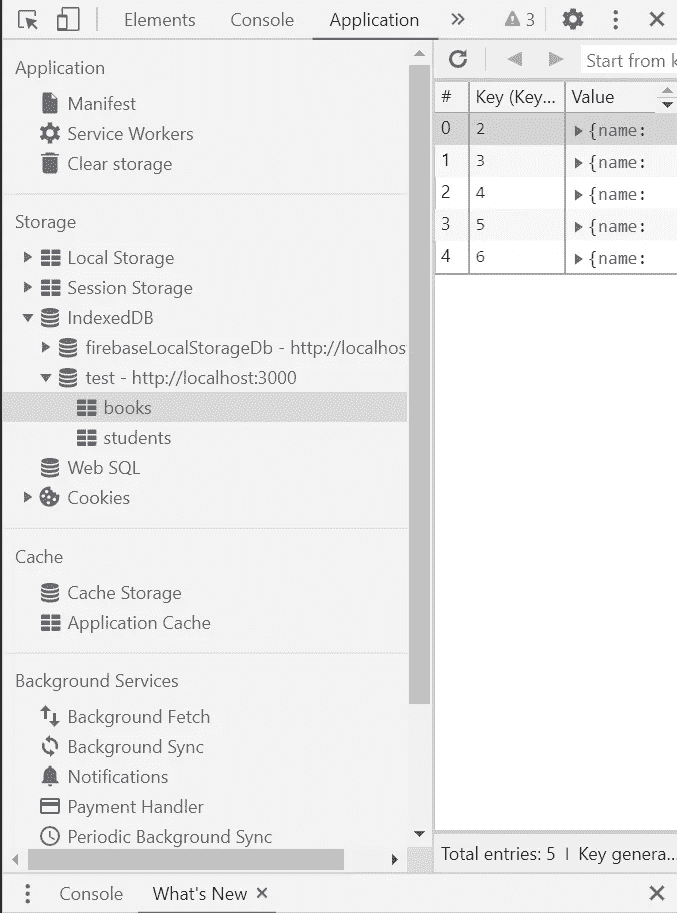

# 在 TypeScript 中使用 indexed db—React

> 原文：<https://javascript.plainenglish.io/working-with-indexeddb-in-typescript-react-ad504a1bdae3?source=collection_archive---------0----------------------->

在本文中，我们将了解在使用 React 应用程序时，如何在 TypeScript 中使用 IndexedDB。

Photo by [Stas Knop](https://www.pexels.com/@stasknop?utm_content=attributionCopyText&utm_medium=referral&utm_source=pexels) from [Pexels](https://www.pexels.com/photo/black-cassette-tape-on-top-of-red-and-yellow-surface-1626481/?utm_content=attributionCopyText&utm_medium=referral&utm_source=pexels)

让我们来看看什么是 IndexedDB。IndexedDB 是一个低级 API，用于客户端存储大量结构化数据，包括文件/blob。这个 API 使用索引来实现对这些数据的高性能搜索。虽然 [Web 存储](https://developer.mozilla.org/en-US/docs/Web/API/Web_Storage_API)对于存储少量数据很有用，但是对于存储大量结构化数据就没那么有用了。

IndexedDB 是一个事务数据库系统，类似于基于 SQL 的 RDBMS。然而，与使用固定列表的基于 SQL 的 RDBMSes 不同，IndexedDB 是基于 JavaScript 的面向对象数据库。IndexedDB 允许您存储和检索用**键**索引的对象；任何由[结构化克隆算法](https://developer.mozilla.org/en-US/docs/Web/API/Web_Workers_API/Structured_clone_algorithm)支持的对象都可以被存储。您需要指定数据库模式，打开到数据库的连接，然后在一系列**事务**中检索和更新数据。

当我们没有任何后端设置并且想要存储一些数据时，IndexedDB 可以是一个非常好的数据库。它将加速我们的应用程序开发过程。

我们现在对什么是 IndexedDb 有了一个很好的概念。现在，让我们实现如何在 TypeScript 中使用 IndexedDB。为了在 TypeScript 中实现 IndexedDB，我们将使用一个非常好且高效的模块—[https://github.com/jakearchibald/idb](https://github.com/jakearchibald/idb)

上面的节点模块让我们的生活变得简单顺畅。要开始使用 IndexedDB，我们需要在 IndexedDB 中创建一个数据库，并开始在该 IndexedDB 中创建表。之后，我们需要在 IndexedDB 中实现基本的 CRUD 操作。

让我们根据正在发生的事情将上面的代码分解成更小的块

1.  我们正在创建一个名为 IndexedDb 的类，其构造函数需要数据库名称。
2.  接下来，我们将创建一个在 IndexedDB 数据库中创建表的方法。
    **openDB** 函数需要一个数据库名称和版本号。 **db.createObjectStore** 创建一个表，我们使用 IndexedDB 的一些内置功能，它会自动添加一个带有键名 id 的键，并在每次插入操作时自动递增。
3.  **getValue** 将返回一个键-值对的值，并需要字段的表名和 id(当我们插入任何值时会自动生成，因为我们在创建表时已经设置了 key path:“id”)。
4.  **getAllValue** 返回一个表中的所有值，并且只需要表名。
5.  **putValue** 会将字段中的值相加，并且需要表名和值。
6.  **putBulkValue** 是另一个我们可以批量插入值的函数，它需要插入表名和一组值。
7.  **deleteValue** 是最后一个从表中删除值的函数，它需要表名和 id。

让我们看看如何在 React 应用程序中使用上面的类。创建一个文件 test.js，并在该文件中需要 IndexedDb 类。

就这样，您已经成功地在 react 应用程序中实现了 IndexedDB。您可以随时在浏览器中查看您的 IndexedDB。

1.  打开 Chrome。
2.  打开检查标签。
3.  转到控制台和网络旁边的应用程序。
4.  在那里你会发现存储和索引数据库。

如果你有任何疑问，欢迎在评论区提问。

## 简单英语的 JavaScript

喜欢这篇文章吗？如果有，通过 [**订阅获取更多类似内容解码，我们的 YouTube 频道**](https://www.youtube.com/channel/UCtipWUghju290NWcn8jhyAw) **！**