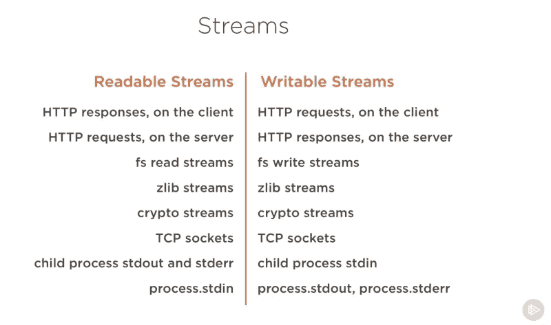
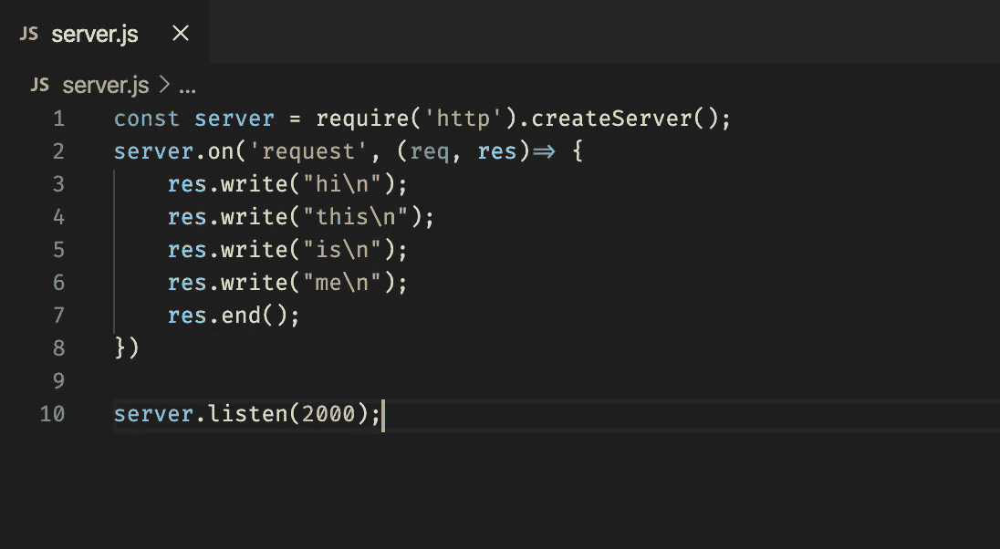
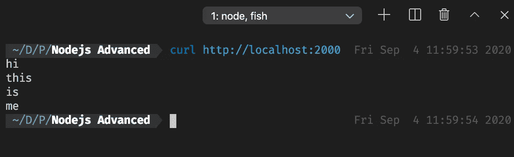
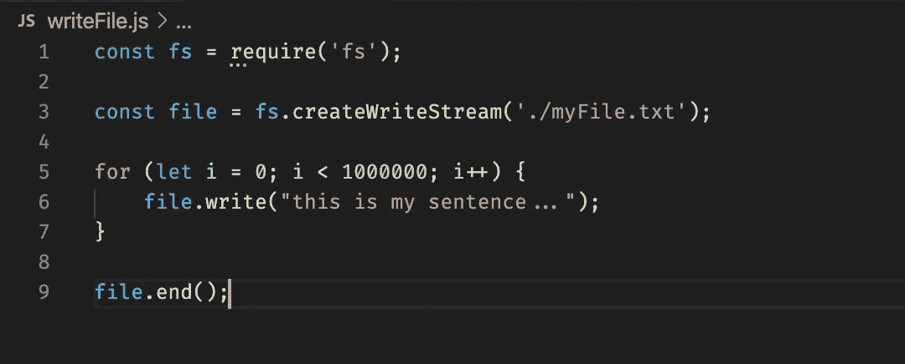
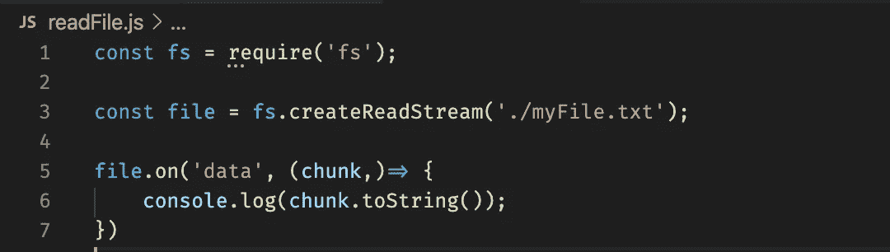
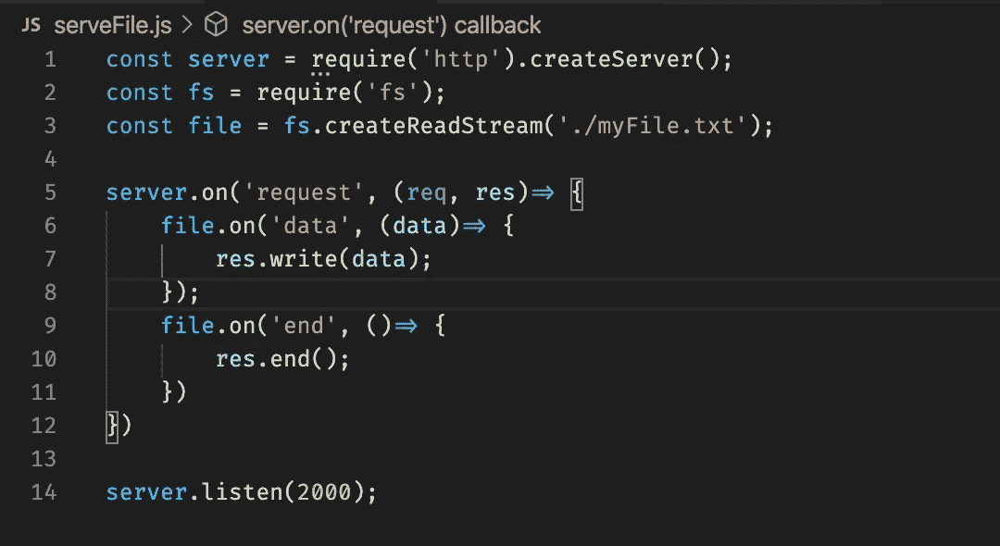
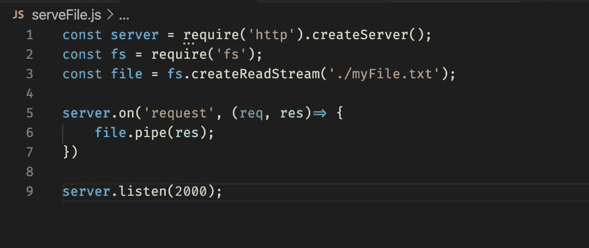
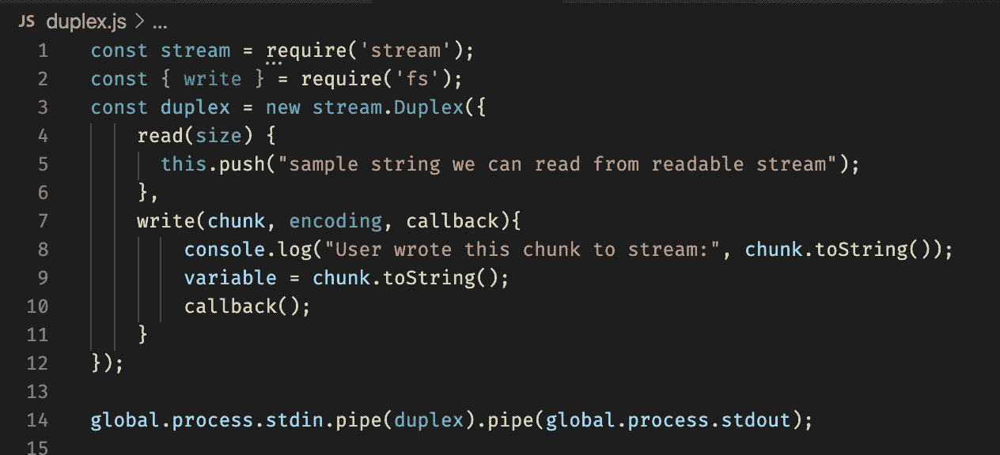
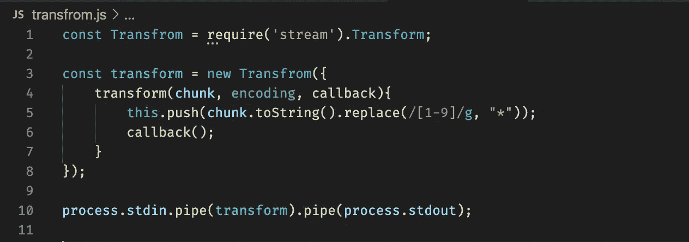

# 使用 Node.js 流

> 原文：<https://javascript.plainenglish.io/working-with-nodejs-streams-a0d35aca0cc0?source=collection_archive---------1----------------------->

Datastream

## 什么是流？

流是可能不完整的数据集合，我们可能无法在内存中容纳它们。

当我们观看在线视频时，我们使用流。我们需要下载整个视频才能看吗？答案是否定的。因此，视频数据是不完整的，但我们可以观看我们想要的部分！

假设我们正在上传一个 12GB 大小的视频。问题是我们的内存只有 4GB。那么怎么可能上传这样的文件呢？答案是，使用流，我不需要使用内存，也不需要在内存中加载 12GB 的文件，我将在流中一个块一个块地发送这个文件。

## Node.js 中我们在哪里使用流？

一些实现流接口的 Node.js 模块。
HTTP 响应是流中最常见的例子。HTTP 响应在客户端是可读的流，在服务器端是可写的流。我们将讨论不同类型的流。

Screenshot from www.freecodecamp.com

## 有哪些不同类型的流？

*   可写流:我们可以写这个流。
*   可读流:我们可以从这个流中读取。
*   双工流:我们可以读写这个流。
*   转换:转换流是双工流，其中输出在某种程度上与输入相关。

没有恰当的例子就不可能理解这些句子。让我们来看几个例子:

## 可写流示例

**写入 HTTP 响应**

这是一个简单的 HTTP 服务器，我们想看看是否可以写入 HTTP 响应:

Simple HTTP server

这是一台监听端口 2000 的服务器。正如你所看到的，我们已经用`write`方法在这个可写的流上写了几行。如果我们向该端口发送请求，输出将如下所示:

The output of a request sent to port 2000

这段代码的另一个重要部分是在可写流上使用`end`方法。

如果我们不使用`end()`方法，客户端将一直等到请求超时。

**写入文件**

我们想在一个文件中写一个特定的句子一百万次。

我们可以创建一个字符串，我们可以将这个句子追加一百万次，但是在现实世界中，我们不能这样做，因为有时这个变量的大小会超过我们的内存大小。这是流定义的一部分，我们可以用一个可写的流来填充我们的句子。

Writing to a file using fs.createWriteStream

## 可读流示例

**从文件中读取**

假设我们想从一个大文件中读取数据，比如我们用可写流创建的文件，我们想检查一个单词是否存在。因为将整个文件加载到内存中不是一个好主意，我们可以使用一个可读的流来代替。

Reading from a file using a readable stream

记住流是事件发射器，我们可以注册事件监听器。这里我们使用`data`事件来记录数据。

## 可读流的两种模式

可读流有两种模式:

**暂停模式**和**流动模式**

当我们使用**流动模式**时，数据即将到来，我们必须使用事件处理程序并监听`data`事件。实际上，当我们使用事件处理程序时，我们将可读流切换到**流动模式**。为了改变流模式，我们可以使用`paused()`方法和`resume()`。在**暂停模式下，**我们使用`read()`方法读取数据。

## 我们如何从一个可读的流中读取并写入另一个可写的流？

让我们用一个简单的例子来看看答案。我们知道 HTTP 响应在服务器上是一个可写的流，我们也知道我们可以从一个文件创建一个可读的流。所以让我们将文件的内容作为对用户的响应。我们有一个可读的流，我们想把它写入一个可写的流(响应)。

第一种方法是使用事件处理程序:

send a file in response

如你所见，我们有两个事件监听器，一个用于向`res`写入数据，一个用于结束响应。

第二种方法是使用管道，就像 Linux 中的管道一样。

Using pipe method

可读流有一个`pipe`方法，我们可以用它来传递可写流。

## 双工流的例子

我们可以使用`stream`模块创建任何类型的流。

为了拥有一个双工流，我们需要同时实现`read`和`write`方法:

Duplex stream

我使用了可读流`process.stdin`和可写流`process.stdout`，所以当我在控制台上写东西时，我是在向那个双工流写东西。

## 转换流及其用法的示例

我们需要使用`stream.Transform`来创建一个转换流，我们需要做的就是实现转换方法。

例如，我想用`*`替换流的编号:

Simple transform stream to convert numbers of a string to *

如你所见，我们必须使用`push`方法向可读流添加内容，我们可以访问来自可写流的`chunk`。

现在让我们看看结果是什么:

Console result of using a transform stream

我输入了第一行，第二行由 transform stream 写到`process.stdout`。