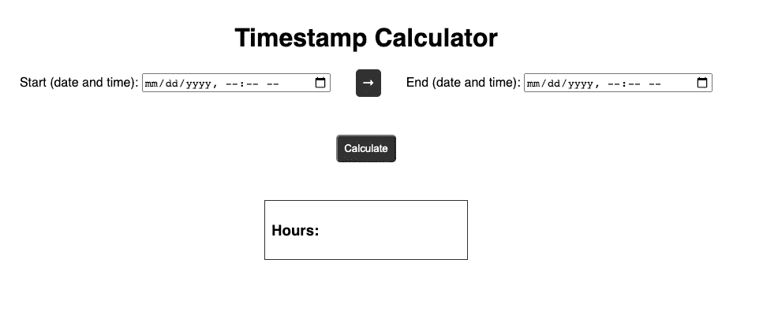
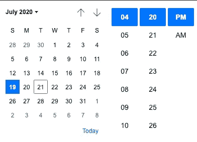
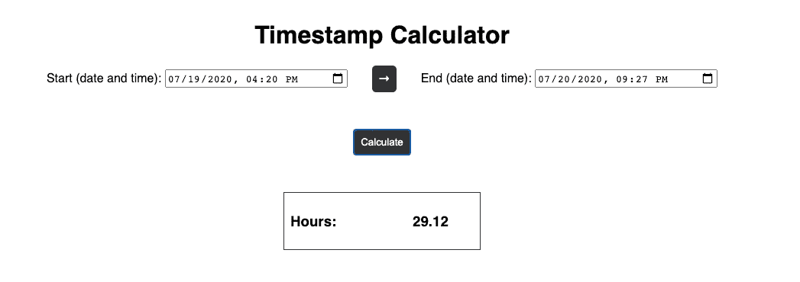

# 在 JavaScript 中使用时间数据

> 原文：<https://javascript.plainenglish.io/working-with-time-data-in-javascript-af3215f64d8a?source=collection_archive---------4----------------------->


Photo by [Brad Neathery](https://unsplash.com/@bradneathery?utm_source=unsplash&utm_medium=referral&utm_content=creditCopyText) on [Unsplash](https://unsplash.com/s/photos/time?utm_source=unsplash&utm_medium=referral&utm_content=creditCopyText)

不久前，我编写了一个 CRUD 应用程序，它跟踪创建并存储在数据库中的条目的“开始时间”和“结束时间”。我可以减去这些时间值，为每个条目找到一个简单的“时间长度”。但是以一种有用的格式检索时间数据比我想象的要困难一些。

# 日期和时间问题

处理时间数据最困难的部分是一个边缘案例可能会让您的应用程序陷入一个循环。诸如本地化、24 小时与 12 小时时间以及其他主题提出了有趣的挑战。

在我的应用程序中，一个困难的概念是让用户能够创建一个持续超过 24 小时的条目。在 AM / PM 格式的约束下工作本身就具有很大的挑战性。

下面的微型项目旨在展示一些我发现的关于在 JavaScript 中使用时间戳的有用的东西，特别是在计算时间流逝的价值方面。

# 设置项目

这是一个非常基本的项目，只有最小的 CSS，我不会在这里包括。

HTML 用两个本地日期时间输入建立了一个基本的计算器大纲。

JavaScript 如下所示:

该项目目前看起来是这样的:



# 项目说明

# 1.用 HTML 输入检索时间字符串

HTML `<input type=’datetime-local’>`为本地化做了大部分繁重的工作。这将创建一个类似日历的输入，其中包括一个 12 小时或 24 小时格式的时间字段，具体取决于用户操作系统的默认设置。



当您在 JavaScript 中检索输入值时，您将可以访问如下所示的字符串:

```
2020-07-21T16:20
```

# 2.将日期字符串转换为 Unix 时间戳(自 1970 年 1 月 1 日以来的毫秒数)

单击 Calculate 按钮时触发的回调函数将把与您的时间输入相关联的日期字符串转换成一个数值。

我们已经创建了一个与每个输入字段的值相对应的变量。然后，我们为每个值创建一个新的`Date`对象，并传递这些值来创建日期。然后，我们使用内置于`Date`对象中的`.getTime()`方法将我们的字符串转换成 Unix 时间戳。

这个时间戳具有很强的可塑性，可以绕过许多关于时间数据处理的陷阱。这个数字被称为 Unix 时间或纪元时间，在 JavaScript 中，它表示自 1970 年初以来经过的毫秒数。

这很棒的原因是，当应用程序的边缘情况开始出现时，处理字符串、对象或其他数据类型格式的时间数据将会带来巨大的挑战。如果您的应用程序被从头开始配置为只接受 Unix 格式的时间数据**和**，那么您可以根据需要轻松地操作您的 Unix 数据，向用户显示有用的信息。我们将在下一步中这样做。

# 3.操作前端的 Unix 时间戳

在这个项目中，以及我前面谈到的 CRUD 应用程序中，我想向用户显示从开始时间到结束时间已经过去的小时数。

这归结为一个基本的计算方法，用 Unix 值的开始时间减去 Unix 值的结束时间。这将产生一个毫秒的差值，我们可以用这个差值除以一个小时的毫秒数(3，600，000)。最后，我们可以通过用`.toFixed(2)`舍入到第二个小数位来进一步清理东西。

计算完成后，我们更新“result”元素的值，以显示前端已经过去的小时数。

# 4.添加基本验证

回调函数中的变量将根据传递给它们各自的`Date`对象的字符串来表示数值。如果他们不能这样做，`NaN`将被归还。

因此，我们将检查以确保两个字段都不返回`NaN`，如果其中一个返回了`alert`，则退出函数。我们还将检查以确保结束时间晚于开始时间。

这基本上是这个项目所做的全部工作，计算结果的成品将如下所示:



Calculator with an accurate calculation on display

# 将此应用于其他场景

使用 Unix 时间数据的美妙之处在于它具有广泛的可塑性。在大多数情况下，它绕过了本地化、用户时间显示首选项以及其他难以管理的情况所带来的限制。

# 关于存储时间数据的重要警告

这个项目是在 JavaScript 中使用时间数据的一个非常简单的演示，但是它并没有涵盖*存储*和*显示*数据以备后用的一些重要方面。当 JavaScript 将时间字符串转换为 Unix 时间时，它将使用 UTC。这通常符合您的最大利益，因为将所有时间数据存储为 UTC 是有益的，但是根据用户的位置，还需要一个额外的步骤来以有用的时间格式显示数据。

换句话说，用 UTC 存储数据，并将该数据的前端表示转换为用户的本地时间。

# 关键外卖

在 JavaScript(以及任何编程语言)中处理日期和时间都会遇到很多“问题”。当您开始考虑您的应用程序可能需要的任何复杂功能时，您可能希望考虑实现 Unix 时间，以将您自己从许多管理难题中解救出来。

我很想知道你对如何在 JavaScript 中处理时间有没有其他建议，所以如果我错过了一些很酷的东西，请告诉我。

感谢阅读。

# 简单英语的 JavaScript

喜欢这篇文章吗？如果是这样，通过 [**订阅解码获得更多类似内容，我们的 YouTube 频道**](https://www.youtube.com/channel/UCtipWUghju290NWcn8jhyAw) **！**