# 用 JavaScript 写一个更好的深度克隆函数

> 原文：<https://javascript.plainenglish.io/write-a-better-deep-clone-function-in-javascript-d0e798e5f550?source=collection_archive---------1----------------------->

## 你的面试官问你这个问题，其实是想考察你的后续知识。


Photo by [Shahadat Rahman](https://unsplash.com/@hishahadat?utm_source=medium&utm_medium=referral) on [Unsplash](https://unsplash.com?utm_source=medium&utm_medium=referral)

网上有很多关于深度克隆的文章，但说实话，作为面试官，我觉得很多代码实现都是不合格的。现在我从面试官的角度给大家展示一下如何回答这个问题。

在阅读本文之前，问自己三个问题:

*   你真的明白深度克隆是什么意思吗？
*   在面试官眼中，怎样的深度克隆功能才算合格？
*   如何写出更好的深度克隆函数？

本文将带您逐步了解创建更好的深度克隆函数的过程。

# 深层克隆和浅层克隆的定义

虽然深度克隆已经讨论过很多次了，但是很多读者还是不太熟悉这个概念，所以我再介绍一下。

浅克隆尽可能少地重复。集合的浅层克隆是集合结构的副本，而不是元素。使用浅层克隆，两个集合现在共享单独的元素。

深度克隆复制一切。集合的深层克隆是两个集合，其中原始集合中的所有元素都被复制。

浅层克隆:

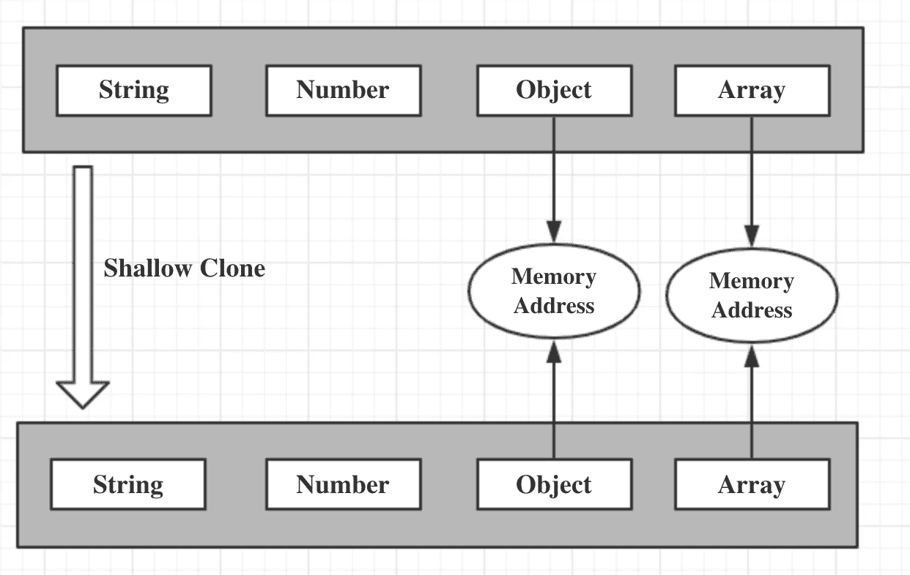

深层克隆:

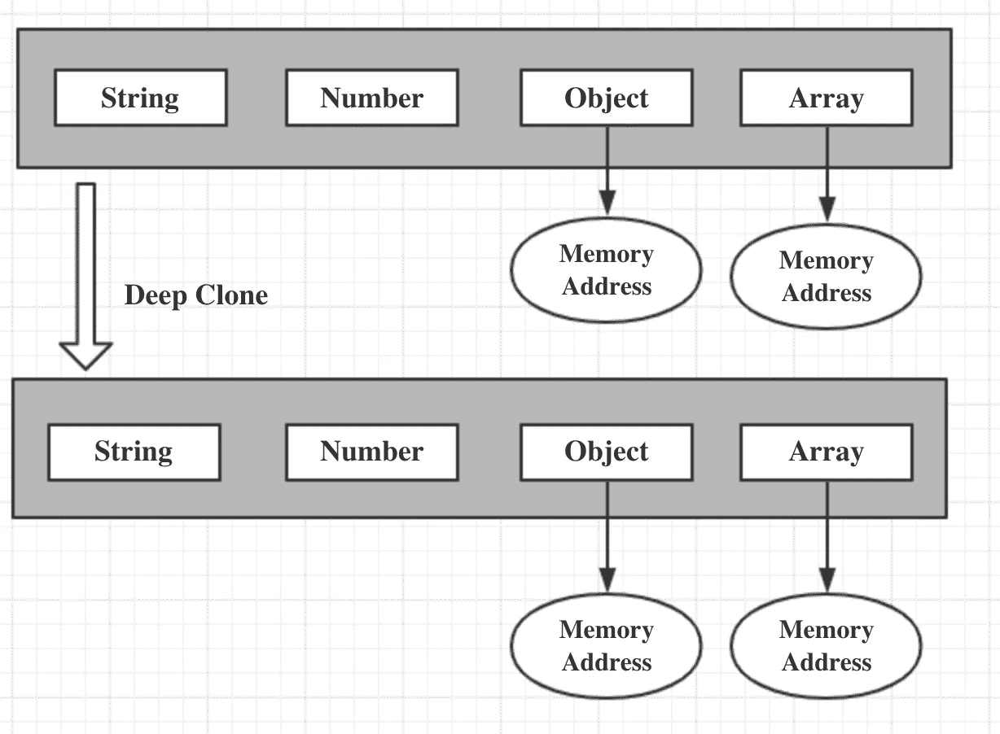

现在让我们切入正题:

# 乞丐版

在不使用第三方库的情况下，我们想要深度复制一个对象最常见的方法就是使用这个方法。

```
JSON.parse(JSON.stringify(target));
```

这种方法非常简单，可以在大多数应用程序中使用，但是它仍然有一些缺点，比如复制函数、循环引用等等。

很明显，光说这些是过不了面试的。接下来，让我们手动实现一个深度复制功能。

# 基本版本

如果是浅层克隆，我们可以很容易地编写下面的代码:

创建一个新对象，遍历要克隆的目标对象，然后添加要克隆的目标对象的属性，并返回。

如果是深度克隆，考虑到我们复制的目标对象不知道它有多深，我们可以使用递归来解决问题，并稍微重写代码:

*   如果它是原始数据类型，就不需要进一步的复制，我们可以直接返回它
*   如果是引用类型，那么我们可以创建一个新对象，遍历需要克隆的目标对象，在执行深度复制后，将需要克隆的目标对象的属性依次添加到新对象中

很容易理解，如果有更深的对象可以递归，直到属性是原始类型，那么我们就完成了一个简单的深度复制:

然后我们可以测试这个函数。

```
const target = {
    field1: 1,
    field2: undefined,
    field3: 'value',
    field4: {
        child: 'child',
        child2: {
            child2: 'child2'
        }
    }
};
```

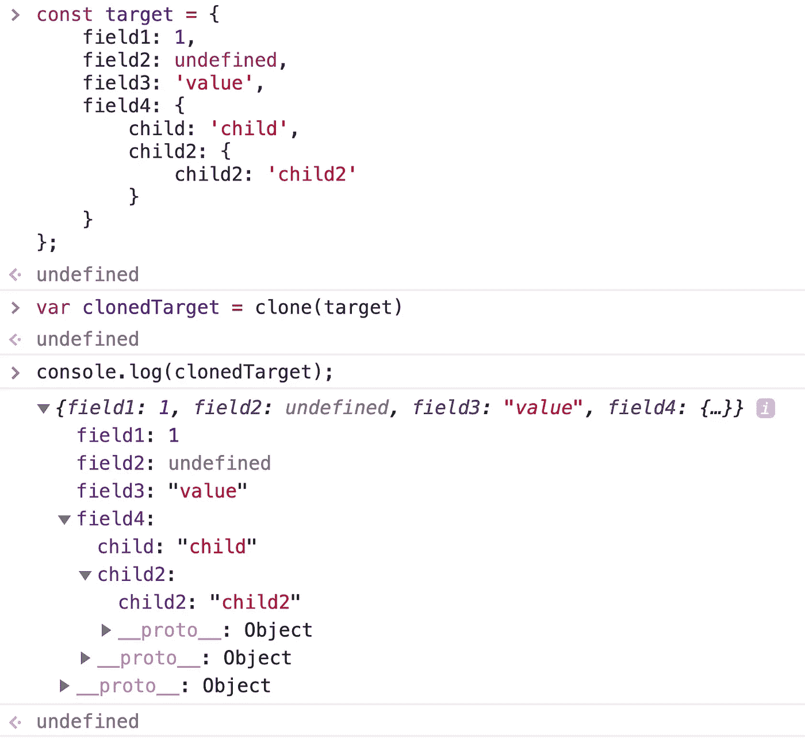

这是最基本版本代码的深层拷贝，允许你向面试官展示你可以递归地解决问题。但显然它有很多缺陷，比如没有考虑数组。

# 考虑数组

在以前的版本中，我们只考虑普通对象进行初始化，所以我们只需要稍微修改一下初始化代码，使其与数组兼容:

然后添加一个新的测试。

```
const target = {
    field1: 1,
    field2: undefined,
    field3: {
        child: 'child'
    },
    field4: [2, 4, 8]
};
```

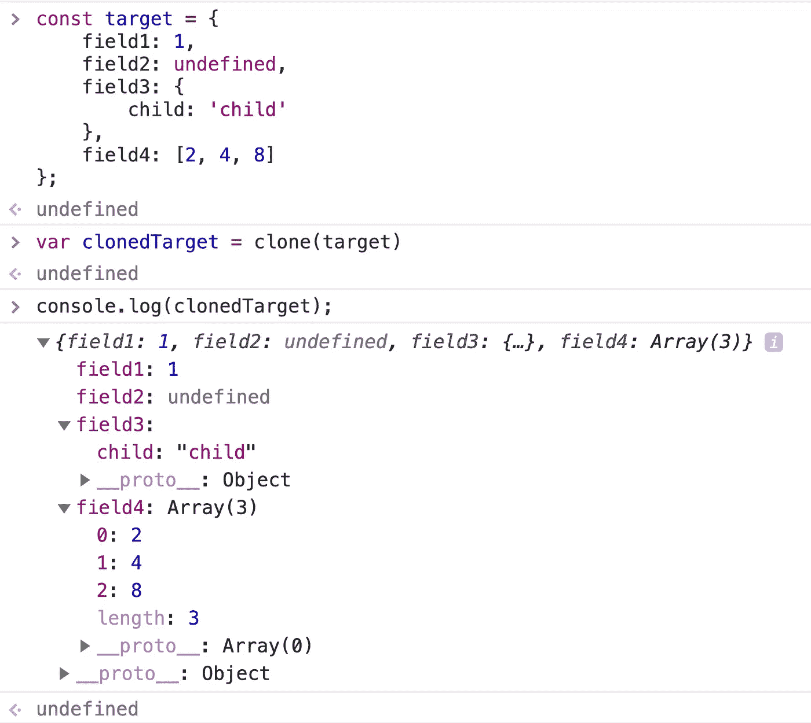

好的，没问题。我们的代码离伟大又近了一小步。

# 循环引用

如果我们执行以下测试案例:

```
const target2 = {
    field1: 1,
    field2: undefined,
    field3: {
        child: 'child'
    },
    field4: [2, 4, 8]
};
target2.target2 = target2;
```

您可以看到以下结果:

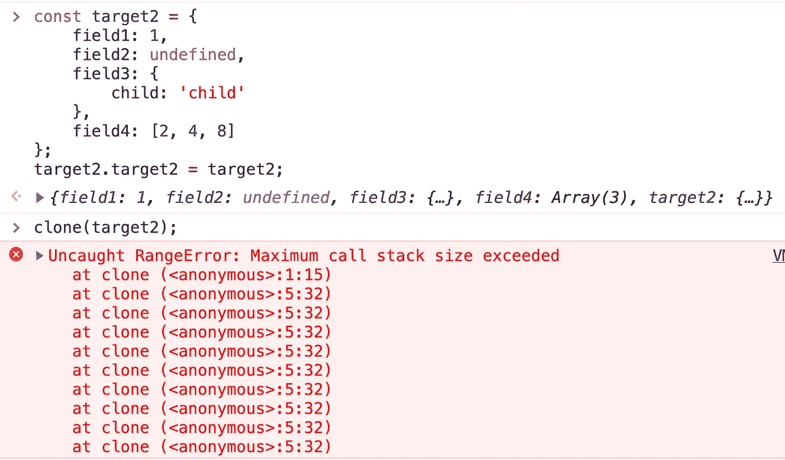

显然，堆栈内存溢出是由递归进入无限循环引起的。

原因是上面的对象有一个循环引用，其中对象的属性直接或间接引用自身:


为了解决循环引用问题，我们可以创建一个额外的存储空间来存储当前对象和被复制对象之间的关系。当我们需要复制当前对象时，我们首先去存储空间查找我们是否已经复制了这个对象，如果是就返回，如果不是就继续复制，这巧妙地解决了循环引用问题。

这个存储空间，需要能够以键-值的形式存储数据，并且键可以是引用类型，所以我们可以选择 Map。

要执行上面的测试用例:

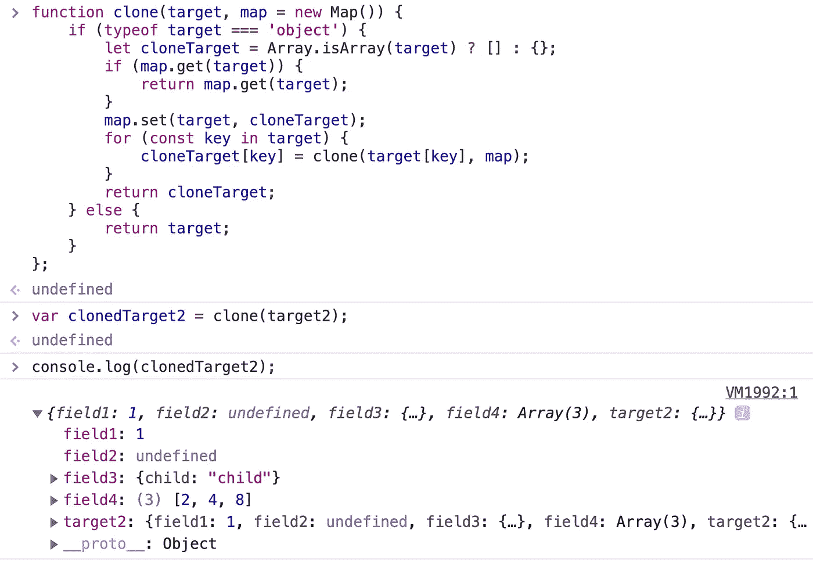

如您所见，执行是无错误的。

# 通过 WeakMap 改进代码

接下来，我们可以用一个`WeakMap`代替`Map`来让代码变得更好。

```
function clone(target, map = new WeakMap()) {
    // ...
};
```

我们为什么要这么做？WeakMap 是这样做的:

> `[**WeakMap**](https://developer.mozilla.org/en-US/docs/Web/JavaScript/Reference/Global_Objects/WeakMap)`[对象是一个键/值对的集合，其中的键被弱引用。键必须是对象，值可以是任意值。](https://developer.mozilla.org/en-US/docs/Web/JavaScript/Reference/Global_Objects/WeakMap)

那什么是弱引用呢？

> 在计算机编程中，与强引用不同，**弱引用**是不保护被引用对象不被垃圾收集器收集的引用。弱引用仅引用了*的对象——意味着“到达该对象的每个引用链包括至少一个弱引用作为链接”——被认为是*弱可达的，*并且可以被视为不可达的，因此可以在任何时候被收集。一些垃圾收集语言具有或支持各种级别的弱引用，如 C#、Java、Lisp、OCaml、Perl、Python 和 PHP 版本以来。*

当我们通过`const obj = {}`创建一个对象时，默认创建一个强引用对象。我们必须手动放置`obj = null`，以便垃圾收集机制释放它。但如果是弱引用对象，垃圾回收机制会自动帮我们释放。

例如:如果我们使用一个`Map`，那么对象之间就有很强的引用关系:

```
let obj = { name : 'Jon Snow'}const target = new Map();target.set(obj,'a man from Game of Thrones');obj = null;
```

即使我们手动释放了`obj`，`target`仍然对`obj`有很强的引用，所以它的内存无法释放。

我们可以切换到`WeakMap`:

```
let obj = { name : 'Jon Snow'}const target = new WeakMap();target.set(obj,'a man from Game of Thrones');obj = null;
```

如果是`WeakMap`，`target`和`obj`有弱引用关系。`obj`将在下次执行垃圾收集机制时被释放。

想象一下，如果我们复制一个非常大的对象，使用`Map`会导致非常大的内存消耗，我们需要手动清除贴图的属性来释放内存，而`WeakMap`将帮助我们解决这个问题。

之前很多人不明白`WeakMap`和弱引用是什么意思。通过这个例子，希望能帮助你理解以上两个概念。

为了能够考虑循环引用，你已经向面试官展示了你在考虑整个事情。如果你能用一个`WeakMap`来解决问题，并且清楚地向面试官解释你为什么这么做，那么你的代码在面试官眼里应该是合格的。

# 性能优化

在上面的代码中，我们使用`for in`来遍历数组和对象。其实`for in`在遍历的时候效率非常低。让我们比较三个常见环路`for`、`while`和`for in`的性能:

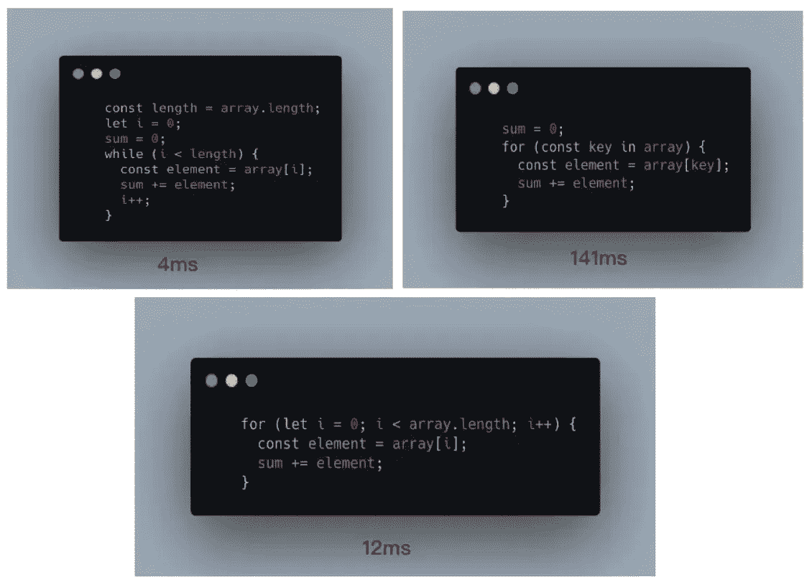

正如您所看到的，`while`效果最好，因此我们可以想出一个办法将`for in`遍历改为`while`遍历。

首先，让我们用`while`来实现一个可以遍历数组的工具函数。

```
function forEach(array, iteratee) {
    let index = -1;
    const length = array.length;
    while (++index < length) {
        iteratee(array[index], index);
    }
    return array;
}
```

这个函数有两个参数，一个是数组，另一个是处理数组中元素的回调函数。回调函数接收两个参数:值和索引。

接下来重写我们的克隆函数:遍历一个数组时，用`forEach`直接遍历；当遍历一个对象时，使用`Object.keys`检索该对象的所有键进行遍历:

我们可以做一个性能测试:

```
const target = {
    field1: 1,
    field2: undefined,
    field3: {
        child: 'child'
    },
    field4: [2, 4, 8],
    f: { f: { f: { f: { f: { f: { f: { f: { f: { f: { f: { f: {} } } } } } } } } } } },
};target.target = target;console.time();
const result = clone1(target);
console.timeEnd();console.time();
const result2 = clone2(target);
console.timeEnd();
```

(*为了避免你的误解，方便你复制代码，我又写了相关函数。*)

结果:

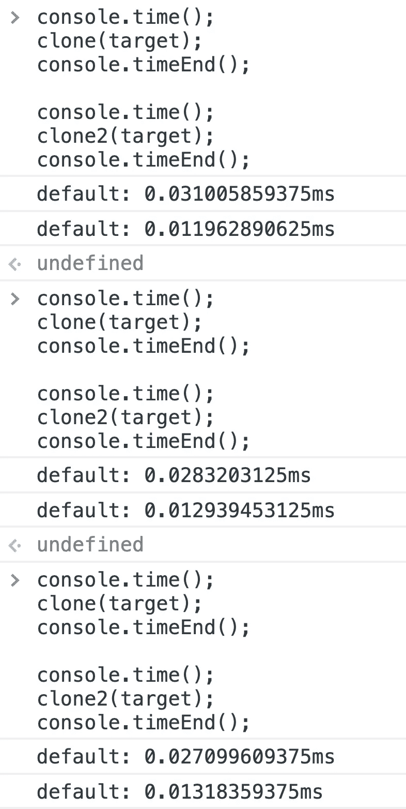

显然，我们的性能优化是有效的。

# 其他数据类型

在上面的代码中，我们只考虑了普通对象和数组对象，实际上所有的引用类型远不止这两个。

对象可以是数组、函数、映射等。当我们尝试深度克隆时，它们是不同的。如果我们想得到对象的具体类型，应该怎么做？

ECMAScript 具有以下规则:

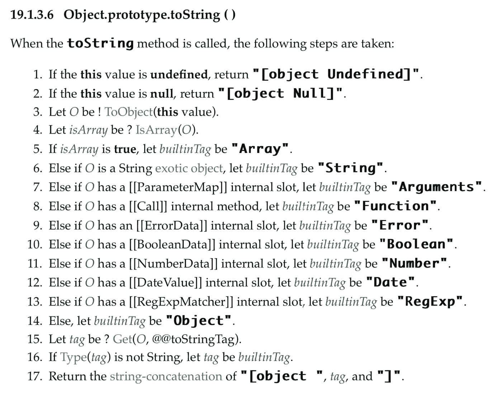

From EcmaScript

对于不同的对象，调用*object . prototype . tostring*时会返回不同的结果。

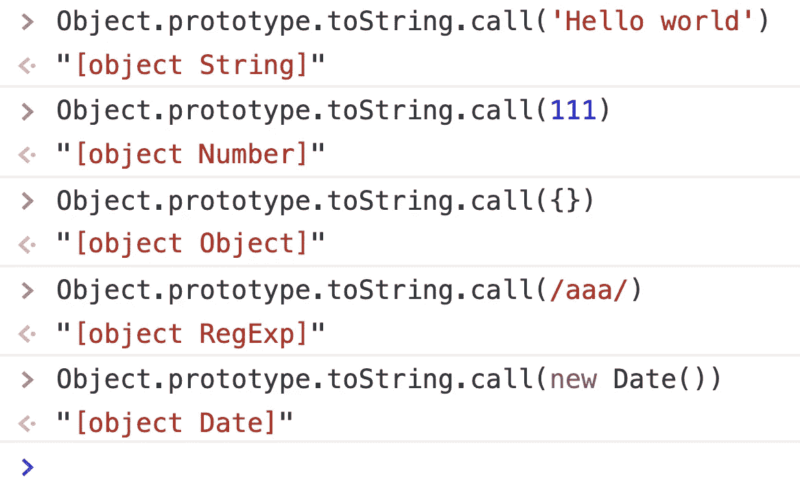

From Chrome‘s Console

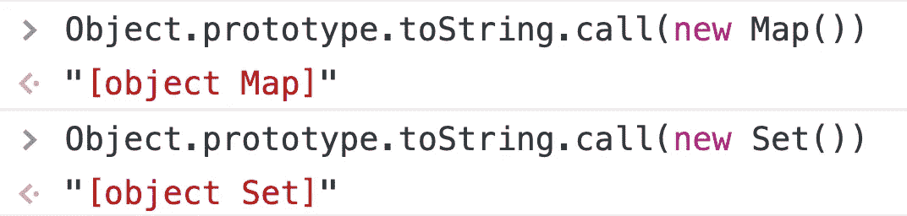

而且*object . prototype . tostring()*的返回值始终是' ***【对象****'*+'***标签****'*+'***]***'。如果只想要中间的*标签*，可以通过正则表达式或者*string . prototype . slice()*删除两边的字符。

所以我们可以写这个函数:

对于任何特定的类型，我们简单地把它们分成两类:

*   可以继续遍历的类型，比如 Map，Set。
*   不能继续遍历的类型，比如函数。

我们应该为它们编写不同的代码。

## 可以继续遍历的类型

普通对象和数组对象是可以连续遍历的数据类型。我们之前已经讨论过了。另外，`Map`和`Set`可以继续穿越。这里只讨论这四种情况。至于其他情况，你可以自己去探索。

`Map`和`Set`的遍历非常简单。它们都提供了`forEach`方法来遍历。所以我们只需要稍微修改一下前面的代码。

为了方便，我还在上面的代码中写了测试用例，下面是上面代码的运行结果。

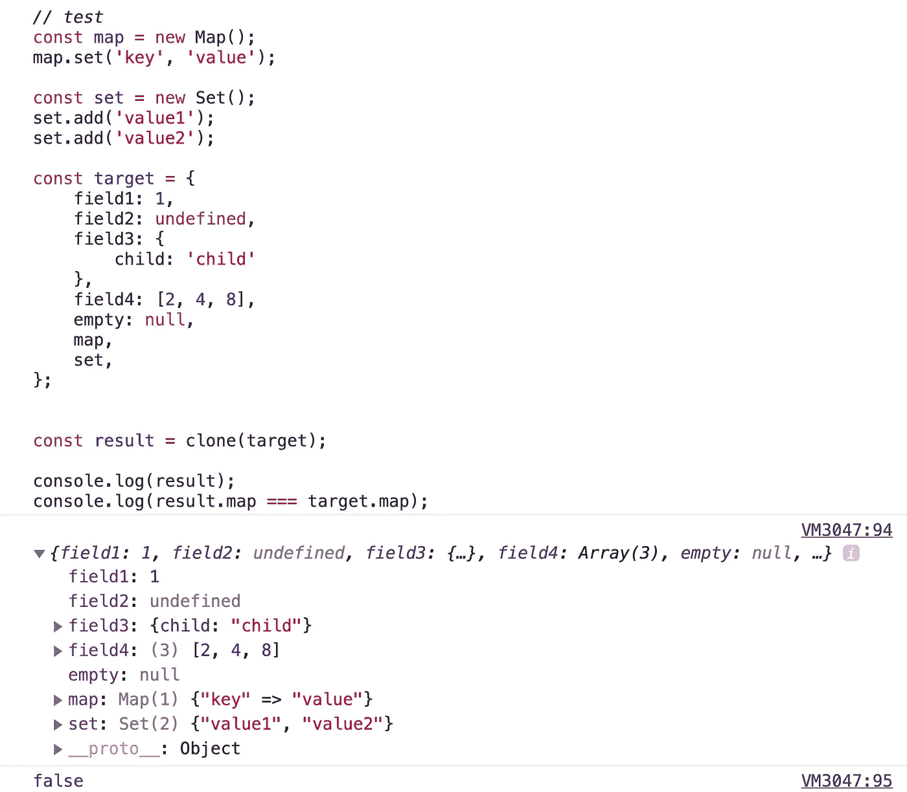

## 不能继续遍历的类型

其他数据类型，如`Boolean`、`Number`、`String`、`Date`和`Error`，它们本身是不可遍历的，所以我们可以直接使用它们的构造函数和原始数据来创建一个新的对象。

# 结论

下面是最终的代码和测试:

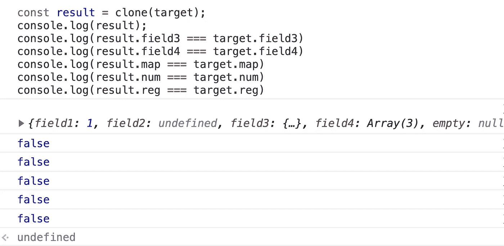

如你所见，在《深度克隆》中隐藏着许多知识。只有深入全面的思考，才能从众多面试官中脱颖而出。