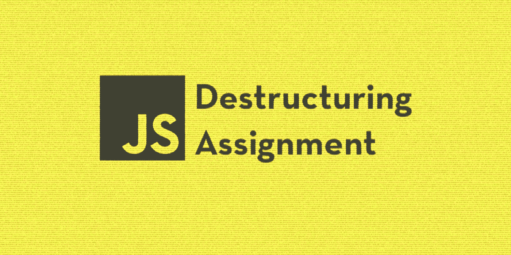

# 使用这些析构技术编写更干净的 JavaScript

> 原文：<https://javascript.plainenglish.io/write-cleaner-javascript-with-these-destructuring-techniques-3cd6aed82893?source=collection_archive---------8----------------------->

析构是 JavaScript 中最通用的表达式之一。为什么？因为它允许开发人员在无数种情况下编写更干净的代码。一旦你完全掌握了析构，你会对它的使用频率感到震惊。让我们开始吧！

## 基础知识

其核心是，析构是一个表达式，使得从数组和对象中提取值并保存到变量中成为可能。该表达式模拟了它正在析构的类型的语法

虽然它们看起来非常相似，但是在对象和数组析构的工作方式上有一些关键的区别。数组析构依赖于数组元素的索引来提取值。

变量`three`已被设置为等于位于数组第 0 个索引处的元素。在我们的例子中，这个元素是`1`。析构数组时分配给变量的名字决定了从数组中提取哪些值。

为了只从数组中提取一些元素，你可以使用`,` 来省略变量。

对象析构是完全相反的。当析构对象**时分配给变量的名字决定了哪些值将被提取。**

如果我们试图用在对象的键中找不到的名字给变量赋值，这些变量将是未定义的。

但是，可以用新的名称来给变量赋值。

默认值可以用`=`操作符设置。它们通常用于避免提取不需要的未定义对象。为提取的特性指定新的变量名时，可以使用默认值。

析构可以与 rest 运算符成对使用，将所有剩余的属性收集到一个数组或对象中。

最后，我们可以使用析构来交换变量。

## 先进的技术

对象和数组析构通常一起用来提取嵌套值。此时，语法应该看起来很熟悉，只有一个明显的例外。

我们已经演示过在析构一个对象时使用`:`来重命名一个变量。它又如何被用来进一步破坏一个嵌套对象呢？你可能已经猜到`:`不仅仅是*重命名一个变量；它允许开发人员以几种方式编辑提取的值。当提取的值是另一个对象或数组时，您总是可以继续破坏(或重命名)嵌套的对象。这不适用于字符串和数字等基本类型。我们去看看。*

numOne is an unsuccessful attempt to use object destructuring on a number

现在我们已经熟悉了嵌套析构，让我们来看一个更有挑战性的例子。

如果你认为`nestObject`有点复杂，那你就对了！它旨在重现开发人员在处理外部数据时有时会遇到的不太理想的情况。虽然这两种方法都不完美，但是析构提供了点链接的替代方法，它通过镜像数据的声明方式来提取数据。它还允许开发人员在创建与对象交互的函数时保持更多的控制和可读性。让我们看看最后一个例子。

除非嵌套的 student 对象作为参数传递，否则返回错误消息。使用参数析构，我们可以保证任何不是嵌套了 students 属性的对象的参数都将被默认值覆盖。然后，我们尝试提取并返回学生默认值中的`error_message`属性。析构还允许我们快速验证`student`的属性，而不必为每个属性使用三元赋值。让我们来看看点链的替代方案。

`locateGrade()`需要额外的验证来确保 `objStudent` 参数是一个具有`student`属性的对象。`extractGrades()`实现了一个简洁的解决方案，许多开发人员都认为它更加自文档化。

## **结论**

你可能会开始识别出可以利用析构的时刻。请务必抓住这些机会，将这些技术融入到您的下一个项目中！你可以在下面了解更多关于析构的知识。感谢阅读。

## 额外资源

 [## ES6 深度:解构- Mozilla 黑客-网络开发者博客

### ES6 In Depth 是一个系列，介绍 JavaScript 编程语言在第 6 版中增加的新特性…

hacks.mozilla.org](https://hacks.mozilla.org/2015/05/es6-in-depth-destructuring/)  [## 解构分配

### 析构赋值语法是一个 JavaScript 表达式，它使得从数组中解包值成为可能，或者…

developer.mozilla.org](https://developer.mozilla.org/en-US/docs/Web/JavaScript/Reference/Operators/Destructuring_assignment)