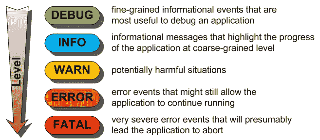
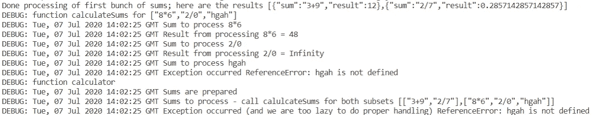

# 构建应用程序时，您应该记录什么？

> 原文：<https://javascript.plainenglish.io/write-debug-level-logs-on-error-print-detailed-logging-only-in-exceptional-circumstances-b624240a5af1?source=collection_archive---------6----------------------->

TL；DR:在内存缓冲区中收集调试信息，当出现错误时打印到输出中(在所有其他情况下被悄悄丢弃)。

我可能想到了一个有用的主意。或者一些不太有用的东西。甚至是已经存在的东西(而我是个无知的傻瓜，因为我不知道这件事)。如果是后者，我很抱歉。

今天早上我们遇到了生产问题。事实上，这件事是昨天下午开始的，我们今天早上才知道。不太好。虽然我们相对容易地解决了这个问题——一个开发人员记得引入到运行时平台中的变更很可能是问题的真正根源，但我们对可用于执行分析的信息并不满意。我们的系统在生产环境中的运行时产生一些日志记录，但显然不是非常多的细节。事实上，随着系统处理的数据量在过去几周增加，我们一直在提高日志级别(从 INFO 到 WARN ),以阻止日志记录的浪潮。日志文件给了我们最起码的线索。

具有讽刺意味的是，我们刚刚进行了一次关于日志的小组讨论。定义我们的日志记录应该遵守的准则。我们将使用什么样的日志消息标签系统来识别消息的来源和含义，即使是以自动的方式。通过 Elastic Stack、Splunk、Azure Application Monitoring 和 Oracle Cloud Logging 实现日志消息输出格式的一致性，从而简化日志消息的自动收集和分析。

我们就我们希望将日志记录分组到的日志级别以及在运行时操纵日志级别阈值的必要性进行了认真的讨论，例如，通过将日志阈值降低到 INFO，开始在生产环境中对特定组件进行详细分析。

但是，如果生产日志级别阈值为 WARN，则当事件发生时，日志文件中不会写入任何信息或调试日志。请原谅我用这种荷兰式的表达方式，在事件发生后更改伐木阈值是“de put dempen als het kalf al verdronken is”。太晚了。

我认为，理想情况下，您可以从代码中有问题的异常之前的所有内容中获得调试级别的日志记录。我们不必设置调试的日志记录阈值，也不必费力处理堆积如山的无关细节，但是当***开始发飙时，一小堆调试级别的日志记录就会被写入输出，就好像在问题发生之前，某个知情人士打开了调试级别的日志记录一样。

听起来不错，不是吗？但是如何实现这个呢？

在我当前的项目中，我们的组件是无服务器功能——小 Java 和节点应用程序。在这些应用程序中添加以下机制并不困难:

*   当输入新的上下文(方法/函数、循环中的迭代)时，创建调试日志消息缓冲区(数组)
*   将消息推送到缓冲区，这在发生错误时是相关的
*   如果出现运行时异常(至少是意外的异常):
*   将缓冲区的内容写入日志记录输出—无论当前日志级别阈值如何，均为 ERROR 级别
*   处理异常
*   如果没有发生异常，则从返回当前上下文后，将立即删除本地缓冲区

请注意，我们可以将调试缓冲区传递给被调用的函数，并以非常类似于调用堆栈的方式使用调试缓冲区对象。它包含日志消息，而不是在整个调用历史中调用的方法的名称。随着程序执行中一个分支的每次成功关闭，与该分支相关的所有日志记录都可以被丢弃。在程序执行的每一级，所有以前从更高级别的调试日志都是可用的。如果这种调试日志记录需要跨异步步骤保留，这可能是有意义的。

在 Node (JS)中，由于处理的异步和单线程特性，可能有必要在 Node v13/14/v12.7 中引入的异步本地存储对象中定义调试缓冲区对象。使用较低级别的异步钩子 API，您也可以在早期版本中实现这一点。在 Java 中，当多个线程并行运行时，线程本地存储可能是半全局调试缓冲区对象的最佳位置。

节点中的一个简单示例(*警告:*为了简单起见，我还没有使用异步本地存储(这意味着该示例不适用于同时处理多个请求)。在本例中，函数*计算器*和*计算总和*准备本地日志缓冲区，向其写入消息，并在出现异常时生成其内容。下面是通过动态计算字符串来处理一系列计算的代码:

这是由明显不正确的总和“hgah”引发的结果:

请注意，对函数 *calculateSums* 的第一次调用没有出现在日志记录中，因为该函数没有生成任何信息级别的日志。但是，因为在对函数的第二次调用中，发生了异常，所以我们从函数中获得了所有调试级别的输出，也是从异常的实际时刻之前获得的。我对 2/0 没有导致异常的方式感到惊讶。

这证明了我的观点:在正常情况下，除了 console.info 报告结果(如果日志记录级别允许 info)，这个小应用程序不会生成日志记录。当异常发生时，来自当前上下文和调用上下文的调试可以用于即时分析。

这有意义吗？如何最好地应用这一点？

另一个实现:将日志记录发送到一个带有“保存点”标识符的更中心的对象(追加和弹出存储)。成功完成一个函数后，通过删除保存点(之后记录的所有内容)来释放日志记录。如果出现问题，打印当前上下文保存点的所有日志记录。在代码中，应该是这样的:

# 资源

探索节点 v14 中的异步本地存储—[https://blog . kuzzle . io/nodejs-14-asynclocalstorage-asynchronous-calls](https://blog.kuzzle.io/nodejs-14-asynclocalstorage-asynchronous-calls)

AsyncLocalStorage 上的节点文档—[https://nodejs . org/API/async _ hooks . html # async _ hooks _ class _ async local storage](https://nodejs.org/api/async_hooks.html#async_hooks_class_asynclocalstorage)

NodeJS—[https://medium . com/@ tabu _ Craig/NodeJS-and-Thread-Local-storage-eb2c 1a 24881](https://medium.com/@tabu_craig/nodejs-and-thread-local-storage-eb2c1a24881)中关于线程本地(仿真)的中型文章