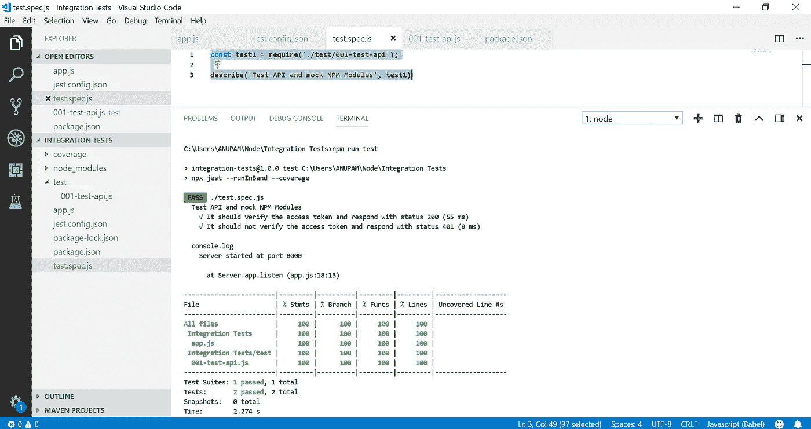

# 用 Jest 和 Supertest 编写集成测试(和模拟)

> 原文：<https://javascript.plainenglish.io/write-integration-tests-and-mocks-with-jest-and-supertest-b65a7b9186ce?source=collection_archive---------1----------------------->

## 概述如何为集成测试设置应用程序

在本文中，我们将讨论如何使用 Jest、Supertest 编写集成测试，在编写集成测试的过程中，我们经常需要模拟 npm 模块和依赖项，因此我们也将模拟这些 npm 模块和依赖项，以便顺利和完整地进行测试。


Photo by [Abet Llacer](https://www.pexels.com/@alxs?utm_content=attributionCopyText&utm_medium=referral&utm_source=pexels) from [Pexels](https://www.pexels.com/photo/black-laptop-beside-audio-mixer-set-919734/?utm_content=attributionCopyText&utm_medium=referral&utm_source=pexels)

让我们开始吧，Jest 是一个优秀的库，可能是编写测试、检查测试覆盖率、模拟模块的最佳库之一，并且配备了许多其他有用的特性。首先，我们将创建一个 Node.js 应用程序，我们可以在其上编写测试。

在上面的代码片段中，我们创建了一个简单的应用程序来验证我们的访问令牌。我们将检查头中的访问令牌，并使用 **jsonwebtoken** 库进行验证。由于我们还没有在应用程序中的任何地方实现 **JWT** ，我们将使用 **Jest Mock** 来模仿 **JWT NPM 模块**。

现在，让我们在应用程序中设置 Jest。我们将从在应用程序中安装 Jest 开始。

1.  `npm install jest`。
2.  在我们的 **package.json** 中，用这个命令
    `“test”: “npx jest — runInBand — coverage”`替换测试脚本。
3.  在根目录下创建一个 **jest.config.json** 文件来指定要测试的文件。

**jest.config.json** 文件的内容将是

```
{ 
  "testRegex": "((\\.|/*.)(spec))\\.js?$",
  "clearMocks": true,
  "testEnvironment": "node"
}
```

上面的文件在我们的项目目录中递归地搜索扩展名为 **spec.js** 的文件，并将其包含在我们的测试中。

现在，应该记住的是，如果我们正在编写集成测试，我们可能希望遵循测试的顺序，特别是当我们处理数据库和外键时。现在，假设我们有一些测试文件，比如说-

1.  **001-dummy-test.spec.js**
2.  **002-dummy-test.spec.js**
3.  **003-dummy-test.spec.js**

并且我们希望上面的文件按顺序运行，那么**没有办法让这些文件按顺序运行，因为 Jest 异步运行它的测试用例**。但是，这些文件中的测试套件以同步顺序运行。

为了避免这种情况，我们应该只有一个测试文件，里面有许多测试套件，在不同的函数中编写我们所有的测试用例，并要求它们在我们的测试套件中同步运行。我现在详细解释一下。

让我们在根目录下创建一个测试文件夹，在里面我们将编写我们的测试函数。

这是我们的测试函数。让我们看看我们在这里做什么—

1.  为了运行集成测试，我们需要一个服务器，我们需要从我们的主 **app.js**
2.  我们需要模块被 jest 嘲笑，jest 在我们的例子中是`jsonwebtoken`模块。
3.  为了运行集成测试，我们需要`supertest` ( `npm install supertest`)。
4.  现在，我们开始在函数 testApi 中编写测试用例，我们将在我们唯一的测试文件中调用这个函数，以便它们按顺序运行。
5.  现在，要模仿一个模块，我们需要在它被调用时对它进行监视，这就是我们用 Jest Spy 所做的。我们在窥探 jwt，jwt 中的 verify 函数是什么时候调用的。
6.  现在，一旦在 jwt 内部调用了 verify 函数，我们就根据需要使用 jest 的 mockReturnValue 模拟 jwt 的返回值。因此，在我们的主 **app.js** 中，jwt verify 函数将返回这个值，而不是它自己的实现值。
7.  现在，使用 supertest，我们达到了 API 端点，set 用于设置头，在我们的例子中，我们设置了访问令牌。
8.  因为我们已经模拟了测试用例将通过的值，并返回状态代码 200。
9.  在第二个测试案例中，我们做了同样的事情，但是这次我们希望访问令牌无效。
10.  为了抛出任何错误，我们使用 jest 的 mockImplementationOnce 来抛出错误。
11.  我们假设一旦它失败并抛出错误，我们将得到状态代码 401。

现在运行这些测试用例，我们将导入我们唯一的测试文件。

```
const test1 = require('./test/001-test-api');describe('Test API and mock NPM Modules', test1);
```

类似地，我们可以有更多的描述函数，所有这些都将按顺序运行，这样我们在运行集成测试时就不会遇到任何问题。

还有一件事，有许多方法来模仿 NPM 模块，但 Jest SpyOn 是最好的方法之一，因为它在每个 it 函数后清除模仿，所以我们不需要自己清除模仿，这样我们可能会错过一些时间，并可能导致我们的代码中的错误。我推荐的另一个图书馆是 sinon，在那里我们可以使用存根来达到同样的目的。

现在运行测试，简单运行`npm run tests`和 jest 将在控制台中提供一个类似下图的详细报告。并在根目录中创建一个文件夹覆盖以获得更详细的信息。



您还可以查看项目结构。我们只有一个测试文件 **test.spec.js** ，我们在其中运行所有的测试套件，以维持集成测试的顺序。

github repo—[https://github . com/anupamchaudhary 1117/Integration-Tests-Jest-Supertest-And-Mocking-NPM-Module](https://github.com/ANUPAMCHAUDHARY1117/Integration-Tests-Jest-Supertest-And-Mocking-NPM-Module)