# 使用{render.props}在 React 中编写可重用的代码

> 原文：<https://javascript.plainenglish.io/write-reusable-code-by-render-props-8ddb4f85cfa5?source=collection_archive---------0----------------------->

在[的上一篇文章](https://medium.com/@hellonehha/reactjs-reusable-components-by-props-children-df6d77d69a98)中，我们看到了如何通过使用*儿童道具*来重用 React 中的组件。在这篇文章中，我们将学习在 React 中创建可重用组件的另一种重用模式—***render . props****。*

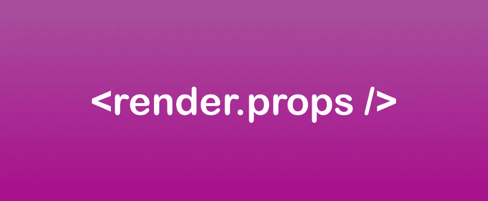

# 什么是 render.props

*render.props* 是一种编写可重用组件的方式。根据 React 文档——"*render . props 是一种* *在 React 组件之间共享代码的方式，使用一个值为函数的 prop。*“不断有人将 *render.props* 与 *children.props* 混淆比较。然而，两者都有自己的用例，但 render.props 比 *children.props* 更强大，我们将在一段时间内看到。

# **问题陈述**

假设，我们想要创建一个 3 列布局，布局中的每个列都可以通过传递道具来独立处理，并且我们可以访问它们。

简而言之，我们希望实现两件事:

1.  三列布局，其中所有三列组件都应该有一个独立的包装
2.  每个 col-component 应该能够从父包装器访问 props

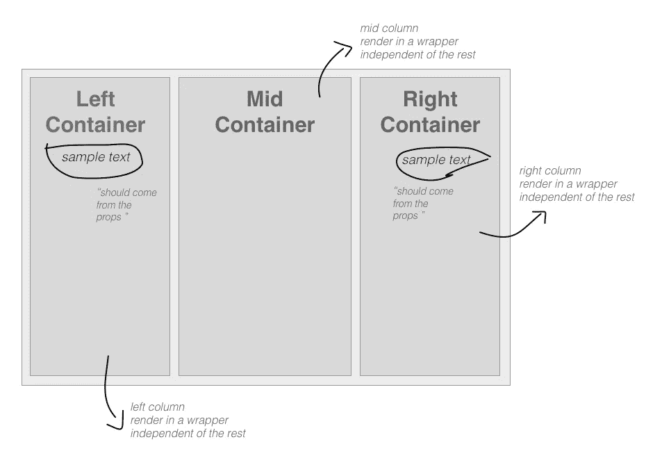

# 解决方案:

让我们先试着通过*儿童道具*来解决这个问题，然后我们将移动到*渲染道具*

*步骤 1:为包装器创建四个组件——left . js、Right.js、Mid.js 和 Content.js。*

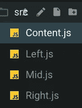

*步骤 2:将下面的代码放入 Left.js、Mid.js 和 Right.js 中，不要忘记更改第 3、#4 和#7 行的组件名称*

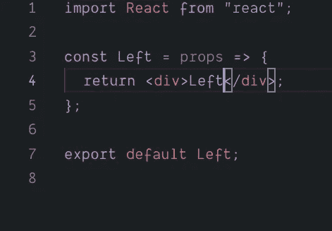

*第三步:让我们组装到 index.js 中的应用程序*

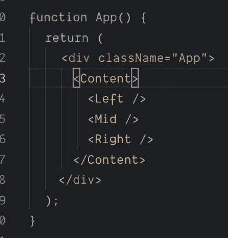

*第四步:通过 children.props 我们将渲染 Content.js 中的组件*

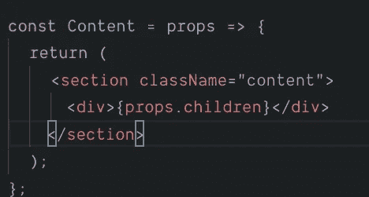

耶！！我们得到了内容中带有 *children.props* 的所有三个组件。现在，继续尝试 Content.js 中的以下代码来分别访问每个组件。

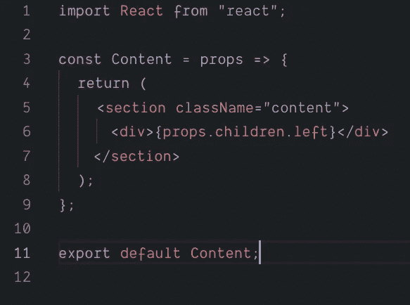

你会看到这是行不通的。这是*儿童道具*范围结束和*渲染道具*开始的地方。所以，现在我们将重构代码来实现 *render.props*

代码链接:[https://codesandbox.io/s/y848622v9](https://codesandbox.io/s/y848622v9)

> 我们将使用相同的代码，只在需要的地方重构文件。

*第一步:按照下面的截图重构 Index.js。*

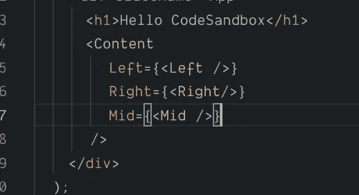

*第二步:在 Content.js 中，用 section 或 div 标签包装每个组件。(根据下面的截图)。*

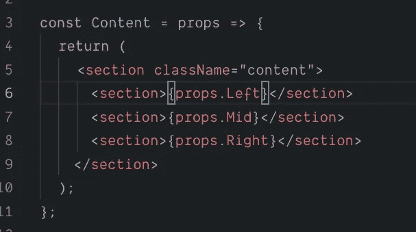

哇。！所以，现在我们能够独立地得到每个组件，并且它有自己的包装。满足了第一个要求，我们也看到了如何在缺少*儿童道具*的地方使用*渲染道具*。

第二个要求是将*道具*传递给组件。为此，我们将转到 *Content.js* 并将*道具*添加到渲染组件(*第 6 和第 7 行)。(参见下图截图)*

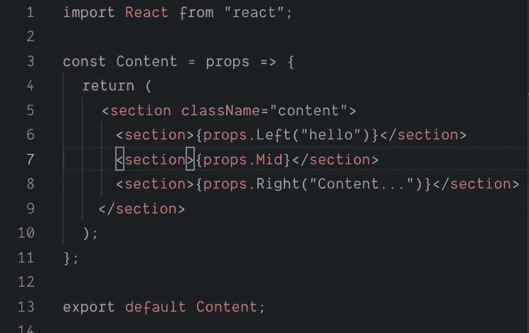

> 如果你注意到上面的截图，我们正在传递圆括号中的道具，代表一个函数。是的，我们称之为道具。这里的功能是传递道具，但是等待我们的 Content.js 持有简单的 Component，然后它将如何处理它。现在，我们将最后一次重新访问 Content.js。

在 15 号线上方，我们正在传递一个函数作为道具，以访问从 6 号线传递的道具并返回组件。

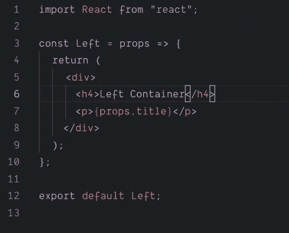

因此，现在您可以访问 *Left.js* 中的标题作为*道具*。有了这个，我们也能够成功地满足第二个要求。

代码链接:[https://codesandbox.io/s/9y6zpj4jjy](https://codesandbox.io/s/9y6zpj4jjy)

> Summary，render.props 让我们将组件作为道具传递，您也可以将组件作为函数传递，返回组件并从包装器组件访问道具。当您想要独立访问 render.props 中传递的每个组件时，这是很重要的，这在 children.props 中是不可能的。

如果你喜欢它，请分享并为它鼓掌。你可以在推特上关注我——twitter.com/hellonehha

## 进一步阅读

 [## 如何在项目中重用反应组件

### 最后，您完成了在应用程序中为表单创建一个奇妙的输入字段的任务。你对…很满意

bit.cloud](https://bit.cloud/blog/how-to-reuse-react-components-across-your-projects-l4pz83f4) 

*更多内容请看*[***plain English . io***](https://plainenglish.io/)*。报名参加我们的* [***免费周报***](http://newsletter.plainenglish.io/) *。关注我们关于*[***Twitter***](https://twitter.com/inPlainEngHQ)[***LinkedIn***](https://www.linkedin.com/company/inplainenglish/)*[***YouTube***](https://www.youtube.com/channel/UCtipWUghju290NWcn8jhyAw)***，以及****[***不和***](https://discord.gg/GtDtUAvyhW) *对成长黑客感兴趣？检查* [***电路***](https://circuit.ooo/) ***。*****