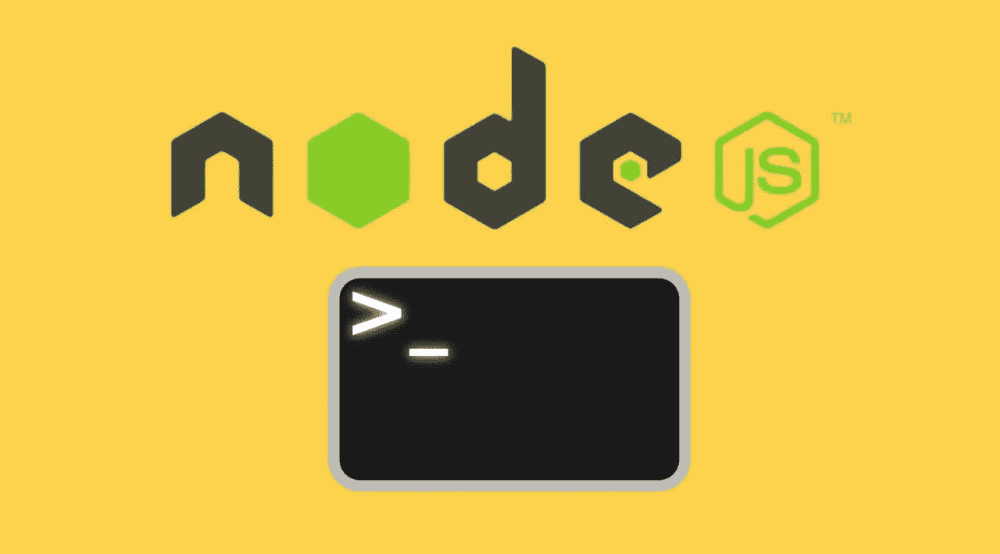
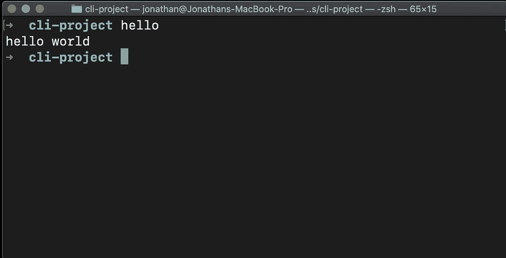
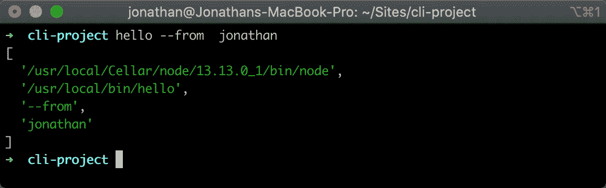
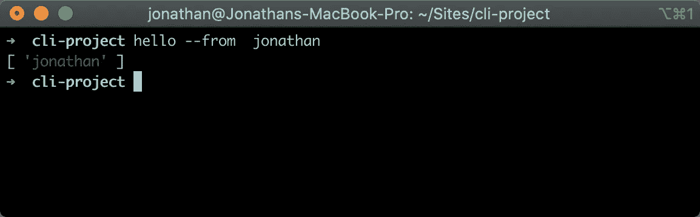
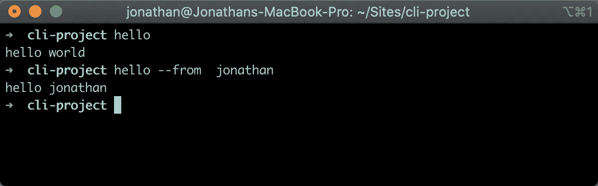

# 使用 Node.js 编写 CLI 工具

> 原文：<https://javascript.plainenglish.io/writing-a-cli-tool-with-node-js-acfe200e20fc?source=collection_archive---------4----------------------->

我最初在 2013 年写了关于如何在 Node.js 中编写命令行实用程序的文章，当时，我正在撰写博客，因为我自己学会了如何在 Node.js 中构建 CLI。

现在是 2020 年，自从那篇原始帖子以来，我已经编写了相当多的 CLI 工具，所以我觉得有必要写一篇新帖子，谈谈我将如何在 2020 年用 Node.js 编写 CLI 工具。



# 先决条件

在我们开始之前，本教程有一个先决条件，即您已经安装了 Node.js。我没有在这里写如何做到这一点，而是在 treehouse 的博客上链接了如何做到这一点的教程。

【https://blog.teamtreehouse.com/install-node-js-npm-mac】Mac:[Windows:](https://blog.teamtreehouse.com/install-node-js-npm-mac)[https://blog.teamtreehouse.com/install-node-js-npm-windows](https://blog.teamtreehouse.com/install-node-js-npm-windows)

# 走吧

安装好先决条件后，我们现在需要初始化我们的项目。要做到这一点，你需要在系统的某个地方创建一个文件夹，对于我来说，我通常在我的主目录中有一个名为 Sites 的文件夹。

要在命令行中访问该文件夹，请使用:

```
cd ~/Sites
```

下一步是为项目创建一个文件夹，为此我将使用`mkdir.`

```
mkdir cli-project
cd cli-project
```

然后我们需要使用`npm`初始化 Node.js 项目。

```
npm init
```

运行这个命令后，NPM 会问我们一系列关于我们项目的问题，对于这个项目，我们将把我们的命令行工具命名为 **hello** 。以下是我对它提出的问题的回答(括号中的答案是默认答案，我按下 enter 键接受)。

```
name: (cli-project)
version: (1.0.0)
description: Simple hello world CLI
entry point: (index.js)
test command:
git repository:
keywords:
author: Jonathan Fielding
license: (ISC) MIT
```

然后，我们会看到 NPM 生成的 JSON 提示:

```
{
    "name": "cli-project",
    "version": "1.0.0",
    "description": "Simple hello world CLI",
    "main": "index.js",
    "scripts": {
        "test": "echo \"Error: no test specified\" && exit 1"
    },
    "author": "Jonathan Fielding",
    "license": "MIT"
}
```

要接受这一点，只需按回车键。

此时，我们的目录中只有 NPM init 生成的 **package.json** 文件，所以我们现在将创建命令行使用的 JS 文件。

如上所述，我们将在项目的根目录下创建一个名为 **index.js** 的文件。我们的 JS 脚本的目的是在我们的 hello CLI 工具运行时，简单地将“hello world”记录到命令行。要做到这一点，我们需要做的第一件事是告诉我们的脚本应该如何执行，要为 Node.js 配置这一点，我们脚本的第一行应该是:

```
#! /usr/bin/env node
```

完成了这些，我们现在可以写剩下的脚本了，因为我们只想在命令行上说 hello world。完整的脚本如下。

```
#! /usr/bin/env node
console.log('hello world');
```

编写完 JavaScript 后，我们还想定义将在命令行中使用的命令，为此，我们需要在编辑器中打开 package.json 文件。然后，我们需要在配置中添加一个新的部分，即`bin`对象。这个对象需要列出用户可能想要输入的任何命令，对于这个例子，我们将添加一个命令`hello`。我们需要将它指向用于实用程序的主 js 文件`index.js`。

```
"bin": {
    "hello" : "index.js"
}
```

我们已经告诉我们的 package.json，每当我们的实用程序的用户在他们的 CLI 上输入' hello '时，它应该运行`index.js`。

我们现在只需返回控制台并运行`npm link`，它将在我们的机器上安装 CLI 工具。



一旦运行测试我们运行的`hello`命令，你会看到'你好世界'登录到控制台。

# 下一步是什么

当我们输入“hello”时，让我们的命令行说“hello world”是很好的，但是如果我们想让这个消息更个性化一点呢？为此，我们可以允许用户输入我们想打招呼的人的名字作为附加参数。

因此，如果用户输入命令:

```
hello --from jonathan
```

它应该响应:

```
hello jonathan
```

为此，我们需要读取传递给应用程序的参数。在 Node.js 中，这样做的方法是读取`process.argv`的值。

首先，让我们更新`index.js`中的代码，将`process.argv`的值记录到终端中。

```
*#! /usr/bin/env node*console.log(process.argv)
```

如果我们现在在终端中键入`hello --from jonathan`,我们将会看到下面的输出。



正如您在上面看到的，我们输入的命令导致一个包含 4 个值的数组被记录到控制台。

数组的第一个值是运行 CLI 的`node`可执行文件的路径。

第二个是我们运行的脚本的完整系统路径。*注意:*由于我们已经将 CLI 工具链接到我们的系统，完整的系统路径位于我们的 */usr/local/bin* 目录中。

数组的其余值将是用户传递的参数。在这种情况下`--from`和`jonathan`。对于我们的 CLI，我们最感兴趣的是这些剩余的参数。

当析构一个数组时，我们可以选择命名数组的值。然后，我们可以使用 spread 操作符将剩余的值放入它自己的数组中。[Samantha Ming](https://dev.to/samanthaming/6-use-cases-of-spread-with-array-in-javascript-2n53)在 dev.to 上写了一篇关于析构数组的博文。

下面我们正在解构数组，为了我们自己的使用，我们提取命令(在本例中我们设置为`--from`)和名称列表。

```
*#! /usr/bin/env node**const* [ nodeExec, scriptPath, command, ...names ] = process.argv;console.log(names);
```

现在运行我们的命令`hello --from jonathan`将只输出名字。



让用户输入到我们的 CLI 后，我们现在将构建我们的消息，并向用户显示。

如果命令设置为`--from`，我们将使用作为参数传递的名字作为我们要问候的人的名字。如果命令没有设置为`--from`，我们将简单地继续将`hello world`登录到控制台。

为了输出消息，我们将使用一个模板字符串，使用`.join(', ')`将“names”数组的值连接起来，这样名称用逗号和空格分隔。

```
*#! /usr/bin/env node**const* [ nodeExec, scriptPath, command, ...names ] = process.argv;if (command === '--from') {
    console.log(`hello ${names.join(', ')}`);
} else {
    console.log('hello world')
}
```

现在，如果我们最后一次测试我们的 CLI，我们会看到，如果我们简单地输入`hello`，我们将得到一个响应`hello world`，如果我们输入`hello --from jonathan`，CLI 将会用`hello Jonathan`来响应。



# 概括起来

总之，在这篇文章中，我们已经完成了编写输出`hello world`的 Node.js CLI 的步骤。然后，我们扩展它，根据指定的参数对问候语进行个性化设置。

从这里开始，在 Node.js 中编写 CLI 非常类似于编写任何 Node.js 应用程序🤗。我希望这个教程对你有所帮助，我会继续在 medium 上发布更多帖子，所以请查看我的简介[https://medium.com/@JonthanFielding](https://medium.com/@JonthanFielding)。

附:如果你喜欢这篇文章，请在推特上关注我[https://twitter.com/jonthanfielding](https://twitter.com/jonthanfielding)😀