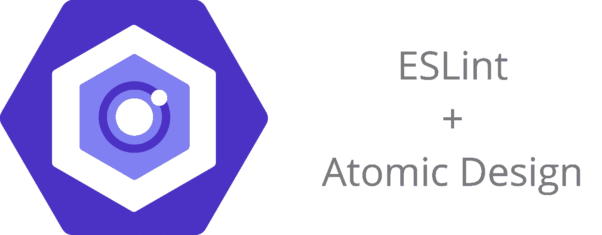

# 用 5 个简单的步骤编写一个定制的 ESLint 插件(原子设计)

> 原文：<https://javascript.plainenglish.io/writing-a-custom-eslint-plugin-in-5-easy-steps-c680ac154aaa?source=collection_archive---------7----------------------->

当在一个项目中提供最佳实践和代码指南时，没有执行的规则很容易在代码审查中被忽略，最终会被完全丢弃。

强制执行项目规则的一个好方法是与林挺合作。然而，并不是每个指南都有现成的 ESLint 规则。这就是为什么在某些情况下，定制插件可能是你最好的解决方案。

对于本指南，我将使用原子设计作为一个例子。

# 1.定义您的规则

你想解决哪个问题？

在这种情况下，我们想要实施[原子设计](https://bradfrost.com/blog/post/atomic-web-design/)。这意味着存在组件级别的层次结构，并且组件只能包括相同级别或更低级别的组件。例如，当一个原子试图包含一个分子时，ESLint 应该将其标记为错误。姑且称之为`hierarchical-import`。

# 2.安装软件包

现在我们知道我们想要实现什么，我们将创建一个 npm 包来保存插件。包的名字应该以`eslint-plugin`开头，所以我们的包就叫`eslint-plugin-atomic-design-hierarchy`。

包的入口文件(通常是 index.js 文件)将包含规则的实际逻辑。

# 3.定义规则选项

我们希望我们的规则是灵活的，所以我们允许为规则设置一些配置参数。

1.  层次:定义组件级别之间的层次
2.  组件文件夹:定义保存组件级文件夹的文件夹的名称

## 选项模式

ESLint rule options schema

模式是在 [JSON 模式](http://json-schema.org/)中定义的输入参数数组。第一个参数是一个对象，具有附加属性(意味着没有固定的属性)。第二个参数是一个字符串。

## 规则配置

该规则在 ESLint 配置中配置如下。

ESLint rule configuration

# 4.定义规则逻辑

编写 ESLint 规则比你想象的要容易。

ESLint 的工作方式是在一个节点结构中分析你的代码。每个节点都可以根据您的规则进行分析。这些节点通过一组接口公开，这些接口标识了正在被遍历的节点的类型。一些例子是变量声明、函数声明、导入声明…更多的文档可以在这里找到。

您的包的入口文件导出如下规则(示例)。

我们的规则是关于导入语句的，所以我们将使用`ImportDeclaration`接口。函数中捕获的每个节点都将是一个导入声明。

## 规则状态

首先，我们定义规则的状态，这包含了规则选项的提取和默认的回退。这些选项在 create 函数提供的上下文中可用。

## 节点处理程序

接下来，我们为导入声明节点定义一个处理程序。对于每个节点，我们将检查导入声明所在的源文件路径，以及目标模块的导入路径。验证层次结构的逻辑被提取到一个独立的方法中，以提高可测试性。`testHierarchy`方法将源路径、目标路径、层次结构和组件文件夹名称作为参数。当层次结构无效时，它将返回一条错误消息。

# 5.测试你的逻辑

为了确保规则按照设计的那样工作，我们将用一个单元测试来覆盖所有的导入案例。因为提取了规则的逻辑，所以我们可以很容易地为这个方法编写一些单元测试。

## 我们想报道的案件

1.  允许向下导入
2.  允许水平导入
3.  不允许向上导入
4.  忽略组件文件夹外的源文件

## 最重要的是，我们希望针对不同的配置测试这些案例

1.  使用默认配置验证层次结构
2.  使用自定义组件文件夹验证层次结构
3.  使用自定义层次结构验证层次结构

Example test case for default rule options

现在你的插件已经准备好发布和分发了。但是在这之前，通过在一些测试文件上运行一个实际的 ESLint 配置来测试集成中的规则。

查看 [npm](https://www.npmjs.com/package/eslint-plugin-atomic-design-hierarchy) 上的生产示例。

*更多内容尽在* [***说白了. io***](http://plainenglish.io/) *。报名参加我们的**[***免费周报***](http://newsletter.plainenglish.io/) *。在我们的* [***社区不和谐***](https://discord.gg/GtDtUAvyhW) *获得独家获取写作机会和建议。**