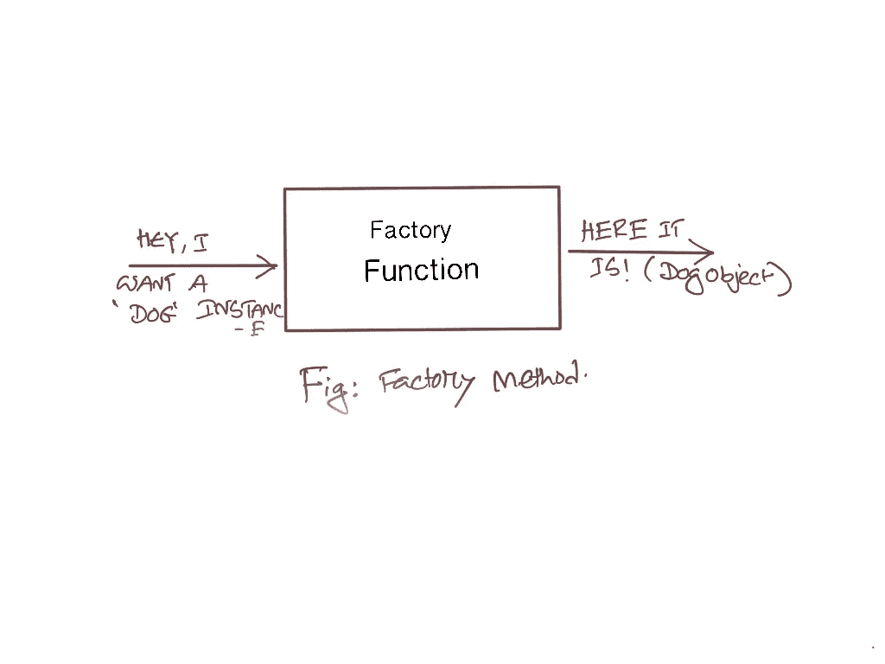

# 用 JavaScript 编写工厂方法

> 原文：<https://javascript.plainenglish.io/writing-a-factory-method-in-javascript-d15a4c8a70e7?source=collection_archive---------9----------------------->

## 传统和更好的方式


Photo by [Daniel Vogel](https://unsplash.com/@vogel11?utm_source=unsplash&utm_medium=referral&utm_content=creditCopyText) on [Unsplash](https://unsplash.com/s/photos/factory?utm_source=unsplash&utm_medium=referral&utm_content=creditCopyText)

工厂模式是一种遵循 DRY 方法的面向对象模式。顾名思义，对象实例是通过使用工厂为我们制造所需的对象来创建的。

让我们考虑下面三个类:

```
// Our Three class based.class Dog {}class Cat {}class Person {}
```

现在我们需要一个函数，我们向它请求一个纯字符串形式的对象，这个函数将返回我们想要的对象的一个实例。



Factory Method in Simple

# 使用开关的传统植入

```
var factory = function(key) {
    var instance;
    switch (key) {
        case 'dog':
            instance = new Dog();
            break;
        case 'cat':
            instance = new Cat();
            break;
        default:
            instance = new Person();
            break;
    }
    return instance;
}
console.log(factory('dog'));
```

# 用对象文字替换开关。

```
var factory = function(key) {
    var map = {
        dog: Dog,
        cat: Cat,
        person: Person
    };
    return new map[map.hasOwnProperty(key) ? key : 'person']();
};
console.log(factory('dog'));
```

## 感谢阅读！🍻