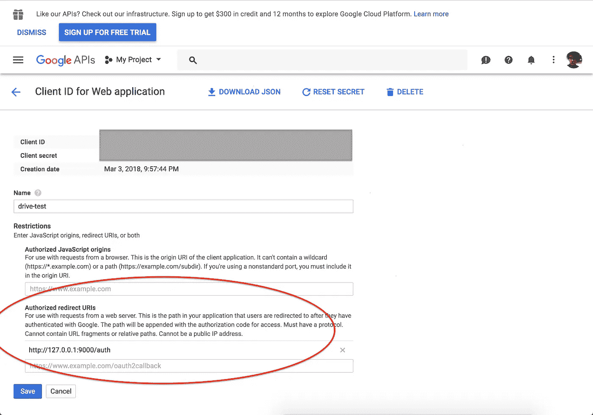
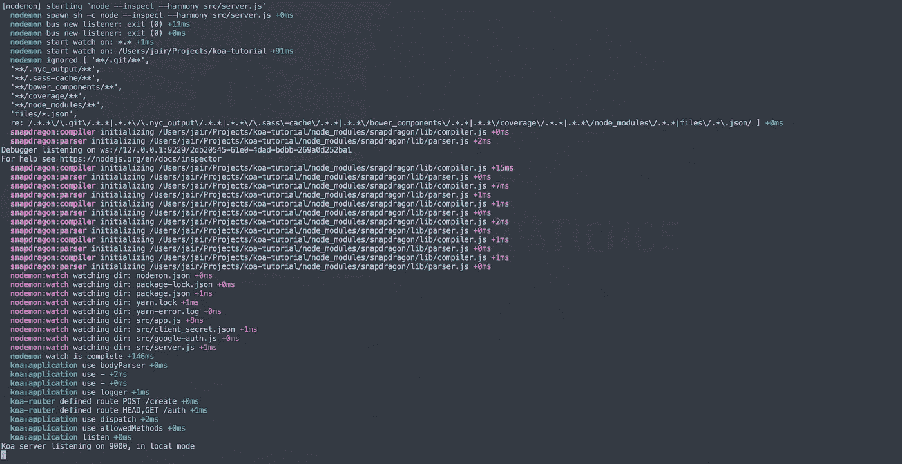
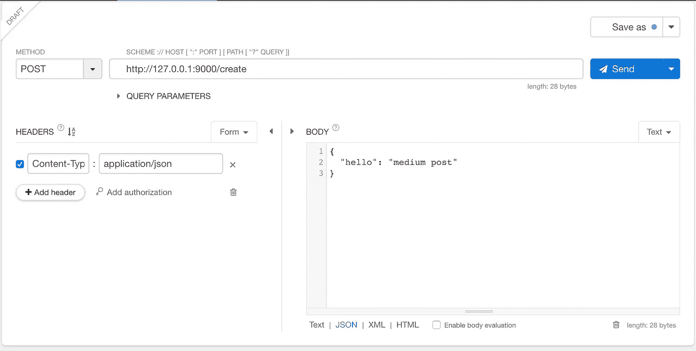
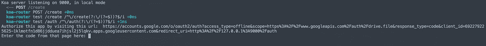
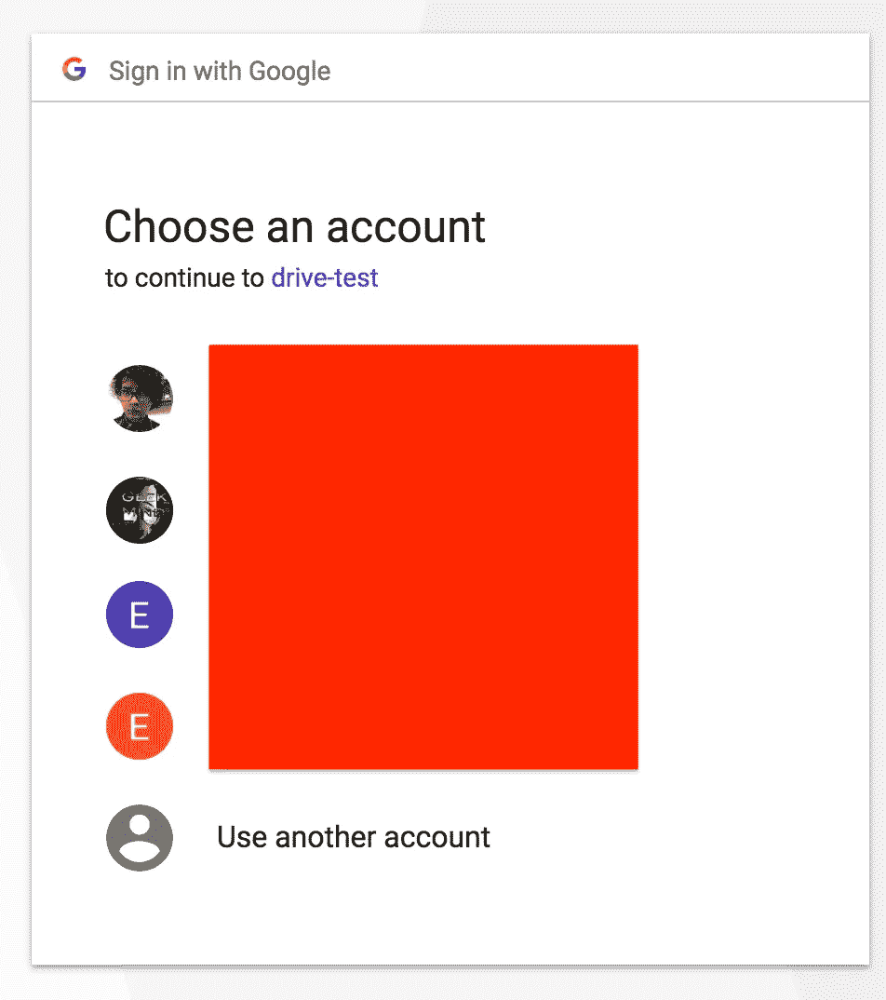
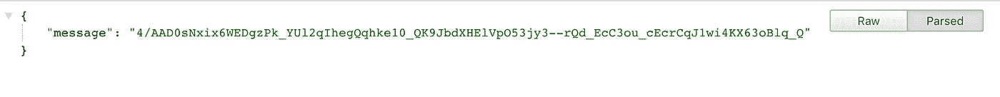
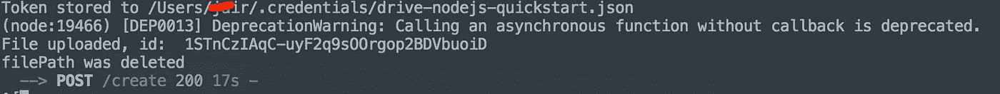
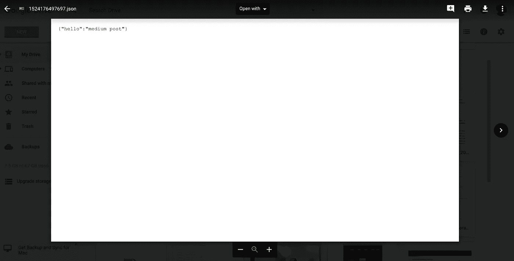

# 构建一个将数据上传到 Google Drive 的节点应用程序

> 原文：<https://javascript.plainenglish.io/writing-a-koa-app-that-uploads-a-json-file-to-google-drive-dbe50abeb3ee?source=collection_archive---------0----------------------->

## 利用 Koa.js 将 JSON 数据上传到 Google Drive


source: [https://pixabay.com/en/koa-tree-tree-big-tree-nature-sky-2241140/](https://pixabay.com/en/koa-tree-tree-big-tree-nature-sky-2241140/)

这篇文章的目标是制作一个 Koa.js 应用程序，将 JSON 文件上传到我们的 Google Drive，这是我们要如何实现的:

我们将向 */create* 发送一个 POST 请求，请求体中包含任何 JSON，应用程序将创建一个 JSON 文件，并将其上传到 Google Drive，之后该文件将被删除。简单对吗？

这些是我们要遵循的步骤:

*   创建基本结构
*   配置项目
*   创建服务器
*   谷歌认证
*   创建 Koa 应用程序
*   运行应用程序

## 创建基本结构

用你想要的名字创建一个文件夹，这将是我们项目的根目录，然后创建这个结构:

```
| Koa Tutorial
|__nodemon.json
|__files
|__src
 |__app.js
 |__google-auth.js
 |__server.js 
```

## 配置项目

在根文件夹中创建

```
npm init
```

并填写其中的所有数据，如果您想跳过所有这些简单的操作

```
npm init --yes
```

添加依赖项，这是我的包。json:

```
{
  "name": "koa-app",
  "version": "0.0.1",
  "license": "MIT",
  "main": "src/server.js",
  "dependencies": {
    "google-auth-library": "0.12.0",
    "googleapis": "24.0.0",
    "jsonwebtoken": "latest",
    "koa": "latest",
    "koa-body": "latest",
    "koa-bodyparser": "4.2.0",
    "koa-logger": "latest",
    "koa-router": "latest"
  },
  "devDependencies": {
    "nodemon": "latest"
  },
  "scripts": {
    "dev": "DEBUG=* NODE_ENV=local nodemon --inspect --harmony src/server.js"
  }
}
```

安装依赖项:

```
npm install
```

让我们配置 nodemon，转到 nodemon.json 文件

这很重要，因为我们需要忽略/ *文件*文件夹中的更改，这样 nodemon 就不会在每次那里发生更改时重启服务器。

```
// nodemon.json
{
    "ignore": ["files/*.json"] 
}
```

## 创建服务器

转到 server.js 文件

```
// src/server.jsprocess.env.NODE_ENV = process.env.NODE_ENV || 'development';const app = require('./app');const config = {
  port: process.env.PORT || 9000,
  env: process.env.NODE_ENV,
};app.listen(config.port, config.ip, () => {
  console.log('Koa server listening on %d, in %s mode', config.port, config.env);
});// Expose app
exports = module.exports = app;
```

## 谷歌认证

首先，我们需要执行此链接中的“步骤 1:打开驱动器 API ”:

[](https://developers.google.com/drive/v3/web/quickstart/nodejs) [## Node.js 快速入门| Drive REST API | Google 开发者

### 完成本页剩余部分描述的步骤，大约五分钟后您将拥有一个简单的 Node.js…

developers.google.com](https://developers.google.com/drive/v3/web/quickstart/nodejs) 

将此 URI 添加到 URI 部分 127.0.0.1:900/auth



我们下载 *client_secret.json* ，并将其添加到我们的 */src* 文件夹中

我从上面的链接重构了 Google 示例中的代码，我们从这里下载:[https://github . com/edernegrete/Google-drive-auth-module-node/blob/master/auth . js](https://github.com/edernegrete/google-drive-auth-module-node/blob/master/auth.js)

我们把它放在 src/google-auth.js

## 创建 Koa 应用程序

最后到 Koa app。

我们需要创建两个端点

*   /auth(对于 Google Auth)
*   /create(用提供的 JSON 创建一个文件)

转到 *src/app.js*

让我们先添加依赖项:

```
//src/app.jsprocess.env.NODE_ENV = process.env.NODE_ENV || 'development';const Koa = require('koa');
const logger = require('koa-logger');
const router = require('koa-router')();
const bodyParser = require('koa-bodyparser');
const fs = require('fs');const uploadFile = require('./google-auth.js');
```

现在让我们添加记录器:

```
//src/app.jsapp.use(async (ctx, next) => {
  const start = Date.now();
  await next();
  const ms = Date.now() - start;
  ctx.set('X-Response-Time', `${ms}ms`);
});
```

让我们创建两个函数

*   writeJSONFile
*   删除文件

流程应该是这样的:

1.  编写 JSON 文件
2.  上传文件
3.  删除文件

所有这些都应该等待前一个结束。**(异步/等待🙈)**

## 让我们编写 *writeJSONFile* 函数:

```
// src/app.jsconst writeJSONFile = (ctx, fileName) => new Promise(
  (resolve, reject) => {
    try {
      const createStream = fs.createWriteStream(`./files/${fileName}.json`);
      const writeStream = fs.createWriteStream(`./files/${fileName}.json`);
      writeStream.write(JSON.stringify(ctx.request.body));
      createStream.end();
      writeStream.end();
      resolve();
    } catch (err) 
      {
        reject(err);
      }
});
```

## 现在 removeFile 函数:

```
// src/app.jsconst removeFile = fileName => new Promise((resolve, reject) => {
  fs.unlink(`./files/${fileName}.json`, (err) => {
    if (err) {
      reject(err);
      throw err;
    }
    resolve();
    console.log('filePath was deleted');
  });
});
```

## 现在让我们创建路线

*/创建*

```
// src/app.jsrouter.post('/create', async (ctx, next) => {
  if (!ctx.request.body) {
    ctx.status = 400;
    ctx.body = {
      error: `expected an object in the body but got: ${ctx.request.body}`,
    };
    return;
  }
  const newName = `${new Date().getTime()}`;
  await writeJSONFile(ctx, newName);
  await uploadFile.upload(newName);
  await removeFile(newName);
  ctx.status = 200;
  next();
});
```

/auth

```
// src/app.jsrouter.get('/auth', async (ctx) => {
  ctx.body = {
    message: ctx.request.query.code,
  };
});
```

最后，我们不需要使用路线并导出我们的应用程序

```
// src/app.jsapp.use(router.routes());
app.use(router.allowedMethods());module.exports = app;
```

## 让我们运行应用程序。

去终端跑

```
npm run dev
```

您应该会看到类似这样的内容:



我们的应用程序在 9000

现在要做测试，我们需要发出一个请求，你可以使用 Postman 或任何 rest 客户端

我们需要用任何有效的 JSON 进行 POST/create



之后，你应该与谷歌认证，去控制台，你应该看到这个:



让我们访问那个链接，你会看到类似这样的内容(取决于你是否有多个谷歌账户)



选择 on 后，您将看到令牌:



将它复制并粘贴到终端中，这个过程应该开始了，您应该在最后看到类似这样的内容:



之后，你可以检查你的谷歌驱动器，文件应该在那里:



你可以在这里查看完整代码:[https://github.com/edernegrete/koa-google-drive](https://github.com/ederng/koa-google-drive)

我很想收到你的来信，你可以在推特上联系我:@ [edernegrete_](https://twitter.com/edernegrete_) ❤️