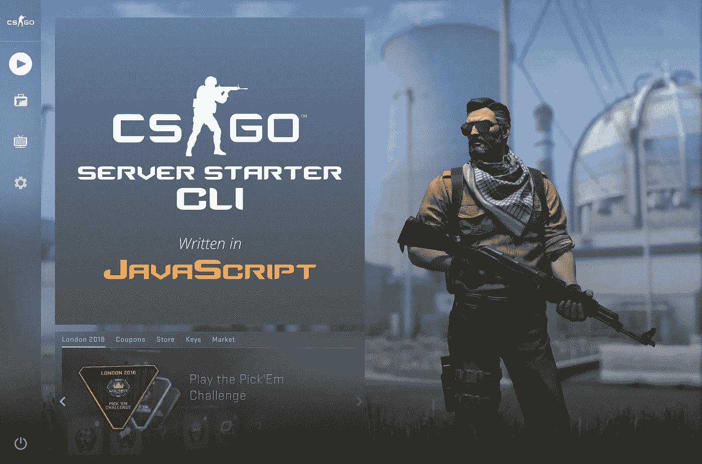
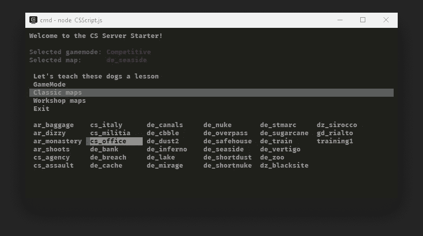
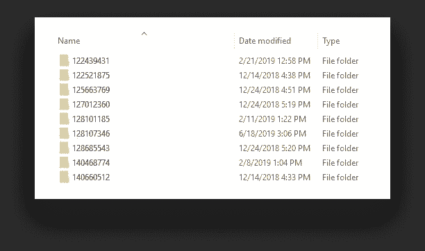
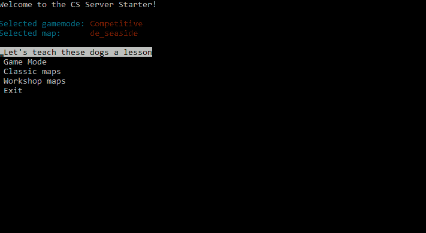
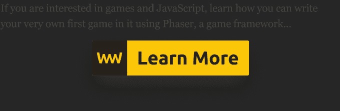

# 为 CS 编写服务器启动 CLI:使用 JavaScript

> 原文：<https://javascript.plainenglish.io/writing-a-server-starter-cli-for-cs-go-with-javascript-44240a896da8?source=collection_archive---------5----------------------->

## 只需点击一个按钮，即可启动您最喜爱的地图

[](https://www.webtips.dev/writing-a-server-starter-cli-for-csgo-with-javascript)

CS:GO 是最受欢迎的游戏之一，最近它已经完全免费了。你们中有多少人至少试过一次这个游戏？你们中有多少人一直在积极地玩这个游戏？我想我们都有同感。

我是为数不多的不太喜欢 FPS 的人之一，尤其是在《反恐精英》中。但是当 Valve 宣布 CS:GO 免费时，我的朋友们比以往任何时候都更努力地试图说服我。

从那以后，我们经常玩，所以我想写一个脚本来启动一个服务器，这样我们就不用每次想玩的时候都手动启动了。你能想象我们通过投资这个工具节省了多少时间吗？可能不是几个小时，而是几分钟。

无论如何，我设法做到了，这是一个关于挑战和最终成功的故事。

# 这个概念

主要概念是用户启动一个批处理文件，他们可以从中选择游戏模式和地图，然后点击运行。游戏从确定的参数开始，每个人都很开心。—这就是概念。概念化比实施容易。我甚至不知道我会遇到什么。

似乎同时启动一个游戏和自动化键盘输入比我最初想的要困难得多。最大的挑战是知道游戏最终启动的时间。我有几个想法。

*   第一个也是最明显的是看看是否有一个 API 可以处理所有这些。没有。
*   游戏开始时有进程事件发出怎么办？—我不能依赖进程，因为进程的开始并不意味着游戏已经在主菜单中。
*   如果我创建一个关于主菜单的截图，然后比较像素来检查主菜单是否显示，会怎么样？—万一他们换了主菜单，那就不行了。更不用说这是不必要的复杂。

似乎我想出的每个解决方案都有缺陷。我甚至在考虑尝试图像识别来找出游戏中很少改变的固定部分，并对它们进行匹配检查。这是一种过度的杀戮。

这个解决方案要简单得多，但可能是所有解决方案中最糟糕的。



The look of the final CLI, the output of this article

# 依赖关系

因为我是一名 web 开发人员，所以很明显我会选择 JavaScript。由于我只想要一个 CLI，node 是显而易见的选择。我们都知道节点是关于依赖的。为了让我的概念生效，我需要 4 个。

首先，我需要一个包来隐藏与命令行交互的底层神秘层。我最初想用 [inquirer](https://www.npmjs.com/package/inquirer/v/0.2.3) ，但是从文档来看，它似乎不支持表格。在一个单独的列中显示选项比在一个表格中显示更不友好，特别是当玩家有数千个车间地图时。因此[终端套件](https://www.npmjs.com/package/terminal-kit)是更好的选择。

我还需要 [robotjs](https://www.npmjs.com/package/robotjs) ,它公开了一些很好的 API 来与用户输入设备交互，比如键盘或鼠标。要求最终写出游戏内部的命令。

因为我们是从 node 开始工作的，所以我们没有和浏览器一样的 API。为了将参数复制到剪贴板中，我需要[复制粘贴](https://www.npmjs.com/package/copy-paste)，这样就增加了功能。

最后但同样重要的是，为了简化阅读地图的过程，[路径](https://www.npmjs.com/package/path)也在依赖列表中

这是我使用的最后一个`package.json`文件:

# **创建配置文件**

为了整理启动脚本，我将一些选项转移到一个保存所有可变参数的`config.js`文件中。比如 CS 根文件夹的路径，游戏中打开控制台的快捷键，保存所有通常由玩家设置的参数的数组。这些将被复制到剪贴板，以便稍后粘贴到控制台。

# 创建菜单文件

我还将一些常量移到了另一个名为`menu.js`的文件中，同样是为了去除主脚本文件中的一些干扰。这个文件包含了用户可以选择的菜单选项，以及关于所选游戏模式和地图的信息:

# 编写 CS 脚本

主脚本文件负责创建 CLI、收集可用地图和启动游戏。为了创建它的可执行版本，我还创建了一个`.bat`文件，其中包含一行代码:

```
node CSScript
```

告诉节点运行`CSScript.js`。

## 设置好一切

为了设置好一切，我引入了所有的依赖项以及两个额外的内置包:

*   `spawn`哪个部门负责启动政务服务流程
*   `fs`是用于读入地图的文件系统

除了导入`config`和`menu`文件之外—

*   我还定义了可供玩家选择的游戏模式列表
*   一个用于`maps`的常量，它将保存所有经典地图和车间地图
*   一个`defaults`对象，将保存游戏文件的路径和我们屏幕的大小*(这将需要检查游戏是否启动)*
*   我还添加了一个助手函数来检查一个文件是否是地图。

我还添加了一个标志来检查游戏是否已经开始启动，以及一个设置`setInterval`的间隔，它将进行我所创建的最黑客的检查。

## 设置默认值

首先:我们需要从玩家那里收集一些信息，比如地图的路径、可执行文件的路径和屏幕大小。这是这个函数应该做的事情:

我把它分配给`defaults`，因为我以后会用到它们。使用 robotjs 很容易获得屏幕尺寸，我只需调用`robot.getScreenSize`。

## 获取地图

为了让用户选择地图，我们首先需要知道他们有什么地图。为此，我在设置默认值后定义了两个函数:`getMaps`和`getWorkshopMaps`。

为了获取地图，该函数读取由`setDefaults`函数设置的目录。为了安全起见，它检查循环中的文件是否是一个 map，并用它填充`maps.classic`。`mapName`属性将显示在 CLI 中，而`mapPath`将被插入控制台。对于经典贴图，贴图名称和贴图路径没有区别，但是对于 workshop 贴图，有以下区别:

车间地图也是如此，但在这里，每个地图都在一个子文件夹中。这就是我们需要嵌套循环的原因，也是我们对映射名称和路径使用不同值的原因。



Each workshop map is inside a separate folder

## 创建主菜单

下一步是最终在 CLI 上得到一些东西，首先是一些基本的信息:显示选择的游戏模式和地图。多亏了 terminal-kit，这相当容易:

Eventually, this piece of code was needed to be extended with terminal.clear() to refresh the cli between switching menus

也是时候在`terminal.singleColumnMenu`的帮助下把菜单放好了。我从菜单文件中获取菜单选项，并根据所选菜单的名称，执行给定的功能:

为了保持事物的分离，我把所有东西都放在了一个`mainMenu`函数中，并在文件的底部添加了一个`start`函数来调用它。我还在这里调用了`setDefault`、`getMaps`和`getWorkshopMaps`函数，这样我们就设置好了每个变量。

从这里开始，我们可以看看菜单项调用的每个函数的实现，除了退出菜单，因为它的唯一目的是终止正在运行的任务。

## 选择游戏模式

选择游戏模式就是给`selectedMenuItem.gameMode`赋值。它由三个不同的功能组成:

当选择游戏模式菜单时，从`mainMenu`功能调用`selectGameModeMenu`。然后显示一个从文件顶部定义的`gameModes`数组创建的列表。当选择一个选项时，它调用`selectGameMode`，该选项包含一个开关盒以设置正确的模式和类型。这些值将被放置在游戏的控制台中。你可以从[这里](https://developer.valvesoftware.com/wiki/CSGO_Game_Mode_Commands)获得游戏模式命令列表。

当选择游戏模式时，我们调用`mainMenu`返回。

## 选择地图

选择地图也是为了给`selectedMenuItem.map`设置合适的值，这个值稍后可以用来将地图输入到游戏控制台中。你可能已经注意到我用一个标志从`mainMenu`调用了`selectMap`函数。这是为了决定玩家是否想要选择经典或车间地图:

我从由`getpMaps`和`getWorkshopMaps`生成的地图列表中创建菜单项，并使用`terminal.gridMenu`显示一个菜单。一旦选择了一个选项，我将`selectedMenuItem.map`的值设置为所选选项的值，然后我们可以返回到主菜单。

## 选择默认游戏

在查看我如何设法启动游戏、测试它是否被启动以及将一切放入控制台以启动它之前，我给`start`添加了一个小函数来选择默认游戏模式并键入:

# 创造心脏——启动游戏

要开始游戏，我们可以相对容易地完成它。困难的部分将是告诉我们是否在主菜单中；在此之前，我们不能在游戏中打开主机。

这是我使用复制粘贴 npm 包复制`config.js`中定义的参数并注销到播放器的地方。游戏可以用`spawn`功能启动，我们需要设置`-steam`标志，否则会说你在“*不安全模式*下运行游戏。

而神奇的事情就发生在`checkGameState`函数内部。interval 每秒执行一次，检查游戏是否已经开始。以下是该函数的代码:

## **解决方案:**

解决方案如下。开始游戏，从中间左侧获取屏幕的像素颜色。如果是纯黑 *(#000)* ，游戏已经**大概**开始开机了。如果它不再是黑色的，那么游戏已经加载。如果我们在主菜单中，我们可以开始输入命令并按 enter 键，然后清除间隔。

我说可能是因为如果你的背景屏幕颜色是黑色的呢？可能不是问题，因为它一直在等待，直到它变成别的东西。大概吧。如果主菜单发生变化，使单个像素变成黑色会怎样？—脚本将停止运行，并且时间间隔永远不会被清除。如果在窗口模式下打开游戏会怎样？不是一个防弹的解决方案，但它能把事情做好。大多数时候。



Starting the server

# 限制

它有一些限制，如果您想用它启动本地服务器，您很快就会发现这些限制，例如:

*   你需要在游戏中按下 shift 键，以确保游戏机再次工作。
*   如果你退出游戏，你必须在重新开始游戏前关闭主机，你不能从同一个主机上重新开始一个新游戏。
*   如果你关闭 cmd，它也会终止游戏，因为它是从控制台启动的子进程。

我没有发现任何其他问题，所以这只是一个小小的拯救代价。如果你对这个脚本感兴趣或者想自己使用，你可以从 [GitHub](https://github.com/flowforfrank/csserver) 中克隆它。现在让我们去给这些狗一个教训。🎮

[](https://medium.com/@ferencalmasi/membership)[](https://www.webtips.dev/building-the-game-breakout-using-javascript)