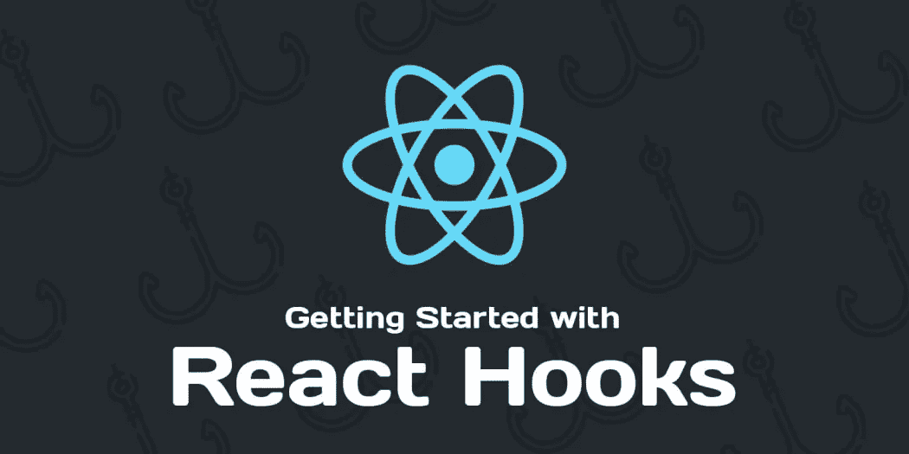
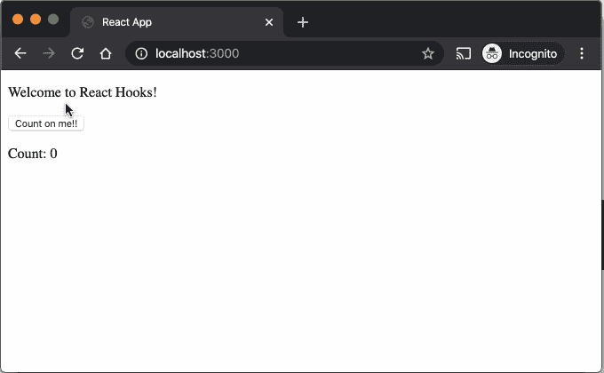
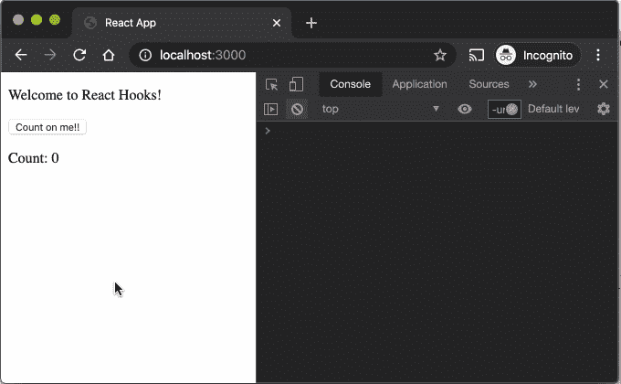
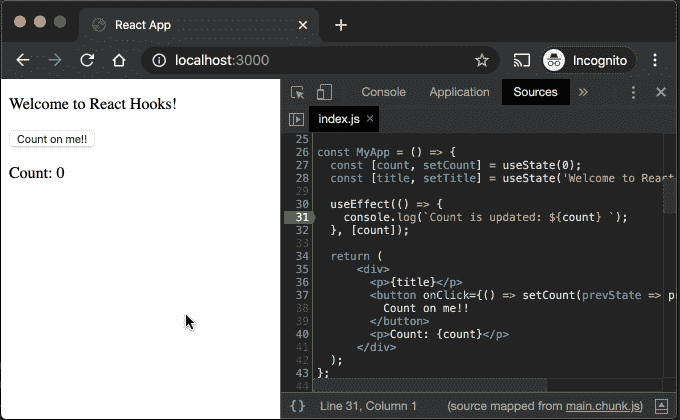
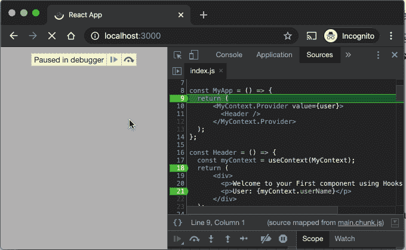
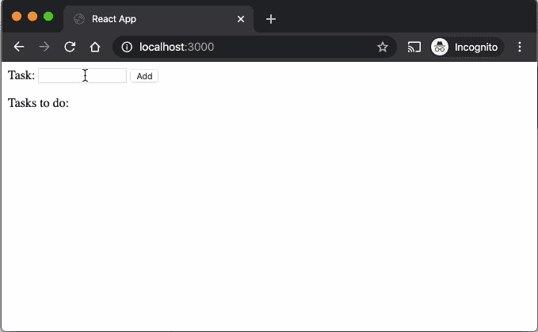
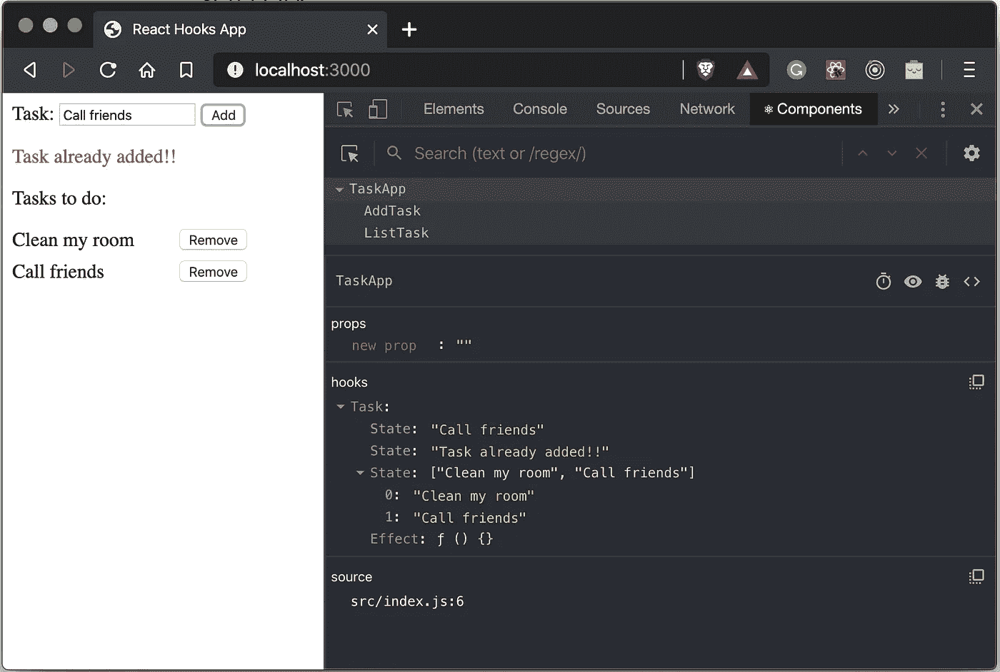

# 如何使用钩子编写一个简单的 React 应用程序

> 原文：<https://javascript.plainenglish.io/writing-a-simple-react-app-using-hooks-59fbeb56a40b?source=collection_archive---------14----------------------->



自从我开始用 React 工作以来，我有点困惑，或者更好的说法是，不太适应 **React** 处理组件的*生命周期的方式，直到我发现了**钩子！！***

***React** 发布了新的**特性**，更好的说法是一个 n***ew*******方式*** 利用 [**钩子**](https://reactjs.org/docs/hooks-intro.html) 创建函数组件自**版本 16.8** 以来，其故事完全不同，更好的一个我相信如此，而且我知道，还有**的优点****

**让我们在这里写一些代码，好吗？**

```
**import React from 'react';const MyApp = () => {

  return (
    <div>
      <p>Welcome to your First component using Hooks!!</p>
    </div>
  );
}**
```

**我知道你在想什么，**“就这样？”是的，就像这样简单，还没有钩子，但是仍然有一个更好的方法将类声明为函数组件。****

**另外，你可能会想，其他的东西呢？像 ***道具，状态，*** ***组件 DidMount* ，*组件 WillUnmount*** 之类的，我们来深入一下，首先有大量新的**钩子**，比如**使用状态**，**使用效果**，**使用上下文**，那些都是基础**钩子**，还有**

# **使用状态**

**使用**使用状态**钩子创建一些状态。**

```
**import React, { **useState** } from 'react';const MyApp = () => {
  const [count, setCount] = useState(0);
  const [title, setTitle] = useState(**'Welcome to React hooks!!'**);

  return (
      <div>
        <p>{title}</p>
        <button onClick**=**{() => setCount(prevState => prevState+1)}>
          Count on me!!
        </button>
        <p>Count: {count}</p>
      </div>
  );
};**
```

****

**As you can see, it’s very straight forward.**

**在某些情况下，您希望获得以前的状态，例如使用数组。**

```
**const [listTask, setListTask] = useState([])setListTask(prevState => prevState.filter(t => t !== task))**
```

**关于 **useState** 有一点非常重要，你可能会问，“**为什么不使用析构变量？**“相反。**

```
**setListTask(listTask.filter(t => t !== task))**
```

**嗯，你可以，但是根据我以前的经验，通过使用 **prevState** ，它看起来更安全，除了它避免了可变异对象的问题之外，更新从已经处于**状态**的东西派生的状态是非常危险的。**

# **使用效果**

**现在，谈论的是*****周期*** *的一个组件* ***，* *componentDidMount，componentWillUnmount 等。*** *对于这个我们有****use effect***，顾名思义，这是一个副作用，让我们写一些代码来更清楚一些。****

```
**import React, { useState, useEffect } from 'react';const MyApp = () => {
  const [count, setCount] = useState(0);
  const [title, setTitle] = useState('Welcome !!');

  **useEffect(() => console.log('mounted or updated'));**

  return (
      <div>
        <p>{title}</p>
        <button onClick={() => setCount(count + 1)}>
          Count on me!!
        </button>
        <p>Count: {count}</p>
      </div>
  );
};**
```

****

**As you can see, once the component is **mounted** or **update** the **effect** will be triggered.**

**但是如果你只是想在挂载之后做一些事情呢？**

```
**useEffect(() => console.log('mounted'), [])**
```

**或者一旦组件被移除？**

```
**useEffect(() => {
  return () => {
    console.log('will unmount');
  }
}, []);**
```

**太棒了，对吧？但是一旦变量发生变化，我也想做些什么。**

```
**import React, { useState, useEffect } from 'react';const MyApp = () => {
  const [count, setCount] = useState(0);
  const [title, setTitle] = useState('Welcome to React Hooks!');useEffect(() => {
    console.log(`Count is updated: ${count} `);
  }, [count]);return (
      <div>
        <p>{title}</p>
        <button 
            onClick={() => setCount(prevState => prevState + 1)}>
          Count on me!!
        </button>
        <p>Count: {count}</p>
      </div>
  );
};**
```

****

****useEffect** will be triggered once **setCount** is called via **onClick.****

**您还可以在同一个 **useEffect** 中放置另一个变量，用于 exp。[ **算一个，另一个变量** ]，但我并不极力推荐，如果可以避免，那就好了，我建议在单独的 **useEffect** 中做。**

**而不是这个:**

```
**useEffect(() => {
    console.log(**`Count is updated: `**${count});
    console.log(**`anotherVarivable is updated: `**${**anotherVarivable**});
}, [**count, anotherVarivable**]);**
```

**我宁愿这样做:**

```
**useEffect(() => {
    console.log(**`Count is updated: `**${count});
}, [**count**]);useEffect(() => {
    console.log(**`anotherVarivable is updated: `**${**anotherVarivable**});
}, [**anotherVarivable**]);**
```

**不要混淆不同的状态，这会导致非常糟糕和奇怪的事情。**

**到目前为止，一切都很好，甚至更多，总的来说你可以用 **useState** 处理大多数场景，但是让我们继续。**

# **使用上下文**

**如你所知，当你想将**数据**从**父**传递到**子**组件时，会用到上下文，但不是通过 props，把它想象成你想申请所有组件，比如**主题**、**区域设置**、**用户 ID、**等等。即使它看起来像是全局变量，但其思想是通过使用一些上下文来共享 React 组件树的公共数据。**

*****P.S*** *使用****props****向子组件传递数据没有错，但是在某些场景中，上下文只是一种更好的方法，你也应该很好地使用它，否则，你可能会遇到麻烦，要注意这一点，还有其他方法可以在没有上下文的情况下工作，比如 Redux。***

**幸运的是，我们可以使用**用户上下文钩子**来实现这个目的。**

```
**import React, { createContext, useContext } from 'react';// creating my own context.
const MyContext = createContext();// mock user data, it could come from API, etc.
const user = { userID : 12, userName: 'Test'};const MyApp = () => {
  return (
      <MyContext.Provider value**=**{user}>
        <Header />
      </MyContext.Provider>
  );
}const Header = () => {
  const myContext = useContext(MyContext);
  return (
      <div>
        <p>Welcome to your First component using Hooks!!</p>
        <p>User: {myContext.userName}</p>
      </div>
  );
};**
```

****

**下面这部分非常重要，用户**被设置到一个上下文中，它可以在组件树的任何地方被读取。****

```
**<MyContext.Provider value**=**{user}>
  <Header />
</MyContext.Provider>**
```

**我们可以通过在子组件中使用 **useContext 钩子来访问数据。****

```
**const Header = () => {
  const myContext = useContext(MyContext);
  return (
      <div>
        <p>Welcome to your First component using Hooks!!</p>
        <p>User: {myContext.userName}</p>
      </div>
  );
};**
```

**同样，没有**上下文**也有其他的方法，你可以使用 **Redux** 来代替，但是你仍然会发现是否使用它。**

# **好的，一切都好吗？但是让我们把这些碎片放在一起，让它更像一个应用程序。**

**首先，让我们在这里设置基础知识，然后我们可以前进，顺便说一下，这将是一个 **TODO** **task** app。**

**创建一个 **package.json** 文件。**

```
**{
  "name": "react-hooks",
  "version": "1.0.0",
  "private": true,
  "dependencies": {
    "react": "^16.13.1",
    "react-dom": "16.12.0"
  },
  "scripts": {
    "start": "react-scripts start",
    "build": "react-scripts build",
    "test": "react-scripts test --env=jsdom",
    "eject": "react-scripts eject"
  },
  "devDependencies": {
    "react-scripts": "latest"
  }
}**
```

**创建一个 **index.js** 文件**，**注意这一点，整个 app 都在一个文件之内，很快就会整理出来，不用麻烦！**

```
**import React, { useEffect, useState } from 'react';
import { render } from 'react-dom';const MyApp = () => {
  // create the states
  const [task, setTask] = useState('');
  const [error, setError] = useState('');
  const [listTask, setListTask] = useState([]);// once listTask changes, clean the task.
  useEffect(() => setTask(''), [listTask]);// add a task also verify duplicate task and display an error.
  const addTask = () => {
    let errorMsg = '';const taskFound = listTask.find(t => t === task);!taskFound
        ? setListTask(listTask.concat(task))
        : errorMsg = 'Task already added!!';setError(errorMsg);
  };// remove task given one.
  const removeTask = task => {
    setListTask(listTask.filter(t => t !== task));
  };// basic CSS.
  const errorStyle = {color: 'red'};
  const taskStyle = {
    width: '12em',
    display: 'flex',
    justifyContent: 'space-between',
    marginBottom: '0.5em'
  };return (
      <div>
        <label htmlFor="task">Task:&nbsp;</label>
        <input id="task" maxLength="15"
               value={task}
               onChange={(e) => setTask(e.target.value)}/>
        &nbsp;
        <button onClick={() => addTask()}>Add</button>{/* if error is valid than display it */}
        {error && <p style={errorStyle}>{error}</p>}<p>Tasks to do:</p>{/* if listTask is valid n has tasks than display them */}
        {
          listTask && listTask.map((t) => {
            return (
                <div style={taskStyle} key={t}>
                  <label>{t}</label>&nbsp;
                  <button onClick={() => removeTask(t)}>
                    Remove
                  </button>
                </div>
            );
          })
        }
      </div>
  );
};render(<MyApp/>, document.getElementById('root'));**
```

**最后但同样重要的是**index.html****

```
**<!DOCTYPE html>
<html lang="en">
<head>
    <meta charset="utf-8"/>
    <meta name="viewport" content="minimum-scale=1, initial-scale=1, width=device-width"/>
    <meta name="description" content="React HOOKs!!"/>
    <title>React Hooks App</title>
</head>
<body>
<noscript>You need to enable JavaScript to run this app.</noscript>
<div id="root"></div>
</body>
</html>**
```

****

**Then, we have it!!**

**到目前为止，一切看起来都很好，但正如我之前提到的，整个应用程序都放在文件中，这并不好，我们需要重组项目，这意味着，是时候创建**自定义挂钩了！！****

**把**定制钩子**想象成应用程序的**引擎**，或者它的 soma 部分，这个**组件**本身**应该** **而不是**过多的担心数据、处理、一些逻辑等等。让我们把它清理干净。**

**创建一个名为 **useTask.js** 的自定义**钩子****

```
**import React, { useState, useEffect } from **'react'**;export const useTask = () => { // create the states
  const [task, setTask] = useState(**''**);
  const [error, setError] = useState(**''**);
  const [listTask, setListTask] = useState([]); // once listTask changes, clean the task.
  useEffect(() => setTask(**''**), [listTask]); // add a task also verify duplicate task and display an error.
  const addTask = () => {
    let errorMsg = **''**; const taskFound = listTask.find(t => t === task); !taskFound
        ? setListTask(listTask.concat(task))
        : errorMsg = **'Task already added!!'**; setError(errorMsg);
  }; // remove task given one.
  const removeTask = task => {
    setListTask(prevState => prevState.filter(t => t !== task));
    setError(**''**);
  }; return {
    task,
    setTask,
    listTask,
    error,
    addTask,
    removeTask,
  };
};**
```

**通过这样做，组件会更干净，可读性更好，而且所有涉及任务机制的逻辑现在都是定制钩子的一部分，可以被任何其他组件重用。**

**现在，看看 MyApp 组件是什么样子的。**

```
**import React from 'react';
import { render } from 'react-dom';import { useTask } from './hooks/useTask';const MyApp = () => {
  const {
    task,
    setTask,
    listTask,
    error,
    addTask,
    removeTask
  } = useTask();// basic CSS.
  const errorStyle = {color: 'red'};
  const taskStyle = {
    width: '12em',
    display: 'flex',
    justifyContent: 'space-between',
    marginBottom: '0.5em'
  };return (
      <div>
        <label htmlFor="task">Task:&nbsp;</label>
        <input id="task" maxLength="15"
               value={task}
               onChange={(e) => setTask(e.target.value)}/>
        &nbsp;
        <button onClick={() => addTask()}>Add</button>{/* if error is valid than display it */}
        {error && <p style={errorStyle}>{error}</p>}<p>Tasks to do:</p>{/* if listTask is valid n has tasks than display them */}
        {
          listTask && listTask.map((t) => {
            return (
                <div style={taskStyle} key={t}>
                  <label>{t}</label>&nbsp;
                  <button onClick={() => removeTask(t)}>
                    Remove
                  </button>
                </div>
            );
          })
        }
      </div>
  );
};render(<MyApp/>, document.getElementById('root'));**
```

**但仍然有一些重构的空间，所以，首先让我们创建一个名为 **AddTask.js** 的组件，并移动**标签**、**输入**和添加**按钮**。**

```
**import React from **'react'**;export const AddTask = props => {
  const {task, setTask, addTask} = props; return (
      <div>
        <label htmlFor**="task"**>Task:&nbsp;</label>
        <input id**="task"** maxLength**="15"** value**=**{task}
               onChange**=**{(e) => setTask(e.target.value)}/>
        &nbsp;
        <button onClick**=**{() => addTask()}>Add</button>
      </div>
  );};**
```

**现在，我们需要创建另一个名为 **ListTask.js** 的组件，并从列表任务中移除所有部分。**

```
**import React from **'react'**;export const ListTask = props => {
  const {listTask, removeTask} = props; // task list css.
  const taskStyle = {
    width: **'12em'**,
    display: **'flex'**,
    justifyContent: **'space-between'**,
    marginBottom: **'0.5em'** }; return (
      <div>
        <p>Tasks to do:</p> {
          listTask && listTask.map(task => {
            return (
                <div style**=**{taskStyle} key**=**{task}>
                  <label>{task}</label>&nbsp;
                  <button onClick**=**{() => removeTask(task)}>
                    Remove
                  </button>
                </div>
            );
          })
        }
      </div>
  );};**
```

**很酷不是吗？，现在好多了，所以，让我们再看看**的 MyApp** ，看看变化后的样子。**

```
**import React from 'react';
import { render } from 'react-dom';import { useTask } from './hooks';
import { AddTask, ListTask } from './component';const MyApp = () => {
  const {
    task,
    setTask,
    listTask,
    error,
    addTask,
    removeTask
  } = useTask(); // error css
  const errorStyle = {color: 'red'}; return (
      <div> <AddTask
            task={task}
            setTask={setTask}
            addTask={addTask}
        /> {/* if error is valid than display it */}
        {error && <p style={errorStyle}>{error}</p>} <ListTask
            listTask={listTask}
            removeTask={removeTask}
        /> </div>
  );
};render(<MyApp/>, document.getElementById('root'));**
```

**确实非常好，但仍然有一些事情留下来，通常 **index.js** 是应用程序的入口点，并不做那么多，所以让我们创建一个名为 **TaskApp.js、**的主要组件，这样 MyApp 就不会再被使用了。**

```
**import React from **'react'**;
import { render } from **'react-dom'**;import { useTask } from **'./hooks'**;
import { AddTask, ListTask } from **'./component'**;export const TaskApp = () => {
  const {
    task,
    setTask,
    listTask,
    error,
    addTask,
    removeTask
  } = useTask(); // error css
  const errorStyle = {color: **'red'**}; return (
      <div> <AddTask
            task**=**{task}
            setTask**=**{setTask}
            addTask**=**{addTask}
        /> {/* if error is valid than display it */}
        {error && <p style**=**{errorStyle}>{error}</p>} <ListTask
            listTask**=**{listTask}
            removeTask**=**{removeTask}
        /> </div>
  );
};**
```

**最后， **index.js** 将仅在此处恢复。**

```
**import React from **'react'**;
import { render } from **'react-dom'**;import { TaskApp } from **'./TaskApp'**;render(<TaskApp/>, document.getElementById(**'root'**));**
```

**就这样，还在工作，但是更干净，更容易维护。**

****

**如果你有任何问题或疑问，让我知道，我很想知道其他方式与挂钩。**

**在这里查看运行[的应用](https://gbrivate.github.io/react-hooks/)以及 Github [库](https://github.com/gbrivate/react-hooks)**

## ****用简单英语写的 JavaScript 的注释****

**我们已经推出了三种新的出版物！请关注我们的新出版物:[**AI in Plain English**](https://medium.com/ai-in-plain-english)[**UX in Plain English**](https://medium.com/ux-in-plain-english)[**Python in Plain English**](https://medium.com/python-in-plain-english)**——谢谢，继续学习！****

****我们也一直有兴趣帮助推广高质量的内容。如果您有一篇文章想要提交给我们的任何出版物，请发送电子邮件至[**submissions @ plain English . io**](mailto:submissions@plainenglish.io)**，并附上您的 Medium 用户名，我们会将您添加为作者。另外，请让我们知道您想加入哪个/哪些出版物。******