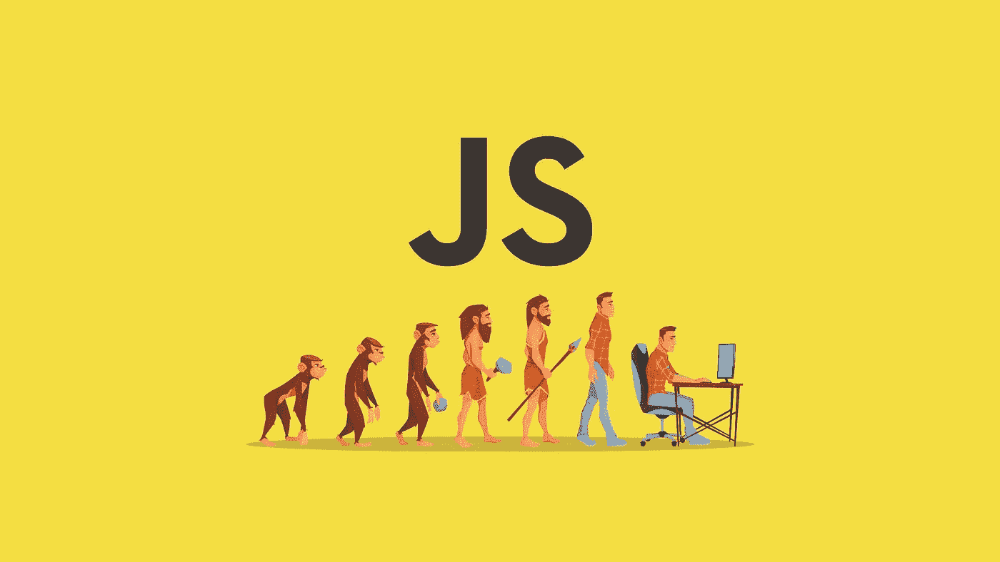

# 如何在 JavaScript 中创建滑块

> 原文：<https://javascript.plainenglish.io/writing-a-slider-in-javascript-learning-web-development-in-practice-ea4862dce85a?source=collection_archive---------1----------------------->

## 在实践中学习 Web 开发

像你们中的许多人一样，我相信在实践中学习 web 开发比光秃秃的理论更有效:一切都很清楚，在开发过程中获得的解决方案可以用于未来的项目。这就是为什么我准备了一个教程来创建一个简单的图像滑块，并解释了每个步骤。

这是最终版本的样子:

**注意:**这篇文章只是对前端开发世界的一个小小探索，因为现代网络并不局限于对 *HTML / CSS / JavaScript* 的了解。要成为一名受欢迎的 web 开发人员，您需要掌握额外的库和框架，这些库和框架通常在前端和后端之间严格划分。

# 你需要什么？

你可以马上下载一个像 WebStorm 这样的 IDE，但是当你从头开始学习 web 开发时，你也可以从在线编辑器开始。我们将使用 [CodePen](https://codepen.io/) ，这是一个为网络开发者提供即时结果的流行在线编辑器。但是如果你已经开始在任何其他环境中工作，并且认为这样更方便，只要确保有 HTML / CSS / JavaScript 支持就行了。

# 编写代码

在各种 [web 开发课程](https://www.pitman-training.com/our-courses/software-web-development/web-development-courses/)中，对前端的熟悉始于对主要技术的描述，即:

*   HTML 是一种超文本标记语言，用于编写网站的“框架”。如果用房子来类比，那么这就是框架。粗略地说，你构建了标记，设计就落在它上面了。
*   CSS —层叠样式表或者完全相同的设计。让我们回到房子的例子:在建造后，它需要重新装饰，粉刷，变得像样，它是描述网站外观的 CSS。
*   **JavaScript** 是一种提供功能的编程语言。你可以和家里的东西互动——开灯、开关电器、水等等。类似地，您可以通过点击按钮、悬停在图像上以及填写表单来与站点进行交互。JavaScript 处理所有这些交互，并且像脚本语言一样，它可以提供规则和逻辑来确定接下来应该发生什么。

# 超文本标记语言

你应该从 HTML 开始学习 web 开发，因为这是网站的骨架。每个 HTML 文档都有一个标准的结构:

但是在我们的例子中，不需要指定整个页面的结构，因为我们正在使用一个单独的组件，它将被放置在标签`<body></body>`之间。这里的一切都很简单:我们有主块(标签`
`)，它是一个父块，包含另外三个带有不同图片的块——未来的幻灯片:

请注意，每个标签`
`都有自己的类。CSS 样式将应用于这些类。在标签中，``我们指出了将要显示的那些图像的链接。在“onclick”属性中，我们通过将点击动作绑定到按钮来引用特定的 JavaScript 函数。

# 半铸钢ˌ钢性铸铁(Cast Semi-Steel)

在级联样式中，我们设置宽度、高度、位置、颜色和动画。在我们的例子中，我们分别处理 slider 容器，分别处理被指定为 item、buttons 的图像容器，为它们添加背景并制作幻灯片动画:

我们可以在编辑器中试验所有的值。如果你对任何属性有疑问，就删除它，看看有什么变化。

# Java Script 语言

一个只接受 HTML 和 CSS 培训的 web 开发人员更像是一个 web 设计师。我们正在转向主要的前端语言，它能够为可视化解决方案注入活力:

但是不要忘记 JavaScript 并不是唯一的:现代的库和框架可以简化开发并改进 web 组件的功能。例如，Bootstrap 允许您更快地创建网站，甚至一个开发新手也可以使用该框架创建工作布局。你也可以用纯 HTML / CSS 编写一个 slider 来训练你在布局和层叠样式表方面的技能。

本课给出的例子非常简单，旨在展示标准 HTML、CSS 和 JavaScript 交互的可能性。

# 图像滑块就绪

滑块的最终版本使用了几幅图片，两个悬停时背景发生变化的按钮，以及平滑过渡动画。从我们的例子中可以看出，web 开发培训可以基于实践:这不仅能激发兴趣，还能让你随意试验、改进、改变组件的功能，同时补充知识和技能。

现在，您可以尝试其他实施方式，继续使用其他工具，如 Bootstrap:

依靠这个项目中的代码，您可以更努力地练习滑块，获得额外的效果:

# 后端和附加功能

如果你在我们现有的基础上添加一个后端，你可以使用 API 来使用来自其他资源的图像，例如 Instagram，或者将所有图像存储在你的数据库中，而不用担心图像会被删除，外部链接会变得无关紧要。

> *但光靠实践不行:不要忘记学习理论，以免在难题上拖延很久。为此，书籍或视频是合适的。从零开始的 Web 开发课程也是理论和实践相结合的好方法。*