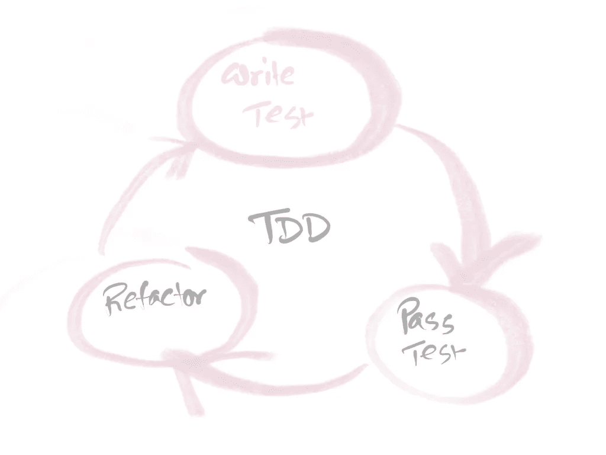

# 在 JavaScript 中用 TDD 编写更好的 GET 请求

> 原文：<https://javascript.plainenglish.io/writing-better-http-get-requests-with-tdd-in-javascript-daef16d9ead?source=collection_archive---------10----------------------->

## 以测试驱动的开发方式编写代码


Photo by [Atik sulianami](https://unsplash.com/@atik1616?utm_source=unsplash&utm_medium=referral&utm_content=creditCopyText) on [Unsplash](https://unsplash.com/s/photos/network?utm_source=unsplash&utm_medium=referral&utm_content=creditCopyText)

测试驱动开发也称为 TDD 是一种软件开发方法，在这种方法中，您必须在编写任何功能代码之前编写测试。



Demonstration of TDD. Failed test → Pass Test → Refactor

## 概观

这里我们有一个 GET API:

```
url = "https://jsonplaceholder.typicode.com/photos"
```

它返回如下所示的对象数组:

```
[
  {
    "albumId": 1,
    "id": 1,
    "title": "accusamus beatae ad facilis cum similique qui sunt",
    "url": "https://via.placeholder.com/600/92c952",
    "thumbnailUrl": "https://via.placeholder.com/150/92c952"
  },
  {
    "albumId": 1,
    "id": 2,
    "title": "reprehenderit est deserunt velit ipsam",
    "url": "https://via.placeholder.com/600/771796",
    "thumbnailUrl": "https://via.placeholder.com/150/771796"
  }
]
```

我们将创建一个 API 管理器类，它在内部使用 [**Axios**](https://github.com/axios/axios) 来实现 REST。

我们必须创建一个名为 **ApiManager.js** 的类和相应的名为 **ApiManager.test.js** 的测试文件

## 编写基本测试和类对象

让我们从编写一些测试开始。假设我们的 ApiManager 类需要用某个 url 实例化，并且 apiManagerInstance 有一个名为 url 的属性要用构造函数实例化。

```
import ApiManager from "./ApiManager";describe('ApiManager Construction test', () => {

 const mockURL = "https://mockurl.com"; //
 let instance = new ApiManager(mockURL);

 it("instance url property set properly",()=>{
    expect(instance.url).toEqual(mockURL)
 })})
```

测试显然会失败，因为我们在 **ApiManager.js.** 中什么都没有

让我们编写代码来通过 **ApiManager.js.** 中的测试

```
export default class ApiManager{

 constructor(url){
     this.url = url
 }}
```

现在我们的测试通过了，是时候重构实际的实现了。似乎一切都很好。所以没什么可重构的。

## 使用测试驱动开发获取方法实现

现在我们的 ApiManager 将有一个 getPhotos 方法，该方法将返回一个包含来自对象的必要数据的照片数组。对于我们的例子，我们只需要来自对象{相册 id，url }的两个字段

场景将会是这样的

*   ApiManager 将有一个名为 **getPhotos** 的方法
*   getPhotos 将使用 **instance.url** 调用 axios get 方法
*   getPhotos 将从 axios.get 返回的对象数组中返回包含**{相册 id，url }** 的数组。
*   如果 axios.get 返回错误，getPhotos 将**抛出**错误

## 设置

```
describe('getPhotos method Test', () => {

  const mockURL = "https://mockurl.com";
  let instance = new ApiManager(mockURL); // Our Test cases will Goes Here !!!!
}
```

## 场景 1 : ApiManager 将有一个名为 getPhotos 的方法

```
it(“getPhotos method defined”,()=>{
  expect(instance.getPhotos).toBeDefined();
})
```

要通过这种情况，编写一个名为 getPhotos 的方法

```
getPhotos(){}
```

现在测试通过了。👌

## 场景 2 : getPhotos 将使用 instance.url 调用 axios get 方法

```
it(“getPhotos will call axios.get method with instance.utl”,()=>{

  jest.spyOn(Axios,”get”) // Axios get need to be spied by Jest 

  instance.getPhotos(); //
  expect(Axios.get).toHaveBeenCalledWith(instance.url);})
```

向右失败。别担心。让我们超过他们

```
getPhotos(){
  Axios.get(this.url)
}
```

现在它又要过去了，✔️。

## 场景 3 : getPhotos 将返回{相册 id，url }的数组

```
it("getPhotos will return proper array of object for axios mock response",async ()=>{ const mockPhotos = [{ 
  "albumId": 1,
  "id": 1,
  "title": "accusamus beatae ad facilis cum similique qui sunt",
  "url": "https://via.placeholder.com/600/92c952",
  "thumbnailUrl": "https://via.placeholder.com/150/92c952"},
 { 
  "albumId": 1,
  "id": 2,
  "title": "reprehenderit est deserunt velit ipsam",
  "url": "https://via.placeholder.com/600/771796",
  "thumbnailUrl": "https://via.placeholder.com/150/771796"
}]
const expectedResponse =[ {
 "albumId": 1,
 "url": "https://via.placeholder.com/600/92c952",
 },
{
 "albumId": 1,
 "url": "https://via.placeholder.com/600/771796",
}] jest.spyOn(Axios,"get").mockResolvedValueOnce(mockPhotos);
 const response = await instance.getPhotos();
 expect(response).toEqual(expectedResponse);})
```

让我们通过这个

```
getPhotos(){
 return  new Promise((resolve,reject)=>{
    Axios.get(this.url).then(response=>{
       const filterArr = response.map(item=> {
           return {
                "albumId": item.albumId,
                "url": item.url
                }
        })
       resolve(filterArr)
 }).catch(error=>{

 })});}
```

太棒了，现在一切都好了。对吗？🤘

## 场景 4:如果 axios.get 返回错误，getPhotos 将抛出错误

```
it("getPhotos will throw error if axios.get return error",async ()=>{
 const mockError = {
    error:{
       msg:"Something Wrong"
    }
 } jest.spyOn(Axios,"get").mockRejectedValueOnce(mockError);
 await instance.getPhotos().catch(error=>{
 expect(error.error.msg).toEqual("Something Wrong")
 });})
```

让我们通过只添加一行来解决这个问题，即**拒绝(错误)**在 catch 块内。

```
getPhotos(){
 return  new Promise((resolve,reject)=>{
    Axios.get(this.url).then(response=>{
       const filterArr = response.map(item=> {
           return {
                "albumId": item.albumId,
                "url": item.url
                }
        })
       resolve(filterArr)
 }).catch(error=>{
       reject(error) // only add this
})});}
```

现在已经过去了，对吗？✔️

值得称赞。通过采用测试驱动开发，我们有了 HTTP GET 的完整实现。👍🏻

注意:如果需要的话，记得在通过测试用例之后进行重构。

# 感谢阅读！🍻

## 简单英语的 JavaScript

喜欢这篇文章吗？如果有，通过 [**订阅我们的 YouTube 频道**](https://www.youtube.com/channel/UCtipWUghju290NWcn8jhyAw) **获取更多类似内容！**