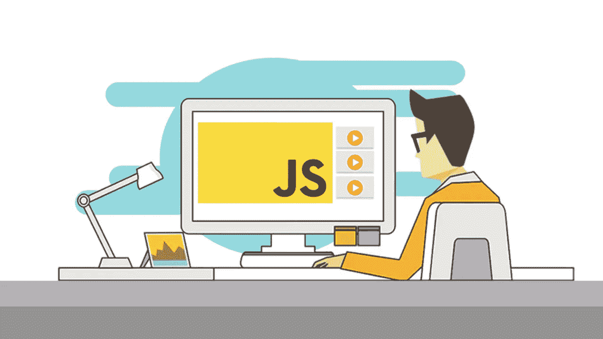

# 编写防御性 JavaScript

> 原文：<https://javascript.plainenglish.io/writing-defensive-javascript-c6d42940d30f?source=collection_archive---------2----------------------->



## 你会听到很多程序员开玩笑说 JavaScript 不是“真正的”编程语言。

除了没有基于类的继承系统，JS 也是动态类型的，不像 C#，Java，Scala…你知道，所有那些真正的编程语言。但是速度，灵活性和易用性是我们写 JS 的原因！该死的类型！

当然，JS 提供的灵活性是有代价的，如果您使用的是 Typescript，其中一些可能会被忽略，但是在编写代码时使用下面的防御策略可以为您节省一个讨厌的 bug(这也押韵，所以您知道这是真的😉).

# **使用默认参数**

如果你有一个依赖于某个参数的函数，那么你应该考虑在你的函数签名中使用默认参数。

```
const addNameToNameArray = (name, nameArray) => {
  if(name.length){
   nameArray.push(name)
  }
  return nameArray
}
```

够简单吧？我们取一个名字和一个名字数组，然后简单地将名字添加到数组中，如果数组中有名字的话。然而，我们在这里做了一些假设，这个名字将是一个具有`length`属性的类型，并且我们的`nameArray`将是一个数组。如果这些条件中的任何一个得不到满足，我们将会惨败。

```
const addNameToNameArray = (name = '', nameArray = []) => {
  if(name.length){
   nameArray.push(name)
  }
  return nameArray
}
```

啊，好多了。现在我们可以晚上睡觉了，因为知道这个无用的函数一旦被部署就不会中断生产，即使它是用一个丢失的参数调用的。

# **使用对象作为参数**

你的团队有一个很好的小函数，接受 3 个参数，用它做一些简单的逻辑，从第三方服务获取一些数据。但那是过去的事了，现在这个小函数几乎认不出来了，并且有 6 个参数传递给它。现在，通常一个论点多于，我不知道，比如说 3 个论点，会有一股代码味，但有些时候你无法避免。

```
const createUser = (name, date, profileId, dataId, dataType, apiKey) => {
  const user = {
   name,
   profileId
  }; const formattedDate = moment(date).unix();
  thirdPartyAPI.fetch(user, formattedDate, dataId, dataType, apiKey)
}createUser('Bob', '04/20/20', 1, 123, 1234, 'story', 'abc123')
```

像这样的函数的危险在于参数的顺序很重要，如果其中任何一个不正确，我们就有破坏 API 调用的风险。更多的论点，意味着更多的犯错空间。几乎不可避免的是，一些开发人员会调用这个函数，`profileId`将取代`dataId`。这不会破坏你的程序，因为它们都可能是数字或字符串，但是它们不正确的顺序会从 API 中给你错误的数据，或者更糟，就是不能工作。

```
const createUser = ({name, date, profileId, dataId, dataType, apiKey}) => {
  const user = {
   name,
   profileId
  };const formattedDate = moment(date).unix();
  thirdPartyAPI.fetch(user, formattedDate, dataId, dataType, apiKey)
}createUser({
  name: 'Bob',
  date: '04/20/20',
  profileId: 1,
  dataId: 123,
  dataType: 'story'
  apiKey: '123abc'
})
```

嘣。使用对象，我们实际上减少了开发人员的认知负担，并确保我们的参数是显式设置的。对于超过 4 个参数的函数，我觉得必须使用一个对象。

# **可选链接**

我们在 JavaScript 中处理了很多对象。许多人错误地认为 JavaScript 中的一切都是对象，这是众所周知的。嗯，这并不完全正确，但我们确实经常与他们和他们的属性打交道，如果不小心的话，挖掘有用的信息可能会很痛苦，而且有点危险。

```
const hat = user.outfit.hat;
```

无害对吗？嗯，如果我们的用户对象没有属性`outfit`或者属性是`undefined`，那么我们就有问题了。

```
TypeError: Cannot read property 'hat' of undefined
```

现在，确保我们不会出现这种错误的第一步是在每一层检查下一个属性是否存在，这样我们就会陷入编写不性感的代码

```
const hat = user && user.outfit && user.outfit.hat || 'hat';
```

我们觉得写这个有点悲伤，而且一点也不性感。幸运的是，借助 Babel 的力量，JS 开发人员可以利用 Ruby 和 Coffeescript 开发人员多年来拥有的优势:可选链接

```
const hat = user?.outfit?.hat || 'hat'
```

嗯，令人满意。现在，如果我们的遍历在任何一点失败，我们的操作将短路并返回`undefined`。代码更安全，可读性更好。

# **最好的进攻就是良好的防守**

对我来说，写很多防御性的 JavaScript 只是简单地设置逻辑安全措施来保护你的代码免受你可能不期望但会接受的输入。希望这些建议能防止你在周六凌晨 3 点被叫醒去修复产品中的一个 bug！