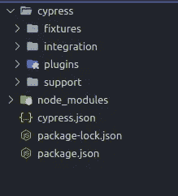
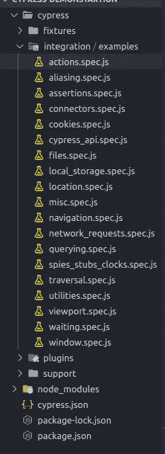

# 与赛普拉斯的写作整合测试

> 原文：<https://javascript.plainenglish.io/writing-integration-test-with-cypress-280ae0f7abaf?source=collection_archive---------6----------------------->

Cypress 是一个为现代 web 构建的开源测试运行程序，它使得集成测试比以前更容易和更快，在 cypress 的帮助下，您可以测试任何类型的 web 应用程序。Cypress 直接与 DOM 交互，这使得它独立于应用程序使用的 web 框架。

## **为什么集成测试很重要？**

集成测试有助于模拟用户的旅程，它有助于检测用户使用应用程序时发生的错误。编写集成测试有很多好处，比如。

*   它确保了集成模块按预期正常工作。
*   一旦待测模块可用，测试仪就可以开始测试。
*   通常覆盖了系统的很大一部分，因此效率更高。
*   增加测试覆盖率并提高测试的可靠性。

在本文中，我将分享如何使用 cypress 设置、编写和运行测试，为了演示的目的，我们将测试一个用 react 编写的 TODO list 应用程序。

这篇文章是给初学者的，所以我已经详细讲解了每一步。

**柏树先决条件**

*   需要 JavaScript 或 TypeScript 的基本知识。
*   必须在您的系统中安装节点版本> 10

**设置赛普拉斯测试的反应应用程序**

1.  从[这里](https://github.com/aniketchanana/react-todo-app)下载 react app 的源代码。
2.  运行 npm install 下载与应用程序相关的所有依赖项。
3.  运行 npm start 在端口 3000 启动本地服务器。

现在，您的 react 应用程序已在[上启动并运行，http://localhost:3000/](http://localhost:3000/) 因此，让我们不要浪费任何时间，直接进入主要内容。

**立柏**

1.  使用`npm init`创建一个空项目。
2.  使用
    `npm install cypress --save-dev`命令将柏树保存为开发依赖项。
3.  使用
    `npm install mocha --save-dev`命令将摩卡保存为开发依赖项
4.  使用
    `npm install chai --save-dev`命令将 chai 保存为开发依赖项
5.  要使用命令`npx cypress open`运行 cypress，您也可以在 package.json 的脚本部分添加以下命令。

您的 package.json 将如下所示

现在运行命令`npm run cypress:open`

运行此命令将打开一个柏树测试运行程序，并将在你的项目下的柏树文件夹下创建一些样板代码。

在集成文件夹下，您可以看到以下文件。

这些是 cypress 给出的一些例子，你可以在 cypress test runner 中使用这些例子，或者你可以访问 [this](https://example.cypress.io/commands/actions) 站点来查看这些例子的文档。

## 用 Cypress 编写我们的第一个测试

由于我们要编写自己的测试用例，我们将使用我们最初下载的待办事项应用程序。

1.  在集成文件夹下创建一个名为 todoapp 的文件夹。
2.  创建一个名为 actions.spec.js 的文件，该文件包含与我们的 TODO 应用程序相关的所有测试。

在 Cypress 中，我们有一个描述块，也称为测试套件，其中包含各种 it 块，it 块也称为测试用例，测试用例包含可能为真或假的断言。如果我们的断言为真，我们的测试就成功通过，否则就会失败。

## **“描述”与“它”**

`describe`块接受两个参数

1.  描述测试套件的字符串。
2.  一个回调函数，它运行所有的**并逐个阻塞其中的**。

`it`块也接受 2 个参数

1.  描述测试用例的字符串
2.  一个回调函数，一个接一个地运行里面所有的 **cypress 命令**。

## **第一个测试套件测试添加待办事项功能**

在上面的代码中，我们将具有 name 属性的输入作为输入我们的文本的任务，然后定位并单击 add todo 按钮。在我们使用 contains 命令放置断言之后，它会向列表中添加一个 todo 项，该命令检查 ul 是否包含带有输入文本的元素。

## **测试删除待办事宜功能**

不需要编写另一个测试套件(描述块)来测试它，因为这属于 todo 应用程序的操作，所以我们可以在前面的描述块中编写这个 it 块。

第二，它阻止对待办事项列表的删除功能的测试。它首先获得列表项目的计数，然后单击待办事项应用程序中的删除图标，然后再次检查某个项目是否被删除。如果没有，则期望这里是来自 chai 库的断言。

## **测试编辑待办事宜功能**

此功能也属于 todo 应用程序的操作，因此对于这一个，我们也将在同一个 describe 块中编写它

最后，它块我们已经限制了`cy`使用 within 命令的范围到最后一个 todo 项，所以从现在开始`cy.get`将从最后一个 Todo 项块开始搜索元素。

本文涵盖了 cypress 的基本命令和用法，详细解释了每个命令的用法，访问 cypress [官方网站](https://docs.cypress.io/)。

感谢您的宝贵时间，我希望您喜欢阅读这篇文章，
我将在其他文章中介绍 JavaScript 应用程序的测试，该应用程序包含使用 cypress 的 API 调用。

喜欢这篇文章吗？如果有，通过 [**订阅获取更多类似内容解码，我们的 YouTube 频道**](https://www.youtube.com/channel/UCtipWUghju290NWcn8jhyAw) **！**