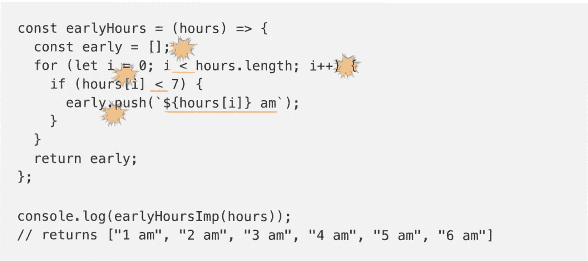

# 使用功能模式编写有弹性的、牢不可破的代码

> 原文：<https://javascript.plainenglish.io/writing-resilient-unbreakable-code-using-functional-patterns-bcd63d28ac1e?source=collection_archive---------2----------------------->

## 抽象的质量取决于其单元的质量


Image by [Edi Nugraha](https://pixabay.com/users/EdiNugraha-30562/?utm_source=link-attribution&utm_medium=referral&utm_campaign=image&utm_content=102840) from [Pixabay](https://pixabay.com/?utm_source=link-attribution&utm_medium=referral&utm_campaign=image&utm_content=102840)

刚毕业的学生，从编码营招募的新人，以前的 Java/Perl/Ruby/Python 程序员倾向于用命令式风格写作。这没有错，我也是一样。我记得有时某些数据转换函数嵌套了大量的条件逻辑，几个月后我都无法推理出自己的代码。调试是一场噩梦。然后我读了函数式编程，它改变了我写代码的方式。

## 一个例子

我们将编写一个简单的函数，它接受一个数字数组，并将小于 7 的值作为一个新的格式化字符串数组返回。如果你的函数看起来像这样，你并不孤单。

```
const earlyHours = (hours) => {
  const early = [];
  for (let i = 0; i < hours.length; i++) {
    if (hours[i] < 7) {
      early.push(`${hours[i]} am`);
    }
  }
  return early;
};console.log(earlyHoursImp(hours));
// returns ["1 am", "2 am", "3 am", "4 am", "5 am", "6 am"]
```

它工作了。那问题是什么？

势在必行。你是在告诉计算机明确的指令去做这个，加这个，做那个等等。命令式代码充满了潜在的错误点。它依赖于状态突变。earlyHours()函数需要两个临时状态值来进行计算。，两者都是多次变异。“*I”*在每次循环中初始化并递增。“*早期”*也是以增量方式初始化和构建的。查看下图。请注意由爆炸和下划线标注的部分。



这里大概有七个潜在的漏洞。

## 纯函数

使用函数式风格的第一步是学习编写纯函数。纯函数具有以下性质:

*   它们是 100%可预测的。对于给定的一组输入参数，返回值总是**与**相同。

```
const sum = (a, b) => a + b;
```

*   它不会访问或改变其范围之外的任何东西。

```
// These are not cool inside a pure function
locaStorage.getItem("name"); 
locaStorage.setItem("name", "me");
fetch("/api/items");
window.addEventListener(...
location.assign(...
```

*   它不会改变它的函数参数。

```
// do not modify the input values
const getNewOnes = list => {
  list.forEach(list => **list.id =** "id-" + list.num);
  return list.filter(list => list.num > 5);
}
```

*   返回值总是数据的新副本。这意味着您不能返回仍然引用输入参数中的属性的对象

```
// person = {
//  name: "Me",
//  address: { "city": "San Jose", state: "CA"}
// }const getAddressTheWrongWay = person => {
  return { address: person.address };
  // address is pointing to the argument's property
}const getAddressTheRightWay = person => {
  return { address: {...person.address} };
  // spread operator clones the properties
}
```

使用纯函数作为设计的基础给你的设计带来了一个重要的品质:**不变性**。这意味着突变只会发生在明确指定的地方，不会有任何意外。

## 功能风格

说到列表的数据转换，我们必须掌握三种方法。映射、过滤和减少。我们的函数可以重写如下:

```
const earlyHours = 
  (hours) => hours.filter(h => h < 7).map(h => `${h} am`);
```

这里没有临时状态变量，只有两个潜在的错误点，一个在比较中，另一个在模板字符串中。

map 和 filter 等功能性工具经过时间考验，迭代在内部处理。还要记住， *forEach* 仍然是必不可少的，因为为了有效，它需要在其作用域之外改变状态。

## 代码表面区域

为了好玩，我在 [codepen](https://codepen.io/rajeshnaroth/pen/WNrjybX) 上截图了两个功能，测量了它们占用的空间。

```
Imperative: 473 x 245 = 115885 pixelsFunctional: 890 x 30 = 267000 pixels
```

使用函数式风格，您可以将代码表面减少到原来的 23%。你的代码越少，出错的几率就越低。

# 进一步提高代码质量

但是仅仅采用更好的模式就足够了吗？还有什么能让你的功能牢不可破？

## 添加输入验证

如果函数的输入无效怎么办？该功能将崩溃。在这个例子中，您可以使用 JavaScript 的**可选链接**来防止错误输入。

```
// returns undefined if input is not an array
const earlyHours =
  hours**?.**filter?.(h => h < 7).map(h => `${h} am`)
```

## 向函数参数添加默认值

如果适用，应该对函数参数使用默认值。这可以在大多数情况下消除不必要的空/未定义检查。

```
const earlyHours = 
  (hours = []) => hours?.filter(h => h < 7).map(h => `${h} am`);
```

## 返回有意义的空值

我建议返回有意义的空值，如`、{}或[]，而不是 null 和 undefined。这意味着函数的调用者可以安全地使用字符串和数组函数，而不必担心未定义的错误。

```
const earlyHours = 
  (hours) => hours?.filter(h => h < 7).map(h => `${h} am`) || [];
```

## 单元测试

希望你的项目有一个测试框架。您可以非常容易地对纯函数进行单元测试。

```
// using expect BDD assertions
expect(earlyHoursImp([1, 2, 3])).to.eql(["1 am", "2 am", "3 am"])
```

您可以为更多类似这样的场景添加测试。

## 静态打字

使用 TypeScript 进行静态类型化可以防止函数被不正确地调用。

```
const earlyHours = 
  (hours**: number[]**) => hours.filter(h => h < 7).map(h => `${h} am`) || [];
```

这使得除了数字数组之外，无法调用其他函数。运行时不存在 TypeScript，因此不会保护您免受类型不兼容的影响。

你可以在这里玩 code sandbox:【https://codepen.io/rajeshnaroth/pen/WNrjybX

## 使用功能实用程序库

除了 map、reduce 和 filter 之外，还有几个实用程序可以帮助您使用函数式编程风格。 [lodash](https://github.com/lodash/lodash/wiki/FP-Guide) 和 [ramda](https://ramdajs.com/docs/) 是两个非常受欢迎的库。我喜欢 ramda 的 API 设计。作为家庭作业，我建议你研究一下*合成、管道、展平、拾取、查找*等功能。

命令式代码是必不可少的，否则你将只有一个静态的网站。您的应用程序需要根据用户/浏览器/网络事件从一种状态转换到另一种状态。JavaScript 的伟大之处在于它支持这两种风格。

# 摘要

1.  编写纯函数
2.  使用功能模式，如映射/减少/过滤/合成
3.  添加输入验证。
4.  在参数中使用默认值
5.  返回空对象，而不是 null 或 undefined
6.  编写单元测试
7.  使用静态类型

要构建高质量的抽象，用弹性的、可组合的单元来构建它们。这些建议可以帮助你实现这一点。