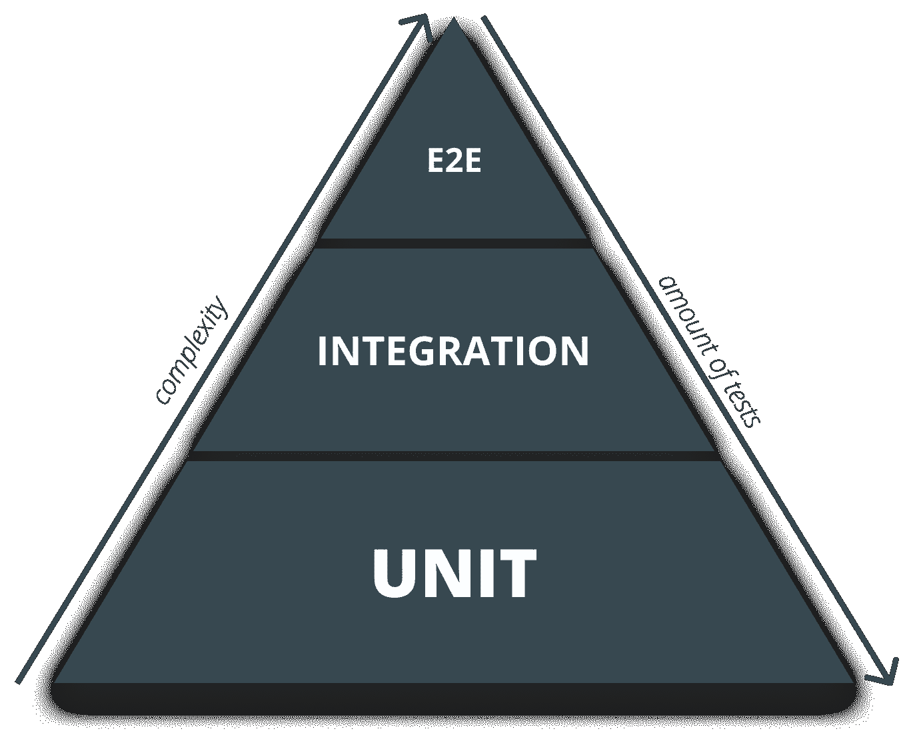
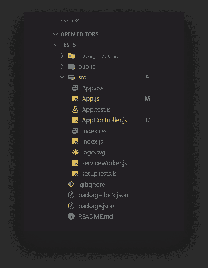
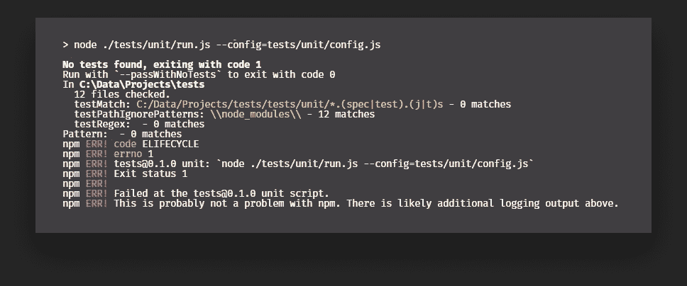
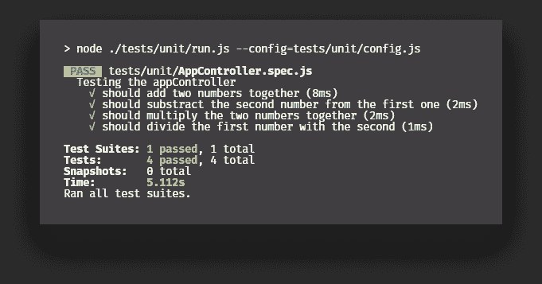
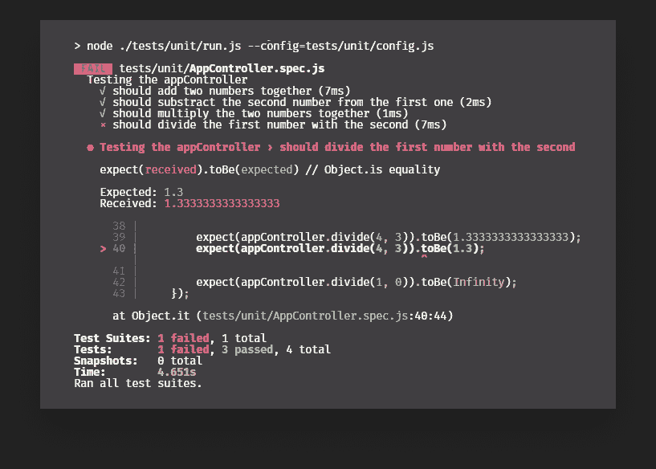
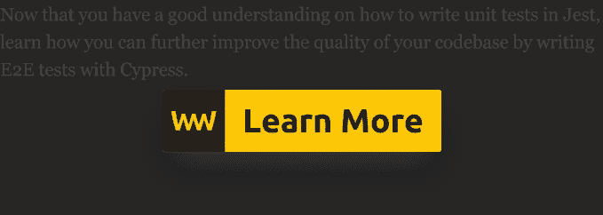

# 用 Jest 编写你的第一个单元测试

> 原文：<https://javascript.plainenglish.io/writing-your-first-unit-test-with-jest-b4953dabb931?source=collection_archive---------0----------------------->

## 如何提高 React 组件的代码质量

Photo by [Ferenc Almasi](https://unsplash.com/@flowforfrank?utm_source=unsplash&utm_medium=referral&utm_content=creditCopyText) on [Unsplash](https://unsplash.com/@flowforfrank?utm_source=unsplash&utm_medium=referral&utm_content=creditCopyText)

单元测试是任何大型应用程序的重要组成部分。他们的主要工作是覆盖最小的单元，比如单个的函数或方法。本质上，是代码中最小的可测试组件。他们测试他们是否按预期工作。

编写好的单元测试并不像有些人想的那样显而易见。例如，测试什么和不测试什么并不总是很清楚。你应该如何测试那些你应该测试的？它容易被其他人阅读和理解吗？或者几个月后被你发现？—在编写单元测试时，您可能需要回答这些问题。

# 好的单元测试有什么特点？

在编写任何单元测试之前，我们需要知道哪些事情是我们需要记住的，以便使它们变得更好。

首先，正如前面提到的，好的单元测试不会测试显而易见的东西。例如，你不应该测试不是你自己写的代码。测试框架功能性— *在 React* 的情况下测试生命周期方法——只是浪费时间。这超出了范围，不应该是你的责任。

最好是，他们应该测试代码中最小的可测试组件:函数或方法。纯函数是最好测试的。如果您需要为给定的测试编写大量的模拟，那么您很可能不需要单元测试。相反，它可以被集成或验收测试所覆盖。

同样重要的是要提到，你为单元测试编写的测试数量将会比你为集成编写的数量多。单元测试和验收测试在数量上的差异会更大。

The testing pyramid which shows that complexity grows upwards while quantity grows downwards

现在你可能会问——如果我需要写这么多最终用户看不到的代码，那还有什么意义呢？有什么好处？真的值得花费时间和精力吗？

# 为什么我们需要测试我们的应用程序？

那么编写单元测试有什么好处呢？

到目前为止，最大的回报是它将使您的过程更加敏捷。它有助于您应对未来的变化，因为您可以放心地接触已经实现的代码。万一您的更改可能会导致 bug，它不会进入生产环境，但会破坏您的单元测试。这意味着您的代码质量将会提高，因为您的测试套件将在提交给最终用户之前更早地捕捉到 bug。

这也意味着修复 bug 的成本将会降低，因为你知道去哪里找，为什么你的应用程序会崩溃。

现在我们已经解决了这个问题，让我们从建立项目和引入 Jest 开始。

# 设置项目

想象我们有一个 React 制造的计算器。我们想编写一些测试来涵盖加、减、乘、除的功能。为了加速这个过程，我在代码编辑器中准备了一个 [create-react-app](https://create-react-app.dev/) 样板文件和一些函数，我们可以为它们编写测试:

它被导入到`App.js`中。

这是我的项目结构，在引导 create-react-app 之后，一切就绪。什么都没有改变，我只添加了`AppController.js`文件，我们将在测试中用到它。

要开始用 Jest 编写测试，我们首先需要获得依赖关系。运行`[npm i jest](https://www.npmjs.com/package/jest)`来安装它。一旦准备好，我们可以添加一个脚本到我们的`package.json`文件，它将为我们运行 Jest:

现在我们每次运行`npm run unit`，它都会调用`run.js`文件，执行 Jest。我们也可以指定一个配置文件。让我们先看看`run.js`里面有什么，然后再看看我们需要什么来进一步配置它。

要让 Jest 运行测试文件，我们只需要三行代码。首先，我导入 Jest 本身，然后从 CLI 中提取参数。在这个例子中，`argv`将代表配置文件。

配置文件将负责决定运行哪些文件。

属性将在指定的位置搜索测试文件。因为我为测试创建了一个单独的目录，并且专门为单元测试创建了一个子目录，所以我们需要后退两个目录。指定`rootDir`将帮助我们将`testMatch`指向我们项目的根。

我还使用了一些正则表达式，因此它将匹配`.spec`和`.test`文件以及`.js`或`.ts`扩展名。

现在一切都配置好了，如果您运行`npm run unit`，您将得到一个错误，说“没有找到测试…”所以让我们创建一个！

# 编写您的第一个单元测试

让我们在`tests/unit`中创建一个名为`AppController.spec.js`的新文件。为了测试它，我们需要首先导入文件。

导入后，我使用了两个函数调用:

*   `describe`用于将相关测试分组在一起。例如，这里我们为单个类编写测试。
*   `it`用于指定我们应该对代码运行的测试。这是支票要去的地方。

名字很重要。你应该总是努力描述。每当您运行测试时，这些都会显示在您的 CLI 中。如果有任何失败，您将很容易发现哪个测试是罪魁祸首。

所以对于每一种方法，我们都有一个测试。让我们看看可以为它们编写什么样的异常:

如你所见，我们可以提出各种案例。为了测试每个方法，我们可以使用`expect`函数。我们传入想要测试的方法，然后验证输出值应该是什么或不应该是什么。

例如，我们可以测试给定相同的参数，函数是否产生相同的输出，但是它们的顺序被交换了。我们可以测试负数和数字`0`的异常。在`divide`的情况下，我们可以测试如果除以 0 会发生什么。

*笑话* [*文档*](https://jestjs.io/docs/en/expect) *相当广泛，你可以好好看看* `*expect*` *还有哪些可用的匹配器。*

现在运行测试，一切都应该变成绿色。

但是如果我们改变这一点呢:

变成这样:

我们真的想把它四舍五入到一位小数？在我们的测试中，这不是一个错误的类型，这就是我们希望我们的功能如何工作。我们的测试套件将捕捉错误，测试将失败。它将生成以下内容，准确描述它所期望的和它所收到的。

现在你可以确信，如果你曾经引起一个 bug，它将被 Jest 捕获，让你的用户体验到一个无 bug 版本的应用程序。

# 结论

这些测试可以在部署之前插入到配置项中，或者您甚至可以使用 [husky](https://www.npmjs.com/package/husky/v/3.0.0) 作为预提交挂钩来运行它。因此，如果你的代码破坏了什么，它甚至不会进入存储库。

您现在可以安全地部署您的应用程序，无需担心任何问题。或者万一发生了，你仍然有机会在它到达用户之前修复它。

如果你想玩已经完成的项目，你可以从 [GitHub](https://github.com/flowforfrank/jest-test) 克隆它。感谢您花时间阅读这篇文章，祝您测试愉快！

