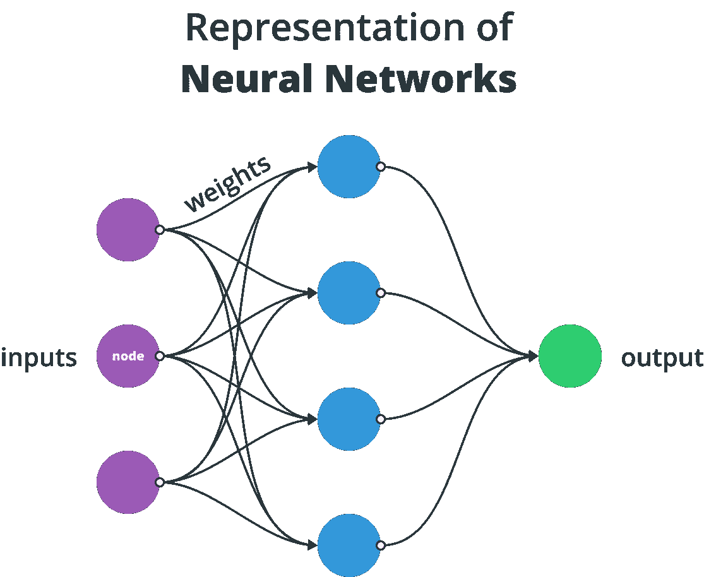
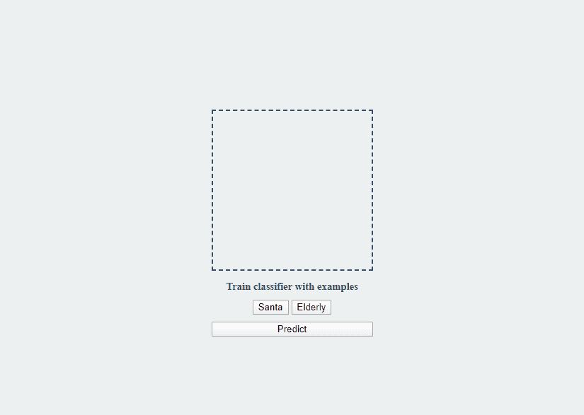
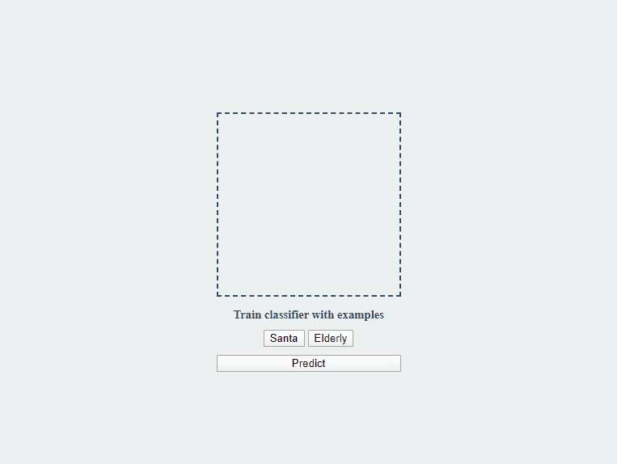
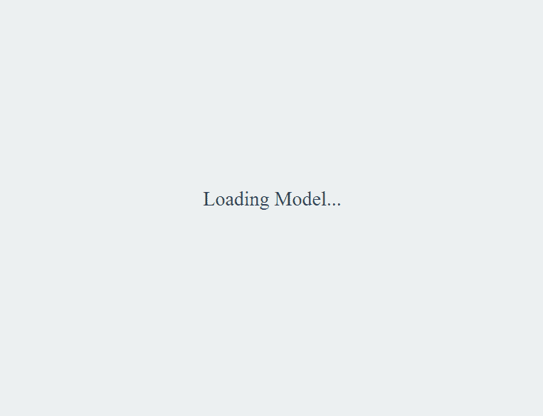

# 用 JavaScript 编写你的第一个神经网络

> 原文：<https://javascript.plainenglish.io/writing-your-very-first-neural-network-in-javascript-e5be554acfac?source=collection_archive---------3----------------------->

## 使用 TensorFlow.js 的机器学习

Photo by [Sander Weeteling](https://unsplash.com/@sanderweeteling?utm_source=medium&utm_medium=referral) on [Unsplash](https://unsplash.com?utm_source=medium&utm_medium=referral)

在过去的几年里，我们已经看到许多机器学习库在 JavaScript 社区中出现，允许前端开发人员将人工智能引入网络，并使用易于使用的 API 解决复杂的问题。

TensorFlow 是最流行的开源机器学习平台之一，主要与 Python 一起使用。2018 年，谷歌宣布了第一个面向 JavaScript 的 TensorFlow 版本，名为 TensorFlow.js。这就是我们在本教程中要探索的。

我们将构建一个图像分类器。在教程的最后，我们的分类器将能够区分图像之间的圣诞老人和一个日常的老人。但要开始，我们首先需要了解什么是神经网络。

# 神经网络如何工作

在深入研究编码之前，我们需要了解几个概念。如果您已经熟悉神经网络，那么您可以跳过这一部分，直接进入编码。否则，请继续阅读，因为我将在整个教程中参考这里提到的内容。让我们先看看什么是神经网络？

## 神经网络

其中涉及到许多技术细节，但为了让您简单了解一下，神经网络是受我们大脑中生物神经网络启发的机器学习算法。它们用于模式识别，由称为神经元的节点组成，通过突触权重连接在一起。

## 模型

当这些机器学习算法用数据训练时，我们得到一个模型作为输出。它代表了培训过程。模型可用于未来的预测。

## 功能和标签

输入模型的数据通常由要素和标签组成。特征是与数据集中的每个样本相关联的属性。一个典型的例子是基于特征(如萼片和花瓣的宽度)对鸢尾花进行分类。

标签代表了您对每个样本的分类方式。继续这个例子，根据你的特征，你把条目分类到一个自由物种中。它要么获得“濑户鸢尾”、“海滨鸢尾”或“花斑鸢尾”的标签。

既然我们已经把一切都解决了，让我们看看我们最终会得到什么。

# 本教程的最终输出

在教程的最后，我们将有一个应用程序，你可以在两个不同的图像集上训练:圣诞老人和老人。一旦你有了足够的数据，应用程序将能够预测图像是关于什么的，而永远不会看到它。

我将在[代码沙箱](https://codesandbox.io/)上提供整个项目，所以你可以对它进行调整。你会在教程的最后找到一个链接。还有一个关于我们的应用程序如何工作的好礼物:

您可以将图像拖到画布元素上，并通过单击下面的按钮之一来训练分类器。一旦你有了足够的数据，你就可以拖动一个新的图像并预测上面有什么。

# 拉入依赖项

我们的第一步是把我们需要的东西都拉进来。我们将使用 [TensorFlow.js](https://www.tensorflow.org/js) 和一个流行的预训练模型 MobileNet 进行图像分类。然后，我们将使用一种称为迁移学习的技术，用我们自己的定制训练集来扩展预训练模型。为此，我们需要一个分类器。我们将使用 K-最近邻模块。它将允许我们对图像进行分类，一旦我们使用预测，它将选择最适合该图像的类别。

这意味着我们将有 3 个依赖项:TensorFlow、MobileNet 和 KNN 分类器模块。这是我们将要处理的整个文档:

在主体关闭之前，我们将有两个不同的脚本。一个用于分类器，一个用于处理 UI 事件。

您可能还会注意到 canvas 元素有一个真正特定的宽度和高度。这是因为预训练模型已经用 224x224px 图像进行了训练。为了匹配数据的格式，我们必须使用相同的大小。您仍然可以处理更大的图像，只需在将数据输入分类器之前调整数据大小。

在开始处理分类器之前，让我们快速地将 UI 组装起来。

# 创建用户界面

创建一个名为`ui.js`的新文件。我们将通过拖放使画布接受图像。首先，获取画布及其上下文，并为其附加一些事件侦听器:

我们需要处理两个事件:T1 和 T2。`onDrop`将图像绘制到画布上，而`dragover`仅阻止默认动作发生。这是必需的，因为没有它，图像将在同一个选项卡上打开。

Without preventing the default action, the page is reloaded

我们来看看`onDrop`函数里面有什么。

第一件事是防止默认动作，就像我们对`dragover`所做的那样。接下来，我们想从拖放到画布上的文件中获取数据。我们可以用`e.dataTransfer.files[0]`得到。然后我们想创建一个新的`FileReader`对象，并将文件作为数据 URL 读取。我们还想为它的`onload`事件创建一个函数。当`reader`完成读取文件时，我们创建一个新的`Image`对象，并将其源设置为`file.target.result`。这将保存 base64 编码的图像数据。一旦图像被创建，我们就把它画在画布上。记住，我们需要将其缩放到 224x244。

同样在这里，让我们快速地向按钮添加事件侦听器，然后我们可以开始创建分类器。我们有 3 个按钮和 3 个事件监听器:

我们将有一个接受一个参数的`addExample`函数:类别的标签。而且我们会有一个`predict`函数。

# 构建分类器

我们将在一个名为`classifier.js`的新文件中创建这两个函数。但是首先，我们需要创建一个分类器并加载到 MobileNet 中。为此，将以下函数添加到`classifier.js`并调用它:

稍后将使用分类器和模型。所以我在函数外面为它们创建了两个变量。模型加载需要一些时间，而且是异步的，因此我们使用`async` / `await`。一旦加载完毕，我们可以隐藏加载信息。

为了用我们自己的定制数据集扩展模型，我们必须添加我们自己的例子。为此，每当用户点击“圣诞老人”或“老人”时，我们调用`addExample`函数。

## 添加示例

该函数将执行以下操作:

*   从画布中获取图像数据
*   使用 MobileNet 获取检索到的数据的特征
*   通过向分类器添加一个使用功能和关联标签的示例来训练分类器

首先，我们使用`ft.browser.fromPixels`从画布中获取像素值。接下来，我们使用 MobileNet 的`infer`方法获取特性。之后，要添加示例，我们可以简单地在带有特征和标签的分类器上调用`addExample`。

然后我们需要更新 DOM 元素。我们清空画布，这样我们可以添加一个新的例子。我们还需要更新按钮来告诉用户每个集合中添加了多少个示例。为此，我创建了一个新的数组来计算例子的数量。

最后，我们可以调用`image`上的`dispose`来释放内存。

## 预测

一旦我们有了必要的数据，我们就可以测试这个模型。点击“预测”，将调用与`addExample`非常相似的`predict`功能:

第一件事是测试我们的数据集中是否有例子。如果我们没有添加任何例子，它不可能预测我们任何事情。这就是`classifier.getNumClasses`检查的内容。

就像对于`addExample`来说，我们需要图像的特征，我们可以用同样的方法得到。然后我们需要调用`classifier.predictClass`传入特征来获得关于图像的预测。一旦我们得到一个结果，我们清除画布，打印出预测，并处理`image`对象。

# 摘要

现在我们的图像分类器像预期的那样工作。在用两组图像训练模型之后，我们可以有把握地预测下一幅图像。

要获得完整的源代码并对项目进行调整，请访问 [codesandbox.io](https://codesandbox.io/s/zealous-gates-g9hk9) 。也可以从 [GitHub](https://github.com/flowforfrank/classifier) 克隆。这是我今年的最后一个教程，但我会在下一个十年带着新的主题回来。感谢您通读！

最后，我想祝你圣诞快乐，新年快乐！🎄 🎉

