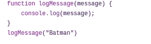
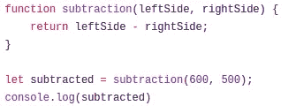
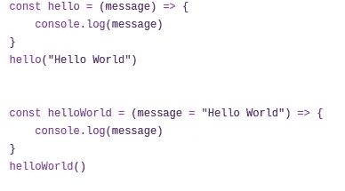
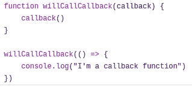

# JavaScript:介绍世界上最容易被误解的编程语言。

> 原文：<https://javascript.plainenglish.io/yes-this-is-another-javascript-guide-696e74376121?source=collection_archive---------2----------------------->

## 第一部分

Photo by [Hack Capital](https://unsplash.com/@hackcapital?utm_source=medium&utm_medium=referral) on [Unsplash](https://unsplash.com?utm_source=medium&utm_medium=referral)

## 有人爱，有人恨。事实是我们不能没有它。

JavaScript 已经在我们的生活中扮演了重要的角色，所以许多开发人员选择害怕或讨厌它。这种厌恶很可能是由于平庸的实现、过时的指南和书籍、没有经验的人或不断与其他语言进行比较的实际数量(尽管共享前缀， *JavaScript* 与 *Java* 无关)。

LiveScript 最初的名字是 T7，创建于 1995 年，第二年首次发布。
在提交给欧洲标准组织 Ecma international 之后， *ECMAScript* 诞生了，定义了一堆要在 *JavaScript* 中使用的标准和特性。尽管制定了这些标准，但直到 2009 年和最近的 2015 年，它们才帮助塑造了今天的语言。

这篇文章是系列文章的第一篇，主要目的是帮助所有读者了解最新的 JavaScript。

# 什么是 *JavaScript* ？

*JavaScript* 是一种具有**一级函数**的语言。一级函数意味着函数可以像任何其他变量一样对待。这就好比说函数可以从函数中返回，作为值赋给变量，并作为函数的参数接收它们。
有一件事你可能知道也可能不知道，那就是 *JavaScript* 支持面向对象编程和许多其他编程范例。
根据主机环境的不同， *JavaScript* 可以被解释或即时编译。

现在让我们讨论类型和值。

# 值和类型

首先，要记住在 *JavaScript* 中，**创建的变量没有类型，它的值有**。

*JavaScript* 中的原语类型如下:

*   *编号*
*   *布尔型*
*   *字符串*
*   *对象*
*   *Null*
*   *未定义*
*   *符号*

前四种应该大家都不陌生。

*数字*用于定义 *JavaScript* 上的数值。与其他语言相反， *JavaScript* 没有整数值或小数值的概念，在 *JavaScript* 中做一些数学运算时要考虑到这一点。

*字符串*用于定义字符或字符序列。在 *JavaScript* 中，它们可以在单引号或双引号中声明。

*布尔*用于定义布尔逻辑。这个逻辑可以通过保留的关键字来表示，*真*或*假*。

*对象*用于定义一个对象包装器。 *JavaScript* 中的每一个非原语类型都被认为是*对象*的一个子类型。一些例子是*函数*、*数组*或*日期*对象。

*未定义*和 *Null* 表示 *JavaScript* 中没有值。 *Undefined* 用于表示值的无意缺失，而 *Null* 表示值的有意缺失。

最后但同样重要的是，最近引入的类型是*符号*。符号用于定义唯一的值。这意味着，即使你给一个*符号*添加相同的数字或字符串，它们也总是互不相同。

我们现在可以看一个例子吗？使用运算符 *typeof* ，我们可以获得一个具有给定值类型的字符串。

types.js

如果你读了上面的描述，这个例子应该非常简单。可能会引起混淆的一点是为什么*类型的*的 *null* 返回一个对象？
这是 *JavaScript* 中一个众所周知的历史 bug，由于一些遗留原因，无法修复。

# 变量

JavaScript 中的变量可以使用三个关键字之一来创建: *var* 、 *let* 或 *const* 。
*var* 是在 *JavaScript* 中声明变量的传统方式。所有用 *var* 关键字声明的变量都有一个函数作用域，可以相应地访问。
*let* 和 *const* 是在*ECMAScript*2015(*ES6*)中引入的，允许我们声明块范围的变量。 *let* 和 *const* 之间的唯一区别是 *const* 用于其值不会改变的变量。

variables.js

# 环

循环允许特定的任务执行给定的次数。例如，这可以是在数组的元素之间移动。

*JavaScript* 支持传统的*用于*和*而*循环。最近( *ES6* )，的*for…被引入并允许在数组或映射的元素之间循环，比以前更加易读和直接。*

loops.js

# 功能

如上所述，函数是对象的子类型，因此，它们可以有属性和方法，也可以赋给变量。
函数是通过 function 关键字创建的，或者，多亏了 *ES6* ，通过一个粗箭头(= >)创建的。
下面，我们可以在 *JavaScript* 中看到各种类型的函数声明。

functions.js

现在让我们来分析每个例子。

A procedure

在第一个示例中，我们可以看到一个过程(过程是不返回任何内容的函数)接收一个名为 message 的参数，通过调用全局对象 *console* 及其 *log* 方法，该参数显示在用户控制台中。值得一提的是，即使没有 return 语句，这个函数也会通过省略返回未定义的。

Subtraction function and assignment to a block-scoped variable

继续第二个函数，这里我们接收两个参数并返回它们的差。也是在这个例子中，我们看到函数调用可以保存在变量中。在赋值之后，我们可以在整个块中调用 subtracted，并得到给定数字之间减法的输出。

Arrow functions and default parameters

第三和第四个函数向我们展示了一个箭头函数的例子。这些箭头函数的工作方式与第一个示例中的过程完全一样。
请特别注意第四个示例的参数，我们可以看到有一个字符串被分配给了消息变量。这被称为默认参数，它们的作用是，如果调用这个函数时没有参数被传递，那么默认情况下，该参数被赋予默认的*字符串*。

Callback function

最后一个例子向我们展示了一个*回调*函数。*回调*函数是作为参数传递给其他函数的函数，由这些函数调用以指示动作的结束。

# 结论

到目前为止，您已经对 JavaScript 提供的一些很酷的东西有了一点点的了解。
类型、变量、循环和函数是你使用 JavaScript 时需要具备的基本要素。我建议使用上面提供的一些例子，编写一个 Hello World 函数，并尝试应用所学的一些知识。在这个系列的下一部分，有趣的事情开始了。我们将首先关注强制，这样我们就可以了解在 *JavaScript* 中相等检查是如何工作的，以及双重和三重相等检查之间的区别。然后我们将继续学习作用域和闭包。我希望你喜欢并关注下一期指南。祝你们所有人度过美好的一周！