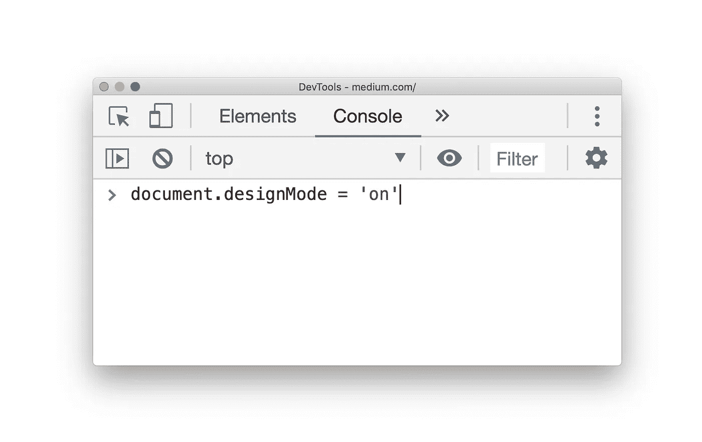
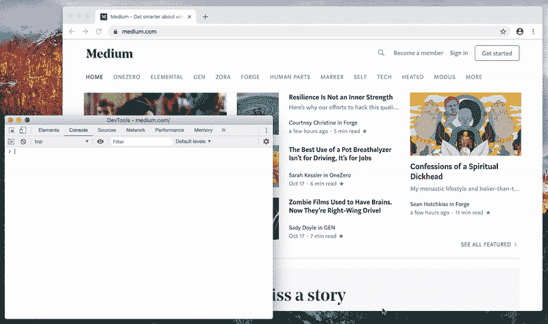

# 如何通过激活设计模式编辑任何网页

> 原文：<https://javascript.plainenglish.io/you-can-edit-any-web-page-design-mode-bafdbf2d10e5?source=collection_archive---------4----------------------->

## 您可以直接在浏览器中编辑任何网站。

如果启用了设计模式，用户可以像在 **WYSIWYG** (所见即所得)编辑器中一样编辑文档的全部内容。

HTML 元素不支持 **designMode** 属性，只能修改整个文档的可编辑状态。

**如果你想快点:**

*   向客户展示他们的网站应该是什么样子
*   编辑网站，让你的设计师知道你想要什么
*   让你的银行账户看起来有 1 亿美元

…那么下面这一招就是给你的。

不需要任何技术知识。文本中不会出现 HTML 标签。

## 建议

 [## 使用设计模式和内容可编辑轻松创建 HTML 编辑器

### 你有没有想过重新创建一个像我们在 Medium 上使用的文本编辑器有多难？

hackernoon.com](https://hackernoon.com/easily-create-an-html-editor-with-designmode-and-contenteditable-7ed1c465d39b)