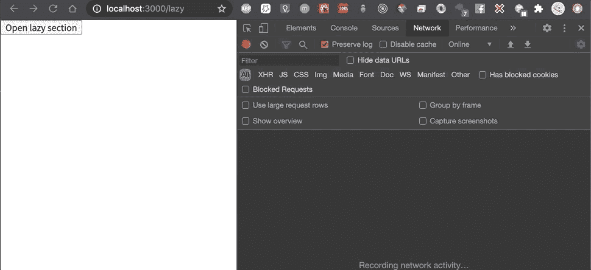

# 你肯定应该在 React 中使用悬念——代码拆分和预加载

> 原文：<https://javascript.plainenglish.io/you-definitely-should-be-using-suspense-in-react-code-splitting-and-preloading-b9cbe393a95?source=collection_archive---------0----------------------->

# 反应悬念—简短回顾

React 悬念是 React 新功能套件的一部分。它基本上让你*暂停*组件的渲染，直到满足某个条件。

反应悬疑与恐怖发声**并发模式**齐头并进。在本文中，我们不打算谈论这一点，因为它仍处于起步阶段，还不稳定。

然而，你已经可以开始使用 React 悬念做一件大事了:**通过代码分割延迟加载组件**🎉。

# 代码分割？

您可能已经通过 create-react-app、Gatsby、Next.js 或使用模板引导了 React 应用程序。所有这些都包括一个捆绑器，如 Webpack。

Webpack 基本上获取 JavaScript 文件(例如，React 组件)并将它们捆绑在一起(即，它创建一个包含所有所需内容的大文件)。**但是实际上一切都是从一开始就需要的吗？**

您可能不需要从一开始就加载所有 React 组件的代码。假设您有多个路由(即多个页面)，因此并非所有路由同时可见，在应用程序的初始加载时，只有**一个**可见。

在这种情况下，您可以稍后获取其他组件的代码，不是吗？从而使初始加载更快🕐。

这种技术通常适用于从一开始就不需要的其他组件，如条件呈现的部分、模态等。

您可以显著减少初始包的大小，从而显著缩短加载时间🚀。

# 那么 React 悬念有什么帮助呢？

在动态导入的帮助下，我们可以很容易地定义哪些组件需要延迟加载。

让我们看一个例子:

这里发生了什么事？

我们有一个组件，最初呈现一个按钮，上面写着“打开懒惰部分”。当我们按下那个按钮时，另一个组件也会被渲染(即`LazyLoadedComponent`)，但是这个组件是延迟加载的！瞧啊。我们已经成功地使用了代码分割。

实际上，你可以在浏览器的开发工具中查看一下，在点击按钮时，可以在网络部分查看。服务器请求一个新的 JavaScript 块(它有我们的`LazyLoadedComponent`的代码)。

A new chunk gets loaded lazily

但是等等，悬念标签上的`fallback`属性是怎么回事？

React 将在加载惰性元素的同时呈现`fallback`中指定的项目。让我们通过在 Chrome Dev Tools 中人为地使我们的连接变慢(*节流*)并将其设置为慢 3G 来检查一下。

React renders the fallback while the element is loading

## React .懒+悬疑= ❤️

正如你在上面的代码中看到的，我们使用了两个重要的 React 元素来完成这项工作:`lazy`函数和悬念标签。

lazy 函数封装了一个动态导入，并且在加载 lazy 元素的 JavaScript 块时，它与`Suspense`标签一起在幕后执行相同的魔术来呈现回退。

## 使用 React 路由器进行惰性渲染

将上述技术应用于基于路线的导航是非常方便的。

如果您使用 React 路由器，您可以实现如下代码拆分:

实际 React 组件中的一切都是相同的。然而，我们不是以传统的方式导入组件，而是以一种**懒惰的方式**。

现在，当最初加载应用程序时，只有**当前路线**组件的代码将被发送到客户端。随着不同的路由被访问，其余的路由代码将逐渐发送到客户端。整洁！

通过使用这种简单的方法，您可以节省数百千字节，因此[第一次内容丰富的绘制](https://web.dev/first-contentful-paint/)和[到交互](https://web.dev/interactive/)的时间将显著减少。

## 预加载

初始加载时间显然很重要。除此之外，有时我们还希望预先为惰性组件/路由预加载代码。

考虑一个简单的导航栏:

每当用户将鼠标悬停在其中一项上时，我们就可以开始预加载该页面。

这是我们实现这一目标的方法:

我们在这里使用一个助手函数，`getPreloadableLazyComponent`，它接受实际的动态导入函数并返回带有附加属性的 React 组件:`preload`，这是一个你可以在任何你想要开始预加载过程的地方调用**的函数。**

# 最后

你可以从今天开始使用 React ( `lazy` + `Suspense`)的代码拆分功能。从初始加载时间来看，它有很多好处，因为它可以节省**秒**，从而改善用户体验🚀。

干杯！

## **简单英语的 JavaScript**

喜欢这篇文章吗？如果有，通过 [**订阅获取更多类似内容解码，我们的 YouTube 频道**](https://www.youtube.com/channel/UCtipWUghju290NWcn8jhyAw) **！**