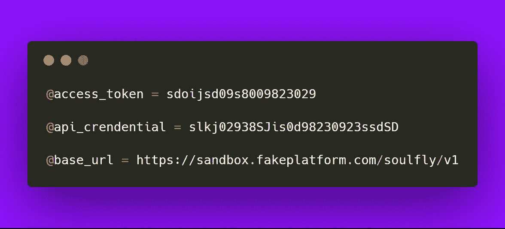
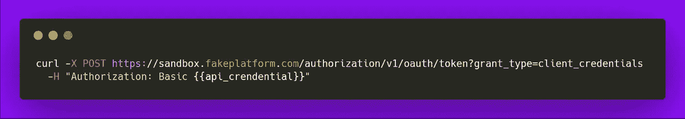
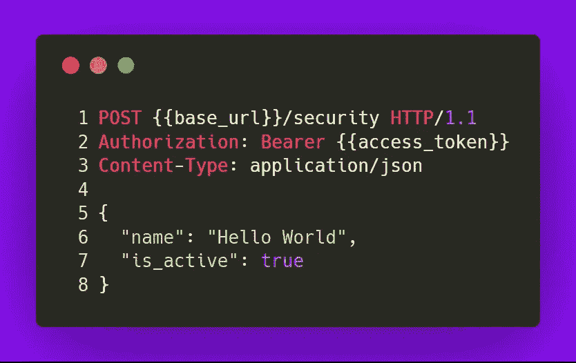
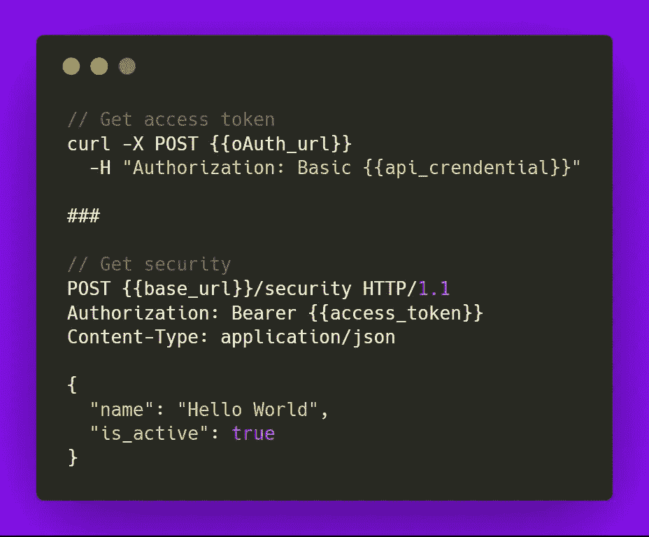
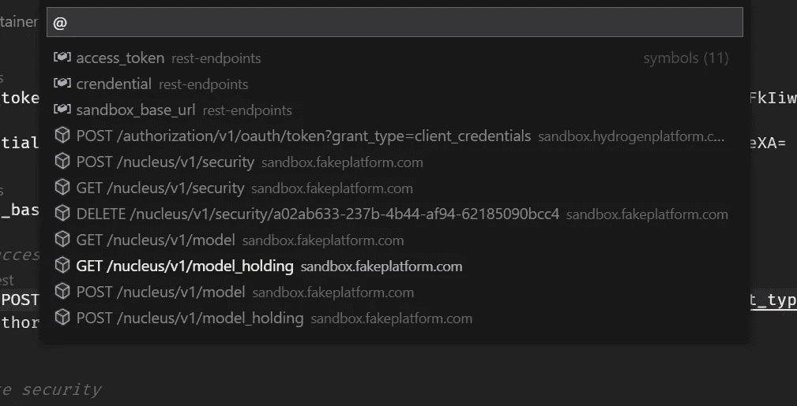

# 如果使用 Visual Studio 代码，您可能不需要 Postman

> 原文：<https://javascript.plainenglish.io/you-might-not-need-postman-if-you-use-visual-studio-code-a77d9b9ec31?source=collection_archive---------3----------------------->

## 在 Visual Studio 代码中管理和进行 API 调用

“peeled pomelo fruit” by [Charles Deluvio 🇵🇭🇨🇦](https://unsplash.com/@charlesdeluvio?utm_source=medium&utm_medium=referral) on [Unsplash](https://unsplash.com?utm_source=medium&utm_medium=referral)

在我看来，Postman 已经变得臃肿，它的 UI 布局和层次结构令人困惑。但是，如果您有大量的端点需要管理，它可能仍然是同类工具中最好的。否则，我将向您介绍一种可以在 Visual Studio 代码中轻松管理和进行 API 调用的方法！

让这一切成为可能的工具是一个名为 [**REST Client**](https://marketplace.visualstudio.com/items?itemName=humao.rest-client) 的 VSCode 扩展。所以，继续安装它，让我与你分享我迄今为止用它学到的东西！😃

首先，让你开始做两件事:

1.  打开一个新编辑器。
2.  将语言模式改为`http` —按`ctrl+shift+p`，搜索`Change Language Mode`，选择`http`。

现在我们可以开始编写一些 API 调用了。

REST 客户端支持以`@`为前缀的自定义变量。变量对于我们经常在任何地方使用的东西都很有用，在这种情况下，它们就是你的`access_token`、`api_credential`和`base_url`。

Note the ‘@’ character in front of each variable!

要使用自定义变量，您只需要用一对双花括号将它括起来，就像 so `{{custom_variable}}`一样。我们将在下面的实践中看到这一点。

REST 客户端支持构建以`curl`和`[RFC 2616](https://www.w3.org/Protocols/rfc2616/rfc2616-sec5.html)`标准编写的 API 调用(不用担心，您很快就会看到这是不言自明的！).让我们看看它们在实践中会是什么样子。🙆

## 卷曲

cURL. Notice the {{ }}

你可以自己写出来，或者如果你已经有 API 在你的浏览器中被调用，你可以很容易地把它们复制粘贴成 cURL。这里是你如何在 Chrome 中复制的方法。尽管 Firefox 有相似的功能和步骤来实现它，但它目前有一个[错误](https://bugzilla.mozilla.org/show_bug.cgi?id=1421207)正在解决。

## RFC 2616

RFC 2616

这里有 3 个主要部分:**请求行**、**标题**和**请求体**。割台(线-2 和线-3)必须位于*请求线*(线-1)下方**。然后，在构造*请求体(第 5–8 行)之前，您需要**留出一个空行**(第 4 行)。*看到了吗？没什么大不了的，对吧？！至少就我所知是这样😆**

## 管理 API

您可以在一个文件中包含**多个 API 构造，方法是用一行`###`分隔符将它们分开，如下所示:**

Separate APIs with a line of ‘###’

要查找特定的 API 端点，您可以利用 VSCode 的符号查找功能— `ctrl+shift+o` —您将看到您的 API 列表！

ctrl+shift+o (btw that’s the alphabet o…). Now you can search!

还有…这都是我送的！虽然有可能将它提升到高级水平，但现在，试一试，你可能会发现你在这里学到的东西对一个小项目或一些快速而肮脏的事情很有帮助，不会产生太多的认知开销。🙇

“Lunch break in Tianjin industrial zone” by Kheoh Yee Wei