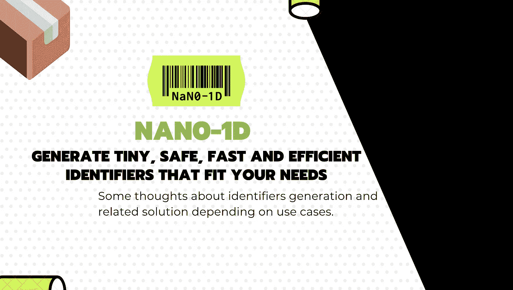

# 您可能不需要 UUID 版本 4 来生成随机标识符

> 原文：<https://javascript.plainenglish.io/you-might-not-need-uuid-v4-for-generating-random-identifiers-89e8a28a7d77?source=collection_archive---------1----------------------->

## 图书馆发现

## 对于每一个决定，一定要理解你为什么要做这个决定，因为你可能有另一个聪明的方法来实现同样的目标。



对于许多应用程序，您可能需要生成某种惟一的标识符，以便能够获得对特定内容的引用。

它可以用于各种场景，一个前端列表，一个后端数据库行标识符，或者其他什么，你只需要一些随机散列…

为了实现这个目标，我们有两种技术和开发人员:

1.  **初学者。**它只是尝试一种自制的算法，该算法基于一些伪随机函数结果(如`Math.random`)或可能使用时间戳的十六进制表示来挑选字母和数字。
2.  **普通的开发者。**使用某种久经考验的 ID 算法，比如著名的 UUID v4，它允许生成 36 个字符的字符串(包括 4 个破折号字符)。

这是我刚刚生成的随机 UUID`123e4567-e89b-12d3-a456–556642440000`

好吧，虽然第一个可以很好地工作在小应用程序上。由于算法简单，它有许多缺点，可能导致 ID 冲突。

另一方面，第二个版本很好地解决了冲突问题，但是太长了:36 个字符！

文章的下一部分将会让你思考文章的中心问题:**你的用例是什么，为什么你需要一个标识符？**

# 好的标识符有什么要求？

*   快速生成，这样你就可以用很少的成本生成大量的 ID。
*   **统一**，防止在敏感数据如代金券或预付费代金券的情况下进行暴力破解。
*   **安全**，以避免会删除标识符“唯一”字符的冲突。
*   变得**不可预测**，以防再次安全。但有时你希望它…像数据完整性检查。
*   它也可以是 **URL 友好的，**在 URL 的 GET 参数中使用它作为电子邮件验证标记。
*   如果它可以变得很小，那也是一件很棒的事情，所以你可以用很小的成本把它放到你的网络应用中:)

# 为什么我们首先需要唯一标识符？

嗯，一切都是关于那个问题，你可能知道答案是:**视情况而定！**

第一种技术的优点在于，开发人员可以控制散列长度，但有冲突的风险。使用第二种技术，用户几乎没有冲突风险，但几乎无法控制散列的长度。

经验法则:哈希冲突的风险是哈希长度和每个字符所用字典的函数。

请记住，您拥有的字符越多，生成散列所需的时间就越长，用户阅读它就越困难。这在您以常规方式生成数千个散列的情况下也是有问题的，比如一个集中的交易平台识别订单。

**出于各种原因，大多数时候你不需要 36 个字符长的哈希**。您可能会生成前端哈希，这些哈希仅用于在本地保存一些数据或用于 react 列表协调算法。

> 通过简单地使用 9 个字符的散列和适当的算法，以 1000 个散列/小时的速度，将需要大约 2 年的时间才能有 1%的概率发生至少一次碰撞。

**这比使用 UUID v4 小 4 倍。你觉得这对你的案子来说够了吗？**

大概吧。

# 欢迎 Nano-id，一个小巧、安全、URL 友好的独特字符串生成器


今天，我想分享一个库，它可以帮助你满足我们上面谈到的要求，而且还能让你根据自己的使用情况简单地调整算法。

你可以在这里得到它[https://github.com/ai/nanoid](https://github.com/ai/nanoid)

首先，我想和你分享下面这个游戏，它可以帮助你了解碰撞的风险，它写得很好，也很容易使用。

 [## 纳米 ID CC

### Nano ID 是一个用于生成随机 ID 的库。同样，UUID 也有可能出现重复的 ID。然而，这…

zelark.github.io](https://zelark.github.io/nano-id-cc/) 

文档非常清楚，所以我不会在这里给你很多例子。

简而言之，`nano-id`是一个小的 npm 包，适用于 NodeJS、web app、react-native 以及许多编程语言。

```
import { nanoid } from "nanoid";
model.id = nanoid() //=> "V1StGXR8_Z5jdHi6B-myT"
```

你也可以指定你想要的字符数，这样你就可以调整你的散列。

```
nanoid(9); //=> "wMeKBp6th"
```

而默认这是一个网址友好的`0123456789ABCDEFGHIJKLMNOPQRSTUVWXYZ_abcdefghijklmnopqrstuvwxyz-`

如果您有特定的需求，您也可以将用于生成散列的字母表更改为您自己的字母表

```
const alphabet = '0123456789ABCDEF#';
generate(alphabet, 9); //=> "F65BF3050"
```

[**🇫🇷STOP！你是法国人吗🥖？**您也可以访问 ici 网站，接收法国的私人简讯🙂](https://codingspark.io/)

## **用简单英语写的便条**

你知道我们有四份出版物和一个 YouTube 频道吗？点击 [**plainenglish.io**](https://plainenglish.io/) 在我们的主页上找到所有内容的链接——关注我们的出版物并 [**订阅我们的 YouTube 频道**](https://www.youtube.com/channel/UCtipWUghju290NWcn8jhyAw) **以示关爱！**