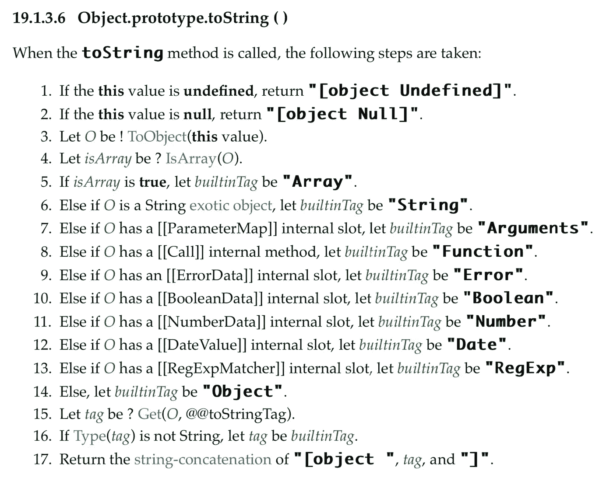
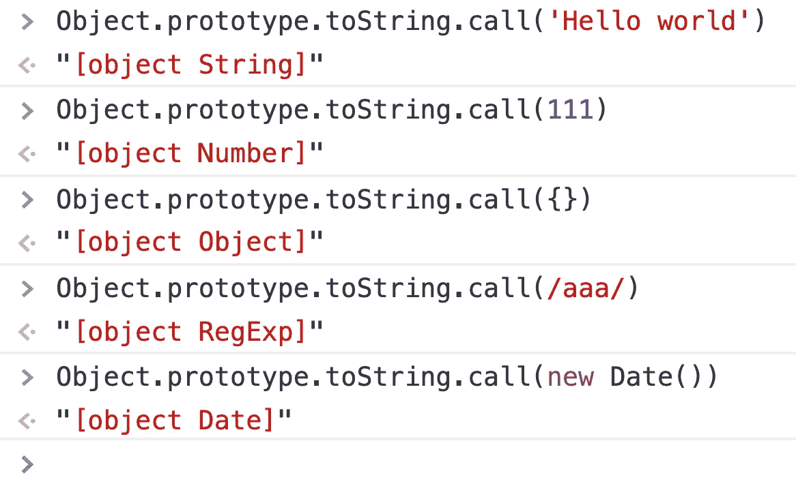
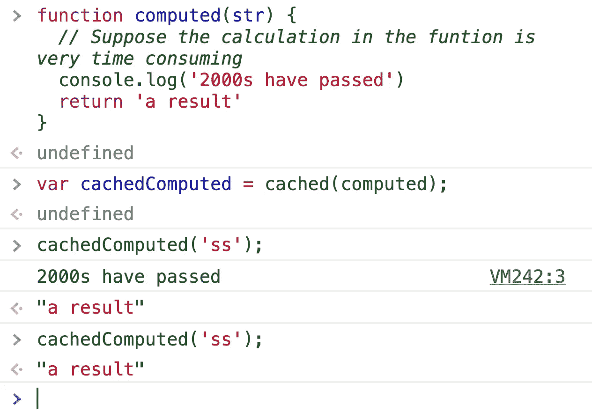
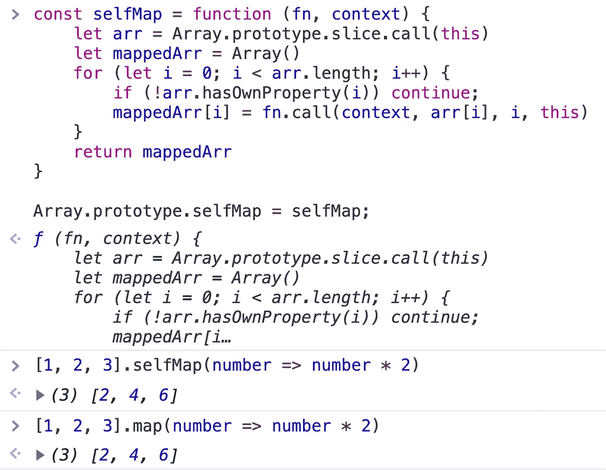
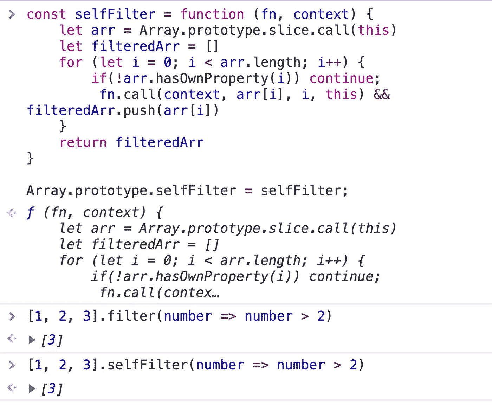
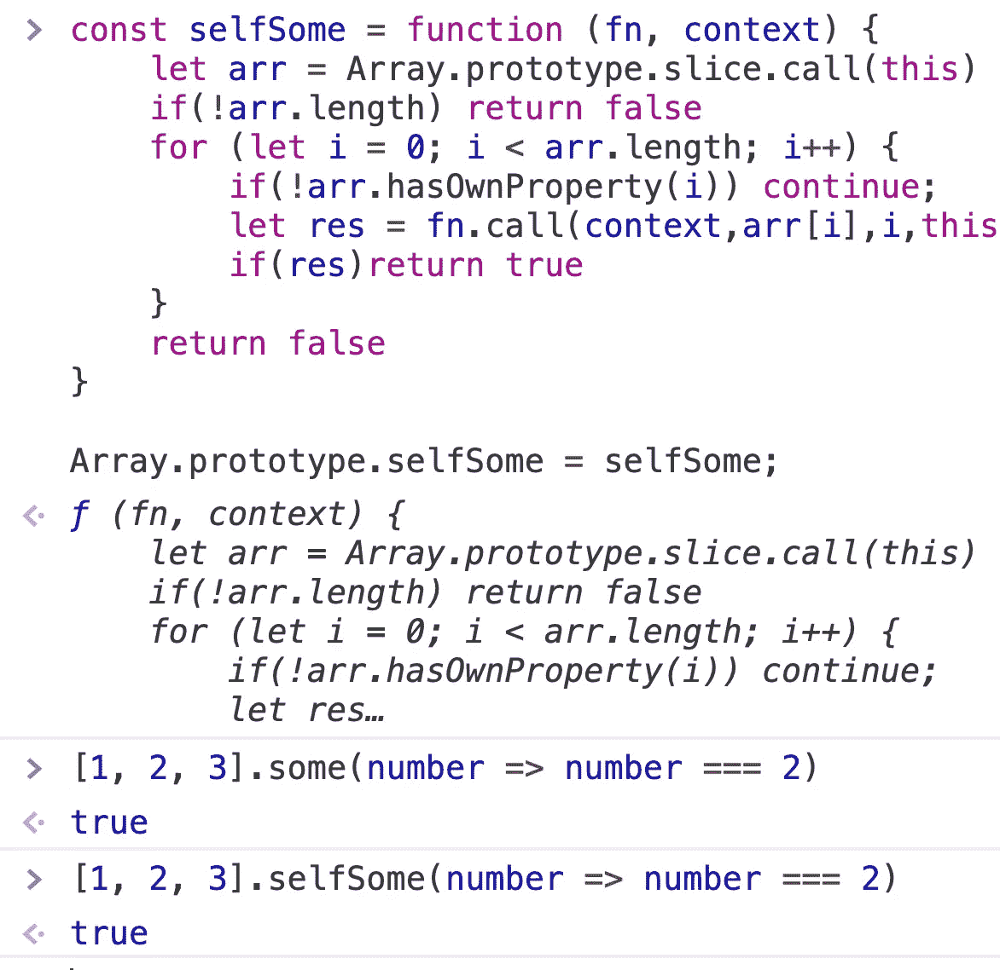
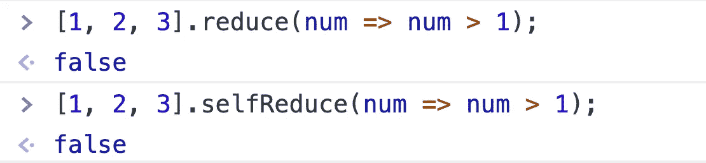
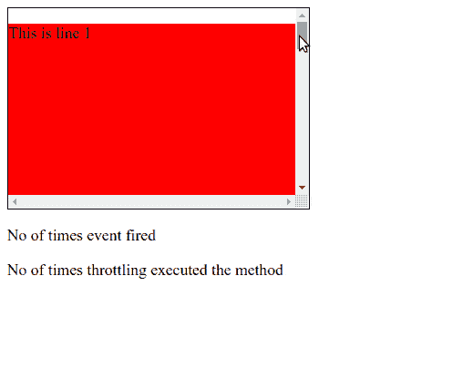
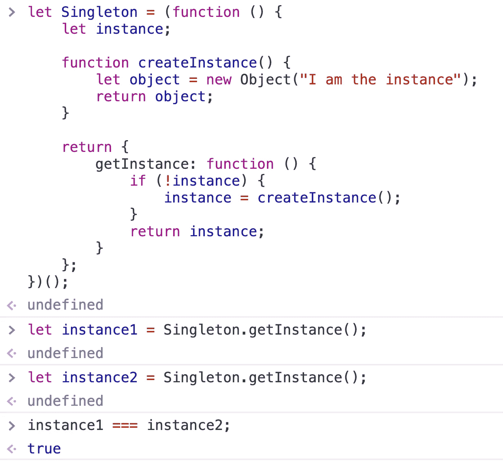
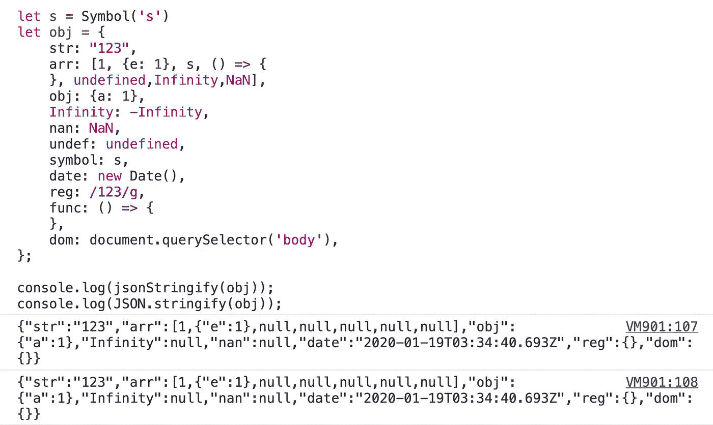

# 你必须理解这 14 个 JavaScript 函数

> 原文：<https://javascript.plainenglish.io/you-must-understand-these-14-javasript-functions-1f4fa1c620e2?source=collection_archive---------0----------------------->

## 在参加任何 JavaScript 面试之前，您应该能够理解并手写这些函数。


Photo by [Caspar Camille Rubin](https://unsplash.com/@casparrubin?utm_source=medium&utm_medium=referral) on [Unsplash](https://unsplash.com?utm_source=medium&utm_medium=referral)

# 1.确定任何对象的具体类型

众所周知，JavaScript 中有六种原语数据类型(Boolean、Number、String、Null、Undefined、Symbol)和一种 object 数据类型。但是你知道对象数据类型可以细分成很多种子类型吗？对象可以是数组、函数、映射等。如果我们想得到对象的具体类型，应该怎么做？

## 代码:

## 解释:

ECMAScript 具有以下规则:



From EcmaScript

对于不同的对象，调用*object . prototype . tostring()*时会返回不同的结果。



From Chrome‘s Console

而且*object . prototype . tostring()*的返回值始终是'***【object****'*+'***tag****'*+'***]***'的格式。如果只想要中间的*标签*，可以通过正则表达式或者*string . prototype . slice()*删除两边的字符。

## 示例:

```
toRawType(null) 
// "Null"toRawType(/sdfsd/) 
//"RegExp"
```

# 2.缓存函数计算结果

如果有这样的功能:

```
function computed(str) { // Suppose the calculation in the funtion is very time consuming console.log('2000s have passed') return 'a result'}
```

我们想要缓存函数操作的结果。以后调用时，如果参数相同，就不再执行该函数，而是直接返回缓存中的结果。我们能做什么？

## 代码:

## 示例:



# 3.实现 Array.prototype.map

这是 JavaScript 中一个有用的内置方法，但是您应该能够自己实现这个功能。

## 代码:

## 示例:



# 4.实现 Array.prototype.filter

这是 JavaScript 中一个有用的内置方法，但是您应该能够自己实现这个功能。

## 代码:

## 示例:



# 5.实现 Array.prototype.some

这是 JavaScript 中一个有用的内置方法，但是您应该能够自己实现这个功能。

## 代码:

## 示例:



# 6.实现 Array.prototype.reduce

这是 JavaScript 中一个有用的内置方法，但是您应该能够自己实现这个功能。

## 代码:

## 示例:



# 7.实现 Array.prototype.flat

## 代码:

## 示例:


# 8.咖喱菜肴

Currying 是一种将带有多个参数的函数计算成带有一个参数的函数序列的技术。

换句话说，当一个函数不是一次接受所有参数，而是接受第一个参数并返回一个接受第二个参数的新函数，然后返回一个接受第三个参数的新函数，以此类推，直到满足所有参数。

这就是我们把函数调用`add(1,2,3)`变成`add(1)(2)(3)`的时候。通过使用这种技术，可以轻松地配置和重用这个小部分。

为什么有用？

*   Currying 帮助你避免一次又一次地传递同一个变量。
*   它有助于创建高阶函数。这对事件处理非常有帮助。
*   小部分可以轻松配置和重用。

我们来看一个简单的`add`函数。它接受三个操作数作为参数，并返回三者之和作为结果。

```
function add(a,b,c){
 return a + b + c;
}
```

你可以用太少(结果奇怪)或太多(多余的参数被忽略)来调用它。

```
add(1,2,3) --> 6 
add(1,2) --> NaN
add(1,2,3,4) --> 6 //Extra parameters will be ignored.
```

如何将现有函数转换为 curried 版本？

## 代码:

## 示例:


# 9.去抖动

**去抖动**无非是减少不必要的耗时计算，从而提高浏览器性能。在某些情况下，某些功能需要更多时间来执行某项操作。例如，以电子商务网站上的**搜索栏**为例。

假设用户想要获得**“Tutorix 学习套件”**。他在搜索栏中输入产品的每个字符。在输入每个字符后，从浏览器到服务器会发生一个 **Api** 调用，以获得所需的产品。因为他想要“Tutorix 学习套件”，所以用户必须从浏览器向服务器发出 17 次 Api 调用。想象一个场景，当数百万人进行相同的搜索，从而调用数十亿个 Api 时。所以一次调用几十亿个 Api 肯定会导致**浏览器性能**变慢。为了减少这个缺点，**去抖**进入画面。

在这种情况下，**去抖动**将在两次击键之间设置一个时间间隔，假设为 2 秒。如果两次击键之间的时间超过 2 秒，那么只有 Api 调用会发生。在这 2 秒钟内，用户至少可以输入一些字符，减少了 Api 调用这些字符的次数。由于 Api 调用减少了，浏览器性能将会提高。必须注意，每次击键时**去抖动**功能都会更新。

## 代码:

# 10.节流

节流将改变函数，使其在一个时间间隔内最多只能触发一次。例如，无论用户点击按钮多少次，节流将在 1000 毫秒内只执行一次函数。



## 代码:

# 11.延迟加载图像

延迟加载图像意味着异步加载网站上的图像——也就是说，在上面的内容完全加载后，或者甚至有条件地，只有当它们出现在浏览器的视窗中时。这意味着，如果用户不一直向下滚动，位于页面底部的图像甚至不会被加载。

## 代码:

# 12.阵列随机无序

我们经常需要打乱一个数组。

## 代码:

## 示例:


# 13.一个

单例模式将特定对象的实例数量限制为一个。这个单独的实例称为单例。

在需要从一个中心位置协调系统范围内的动作的情况下，单件非常有用。数据库连接池就是一个例子。该池管理整个应用程序的所有数据库连接的创建、销毁和生存期，确保没有连接“丢失”。

单例减少了对全局变量的需求，这在 JavaScript 中尤其重要，因为它限制了名称空间污染和相关的名称冲突风险。

## 代码:

## 示例:



# 14.实现 JSON.stringfy

这是 JavaScript 中一个有用的内置方法，但是您应该能够自己实现这个功能。

## 代码:

## 示例:

