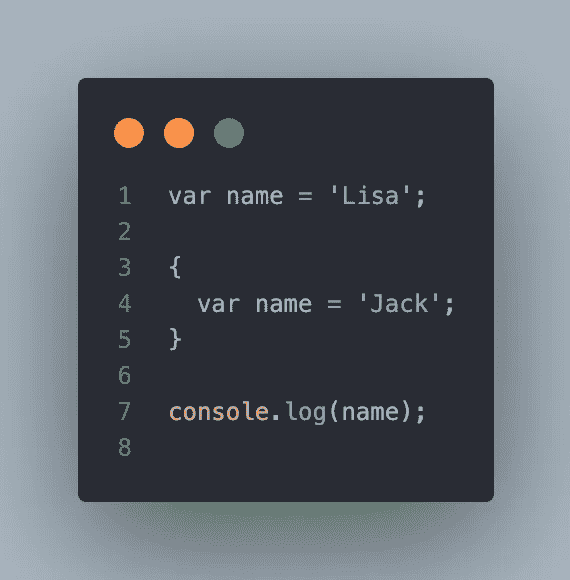

# 在编程之前，您需要了解 JavaScript 中的作用域

> 原文：<https://javascript.plainenglish.io/you-need-to-know-scope-in-javascript-before-programming-f3cfc2ce8a54?source=collection_archive---------1----------------------->

## Java Script 语言

## JavaScript 范围的解释



与块范围的 C 或 C++语言不同，JavaScript 天生就是函数范围的语言。所以许多开发人员过去不喜欢 JavaScript，因为它与他们的语言大相径庭。但是，JavaScript 的吸引力足以让我们做出选择！在这篇文章中，我将简单谈谈 JavaScript 中的作用域。

# 什么是范围？

JavaScript 中的作用域指的是变量或方法所在的范围或边界。对此，更好的说法可能是“语境”。其他编程语言用花括号声明作用域。

```
// C language has block-scope
int a = 1;
{
  int a = 2;
  printf("%d", a); // 2
}
printf("%d", a); // 1
```

但是在 JavaScript 中，结果略有不同。

```
var a = 1;
{
 var a = 2;
 console.log(a); // 2
} 
console.log(a) // 2
```

为什么会这样？因为 JavaScript 的作用域原则是基于函数的，而不是基于块的。所以在 JavaScript 中，那些代码在一个根函数作用域中，`window`。

JavaScript 中的每个函数都有自己的作用域。它以左边的花括号(`{`)开始，以右边的花括号(`}`)结束。每个变量和方法只能在作用域内访问。

```
var caller = 'window';
function scope() {
  var caller = 'scope';
  console.log(caller);
}console.log(caller); // window
scope(); // scope
```

JavaScript 关于变量的一个神秘特性是，当使用关键字声明变量时，实际上不需要键入`var`。为什么？因为如果一个变量没有关键字，默认情况下，JavaScript 引擎会认为它属于`window`，不管变量在哪里。

```
function a() {
  function b() {
    function c() {
      a = 1;
    }
    c();
  }
  b();
}
a();
console.log(a); // 1
```

看起来非常方便。但是请记住这是 JavaScript 的反模式。1)它破坏了 JavaScript 中的作用域系统，因为它直接绑定到根对象，2)如果您更改了`window`中的`a`，可能会导致副作用。

# ES5 和 ES6+在范围上的区别

到目前为止，我介绍的所有例子都使用了`var`关键字。但是，从 ECMAScript 2015 开始有了新的关键词，换句话说就是 ES6—`let`和`const`。`let`和`const`支撑块-范围。

```
let a = 'let a';{
  let a = 'let a in block';
  console.log(a); // let a in block
}console.log(a); // let a
```

当你使用`let`和`const`时，还有一个注意事项你应该记住，尽管这个问题与作用域无关。

```
console.log(a); 
let a = 1;
// Uncaught ReferenceError: Cannot access 'a' before initialization
```

是吊装问题。我建议您在使用变量之前声明它们。

# 范围链接

当 JavaScript 寻找一个变量时，JavaScript 中有一个症状叫做作用域链接。我们举个例子。

JavaScript 运行`a()`时，`x`和`y`被赋值为 10 和 100。然后`console.log(x)`和`console.log(y)`打印出 10 和 100。但是`z`呢？在`a()`中没有声明。当没有 JavaScript 一直在寻找的值时，它会自动转到`a()`的上部范围，并尝试查看是否有它正在寻找的值。在这种情况下，全局范围中有`z`，所以`a()`中的`console.log(z)`打印出 1000。

然后`b()`被执行，`b()`里面有`x`，是 20。所以第一次印刷是 20。第二个打印，`console.log(y)`在`b()`范围内寻找`y`但不存在。所以 JavaScript 在`a()`的范围内寻找`z`时采用了相同的过程。但是`b()`、`console.log(z)`最后一个呢？同样，它在`b()`和`a()`中并不存在。然后 JavaScript 再一次进入`a()`的上层范围，寻找它想要的东西。`window`中有`z`，是`a()`的上界。

JavaScript 通过作用域寻找变量的过程被称为**作用域链接**。

# 结论

那么，那我应该用`var`还是`let`和`const`？大多数 JavaScript 开发者倾向于只使用`let`和`const`。就副作用而言，这是因为 block-scope 更具可读性和稳定性。但我不会告诉你`var`是我们应该在这个世界上摧毁的东西。但是更重要的是记住 JavaScript 作用域和作用域链接是如何工作的。