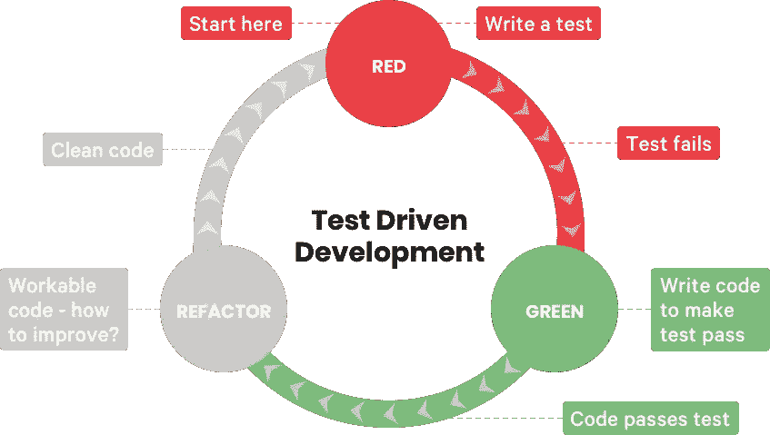

# 您应该习惯于测试驱动的开发

> 原文：<https://javascript.plainenglish.io/you-should-get-used-to-test-driven-development-fc1c6daac04b?source=collection_archive---------11----------------------->

## 因为它会留在这里

Photo by [Scott Graham](https://unsplash.com/@sctgrhm?utm_source=medium&utm_medium=referral) on [Unsplash](https://unsplash.com?utm_source=medium&utm_medium=referral)

我敢肯定，作为开发人员，我们都必须面对这样的情况:我们在生产中破坏了一些我们已经尽快用热修复程序修复的东西。我们能确定多少次这个热修复不会破坏任何其他功能？任何匆忙完成的事情都可能意味着我们错过了某个地方。如果有一个真正的过程，这可能意味着我们可以在很大程度上避免这一切呢？

# 什么是 TDD？

维基百科对 TDD 的定义是:

*测试驱动开发(TDD)是一个* [*软件开发过程*](https://en.wikipedia.org/wiki/Software_development_process) *依赖于一个非常短的开发周期的重复:需求被转化为非常具体的* [*测试用例*](https://en.wikipedia.org/wiki/Test_case) *，然后代码被改进以使测试通过。*

简单地说，测试驱动开发就是我们首先编写测试用例，然后编写生产代码，以便传递最先编写的用例。这是软件开发中一种测试优先的方法，可以为我们节省很多最后一分钟的错误修复紧张。

有了 TDD，就不能保证臭虫再也不会发生了，只不过臭虫泄露出去的几率非常接近于零。有了 TDD，您的应用程序的测试覆盖率也将显著提高，这给了您一个额外的优势，即生产错误更少。

# TDD 三定律

我最近有机会读了罗伯特·马丁的书《干净的代码:敏捷软件工艺手册》，其中提到了 TDD 必须遵循的三条法则。我引述如下:

**第一定律**——除非你写了一个失败的单元测试，否则你不能写生产代码。

**第二定律—** 你写的单元测试可能不会多到足以失败的程度，不编译就是失败。

**第三定律**——编写的产品代码不能超过通过当前测试的数量。

# TDD 如何让您的生活变得轻松？

首先编写测试用例有太多的好处。让我们考虑一下大多数开发人员如何调试 JavaScript 代码。我们可能会写一段代码，然后在浏览器中重新加载来检查它。如果你遇到任何严重的错误，我们会检查控制台。JavaScript 不会告诉我们大部分地方做错了什么，我们的超级英雄`console.log`来拯救我们了。我确信是`console.log`和浏览器开发工具拯救了每个前端开发人员的工作生活。在它按预期工作之前，我们大部分时间都在做——“更改-编译-重新加载”，重复时会有很多断点。想象一下，如果你不必为了检查你是否写对了一段代码而经历这一切，那该有多酷。在这种情况下，TDD 可能是救生衣，可以帮助你避免淹没在错误的海洋中。

使用 TDD，过程相当简单:

1.  您首先编写定义良好的测试用例
2.  编写能够通过测试用例的代码
3.  如果测试用例失败，自信地重构你的代码

Image from Codica’s [post](https://www.codica.com/blog/test-driven-development-benefits/)

遵循这些简单的步骤，你会有很多好处。你可以节省大量的开发时间。你更了解你的工作范围。你的产品知识也会变得更好，因为你不需要进入如何编码和编码什么的细节，你有足够的时间去理解和编写你的工作成果。当你首先编写测试用例时，它也更像是一个文档化的规范。如果你的测试用例失败了，它会给你一个详细的错误报告，包括实际输出和预期输出的细节。

假设你团队中的某个人试图扩展相同的特性，当你的测试用例总是支持你的时候，破坏你已经写好并定义好的代码的可能性有多大？这可能意味着不仅为您，而且为您的整个团队和整个软件开发过程节省了大量时间。

# TDD 的好处

1.  提高测试覆盖率
2.  易于重构
3.  提高整个团队的生产力
4.  帮助您编写更好的代码
5.  减少生产缺陷
6.  有助于避免过度设计
7.  帮助维护产品的书面规范

# 最佳实践

## 保持测试用例的整洁:

您的测试用例应该像您编写产品代码一样仔细编写。干净的测试用例将支持测试用例的可伸缩性。测试越灵活，代码越灵活。

## 关注输出:

您的测试应该是您想要构建的特性的证明。它必须清楚地定义代码的输出应该是什么样子。将来，如果任何其他开发人员研究它，您的测试用例应该会自己说话

## 一次一个功能:

编写具体的测试用例来涵盖每一个小细节，并始终记住保持简单。

## 类似地，命名您的测试用例:

例如，如果你正在为一个类编写测试用例，那么你的测试类名应该类似于它所测试的组件的实际类，后跟一个后缀。这将有助于识别和定位测试用例。

# 结论

在软件开发中，TDD 也被称为“测试优先开发”。测试驱动开发最适用于可以快速测试应用程序的场景。这种开发过程最近获得了很大的吸引力，许多公司都在寻找采用它的方法。然而，在运行复杂或长时间测试的复杂应用程序的情况下，TDD 的整个目的就失效了。然而，我是 TDD 的忠实粉丝，因为它帮助我写出更好的代码，并使我真正富有成效。如果你也是粉丝，发表评论吧。

希望您阅读愉快:)