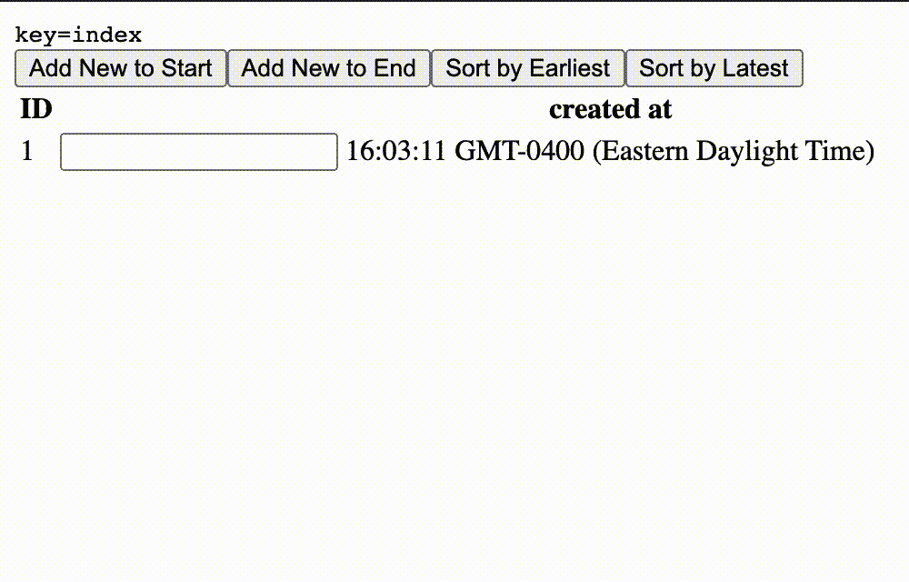
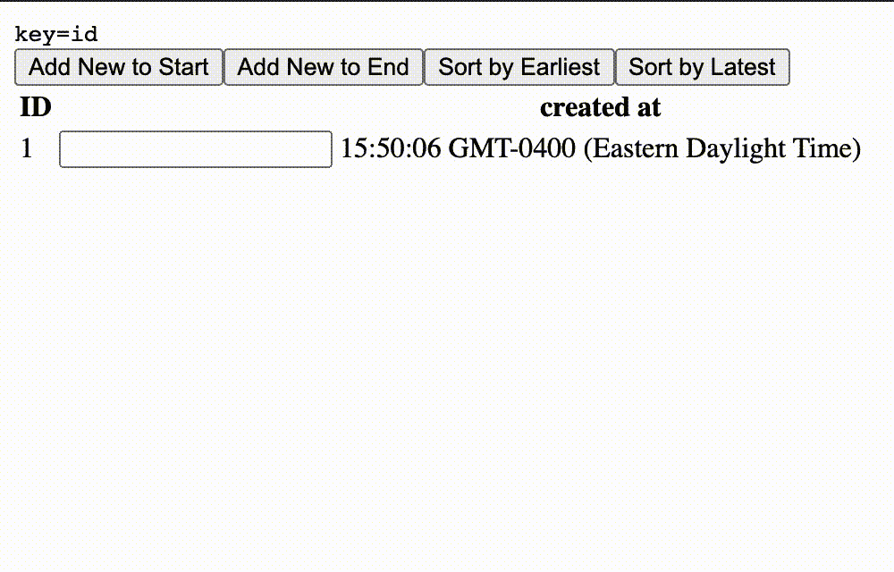

# 我希望我能早点知道这个小小的反应怪癖

> 原文：<https://javascript.plainenglish.io/you-wish-you-knew-this-little-reactjs-quirk-f021d8375dbe?source=collection_archive---------3----------------------->

## 我是吃了苦头才知道的，所以你们不必…


Photo by [Kevin Ku](https://unsplash.com/@ikukevk?utm_source=medium&utm_medium=referral) on [Unsplash](https://unsplash.com?utm_source=medium&utm_medium=referral)

大约 6 年前，我开始使用 React，从那时起，我就开始宣传 React 在开发人员体验方面的优越性。然而，需要考虑的一件重要事情是，React 绝不是一个放之四海而皆准的解决方案，如果你试图用 React 构建一个简单的静态网站，你可能会意识到你已经把自己复杂化成了不必要的复杂概念。但是如果你已经决定 React 适合你的下一个项目，你也可以充分利用 React 的力量。

正是出于这个目的，建议更深入地理解 React 性能优势背后的核心原则之一——虚拟 DOM。了解内部可能不是构建 React 应用程序的必要条件，但是通过理解底层概念，您应该能够编写更好、更健壮的 React 应用程序。

ReactJS 使用一种启发式算法，该算法使用一种差分机制来计算 DOM 结构中的变化，这种差分机制使用 DOM 的内存版本来计算变化。通过利用这一点，React 可以只更新页面中已经更改的部分，而不是重新呈现整个页面。反应过来的作者称之为[](https://reactjs.org/docs/reconciliation.html)*。*

*注意到启发式这个词了吗？这改变了大多数人对虚拟 DOM 的看法，呈现性能&最糟糕的是——视图中的数据不正确(是的，这可能发生！).React 在区分变化时使用某些假设，如果你不小心，算法可能会出现失败。*

*在遍历列表时使用索引作为键是一种很常见的做法。但是在大多数情况下，使用数组索引作为键可以被认为是一种反模式。原因如下—*

> *常见的实践并不总是理想的实践*

```
*Each child in an array should have a unique "key" prop.*
```

*为了消除这个警告，通常将数组的索引传递给数组迭代返回的元素。您知道这可能会导致不正确的应用程序状态吗？尽管看起来很安全，但在某些常见的用例中，这种做法可能非常糟糕。例如，让我们考虑使用 React 呈现的输入列表:*

```
*{
  list.map((item, i) => (
    <div>
      <label>item.name</label>
      <input key={i} />
    </div>
  );
}*
```

*这段代码显示了一个输入列表。只要列表没有被*改变*(没有重新排序、拼接或过滤)，它就能正常工作。猜猜当你在列表中添加一个项目时会发生什么？您将看到一个新的文本输入被呈现，但是输入中的值没有被重新呈现！*

**

*不久前，当我试图呈现一个不受控制的输入列表时，我遇到了这种奇怪的行为。当时，我甚至不知道使用索引作为键不是一种推荐的方法，所以我想我应该使用受控输入。这在技术上是可行的，但是有一个性能上的权衡。*

*通过使用正在渲染的项目的`id`或列表中唯一的任何其他标识符，这个问题很容易解决。当使用的钥匙是`id`而不是`index`时，是这样的*

**

*查看 React 的高级指南文档页面中的这 2 个 Codepen 示例，您可以自己进行尝试:*

*[*https://react js . org/redirect-to-code pen/对账/index-use-as-key*](https://reactjs.org/redirect-to-codepen/reconciliation/index-used-as-key)*

*[*https://react js . org/重定向至 code pen/对账/无索引用作密钥*](https://reactjs.org/redirect-to-codepen/reconciliation/no-index-used-as-key)*