# 最终理解 TypeScript 的基本指南

> 原文：<https://javascript.plainenglish.io/your-basic-guide-to-finally-understand-typescript-f81ab85d2a33?source=collection_archive---------6----------------------->

Photo by [Shot by Cerqueira](https://unsplash.com/@shotbycerqueira?utm_source=medium&utm_medium=referral) on [Unsplash](https://unsplash.com?utm_source=medium&utm_medium=referral)

随着 TypeScript 的力量在过去几年中不断增强，成千上万的开发人员决定开始使用这个 [Javascript 超集](https://thecoderswag.com/you-absolutely-have-to-learn-typescript-in-2019/)来增强他们代码的能力。本指南旨在成为所有想学习如何使用 TypeScript 并在他们的下一个项目中使用它的开发人员的快速入门。

# #1 单词 Types 的意思是:使用它们！

TypeScript 最大的特性之一是**编译时类型检查**，以防止变量类型中的任何**不匹配**，是的，你实际上可以在 TypeScript 中使用类型，下面是一些关于你如何使用它们的例子:

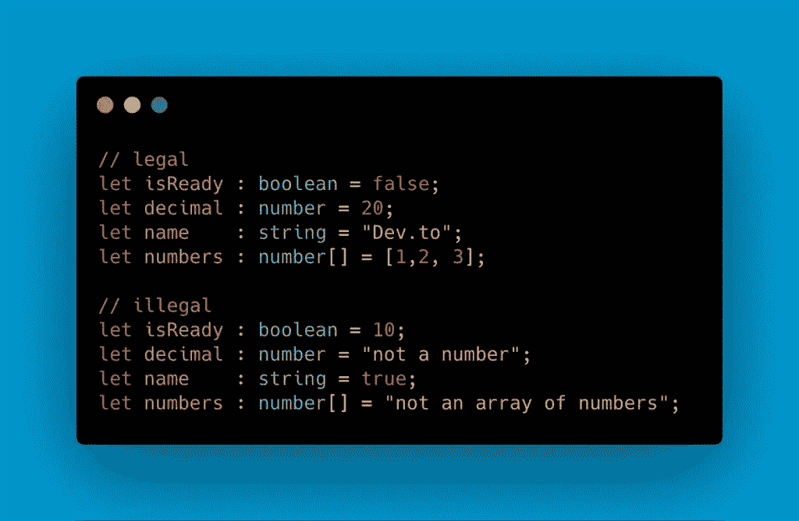

# #1.1 我可以对我的变量使用多种类型吗？

当然你可以，通过简单地使用 **any** 类型作为你的一个变量，你将能够**分配不同的值类型**，比如:

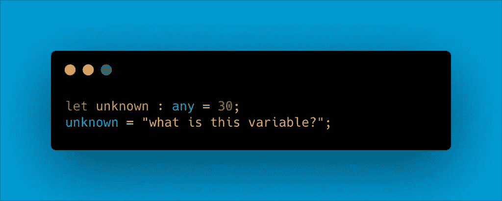

如果你想要**限制你可以分配**给你的变量的类型，你最终可以像这样使用管道操作符:

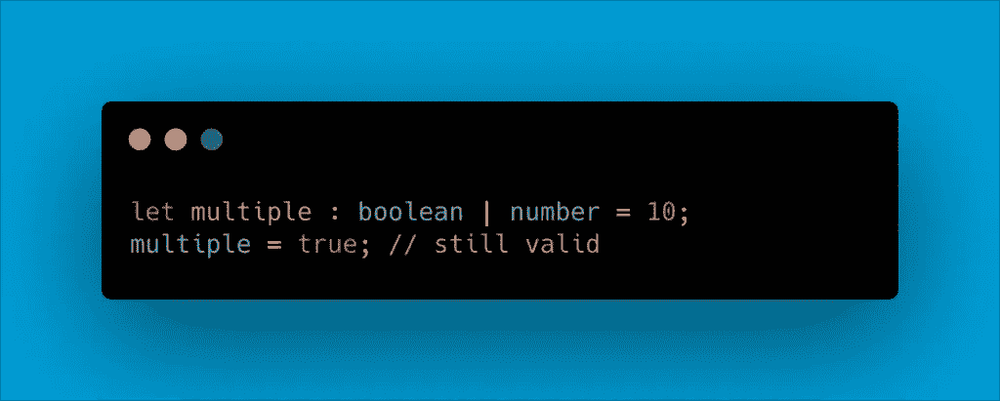

# #1.2 如果不想指定变量的类型怎么办？

没问题！TypeScript 支持隐式和显式类型化。在第一种情况下，您将精确地指定变量的类型，就像我们到目前为止所看到的那样，在第二种情况下，**每当您第一次初始化变量** a 值时，类型将自动分配给变量，这种机制更好地被称为**类型推断**。

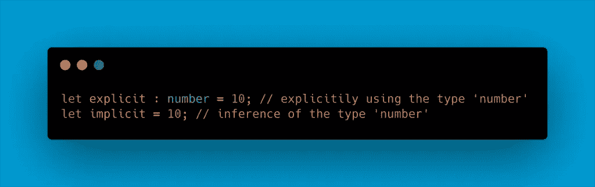

注意类型推断在其他有用的情况下是如何变得方便的，比如函数返回值:

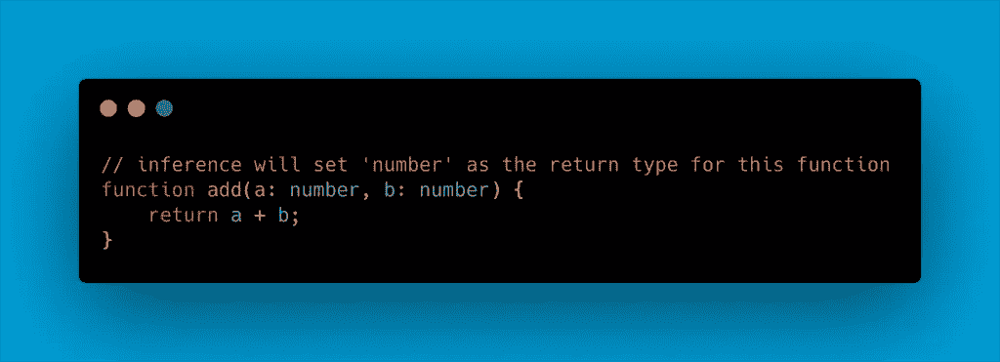

# #1.3 我可以检查变量的类型吗？

想确定你用的是正确的类型吗？合适的班级？您可以像这样使用操作符的**实例来使用它:**

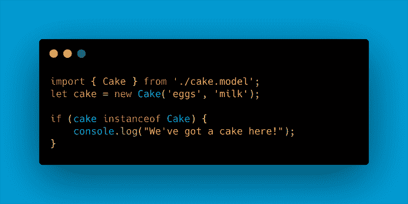

这对于**用户定义的类型**特别有用，当你从另一个对象继承属性时也同样有效。

# #1.4 我可以转换变量的类型吗？

这种类型的操作通常被称为**强制转换**，它可以在特殊情况下在 TypeScript 中执行，我们可能需要使用特定类型处理变量。让我们假设你定义了一个类型为 **any** 的变量，但是你现在想在这个变量**上使用一些普通的 **string** 函数，你现在不能访问这个函数**因为这个类型不是 string，你可以告诉 TypeScript 这样处理这个变量:

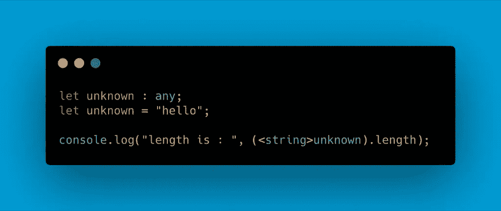

# #2 使用阵列

当涉及到在 TypeScript 中使用数组时，上面提到的所有内容都非常适用:

# #2.1 使用元组

元组类型是一个全新的概念，它允许您表达一个数组，其中固定数量的元素的类型是已知的，但不需要相同。考虑一下，如果您想将一个值表示为一对布尔值和一个数字:

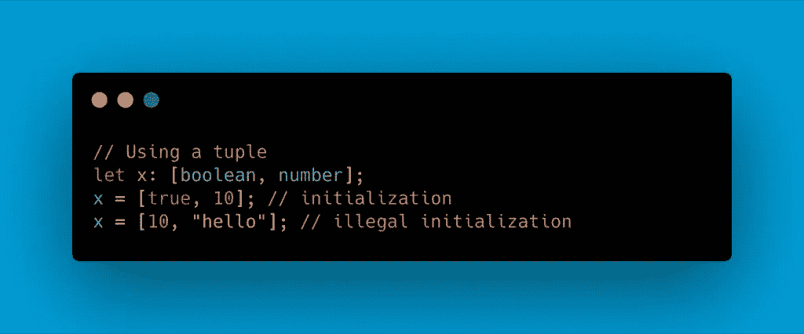

# #2.2 我真正错过的东西:Enums！

这个对 Javascript 的伟大补充是我过去用 Java 编码时真正缺少的东西，枚举基本上是一组命名的常量。枚举有三种类型:

*   数字枚举
*   字符串枚举
*   异构枚举

为了不使这篇文章太长，我不会对枚举进行太多的描述，只要记住，如果您想更好地记录您的意图或者创建一组不同的情况，比如:

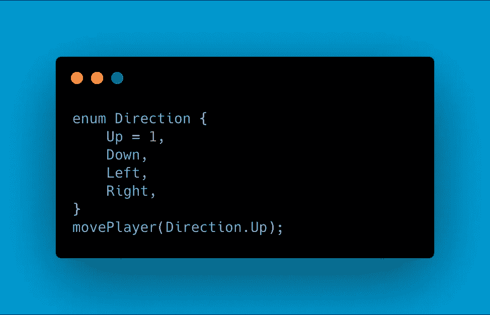

# #3 物件呢？

对象是 Typescript 的另一个重要部分，让我们通过一个例子来更详细地分析它们:

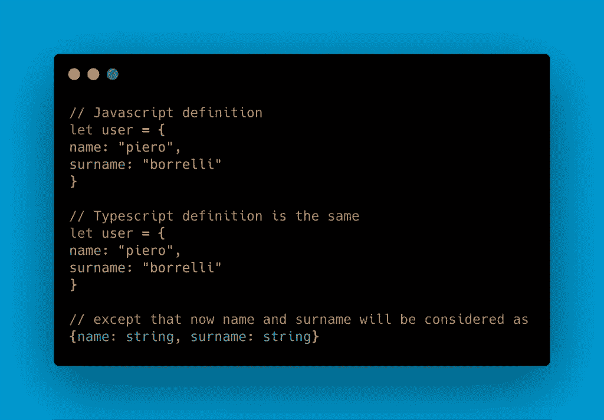

我们拥有的对象的两个属性被推断为 string 类型，这意味着任何向它们分配不同类型的值的尝试都是无效的:

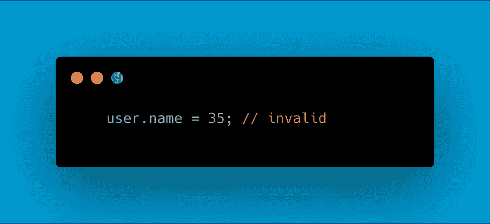

# #3.1 对象类型

对象是不属于原始类型类别的类型，如:布尔型、字符串型、数字型、符号型、空型、未定义型，它遵循以下语法:

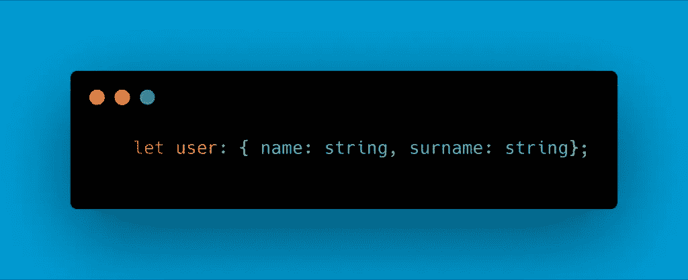

# #4 功能

当谈到函数时，Typescript 引入了在处理函数时使用类型的可能性，例如，我们首先希望将它们用于函数参数:

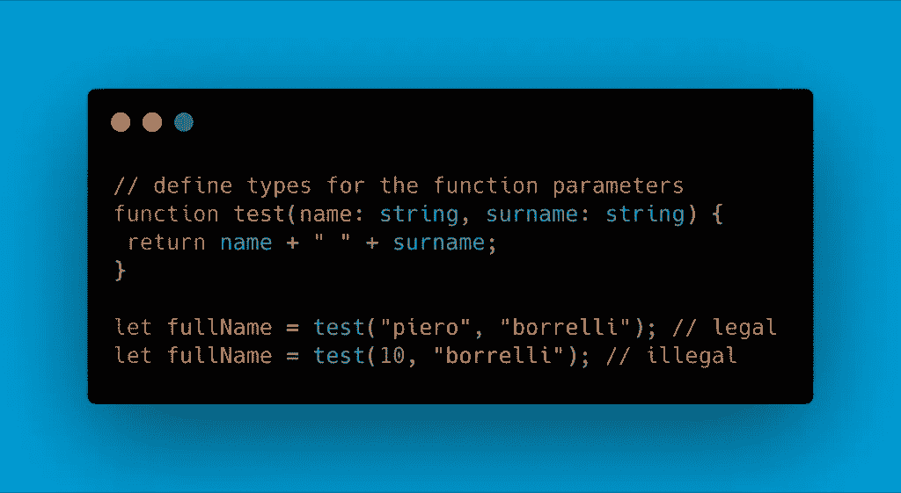

另一个可能需要指定类型的地方是从函数返回值的时候。注意，在上面的函数中，返回类型被自动推断为 string 类型。让我们看看如何使用以下方法显式定义函数的返回类型:

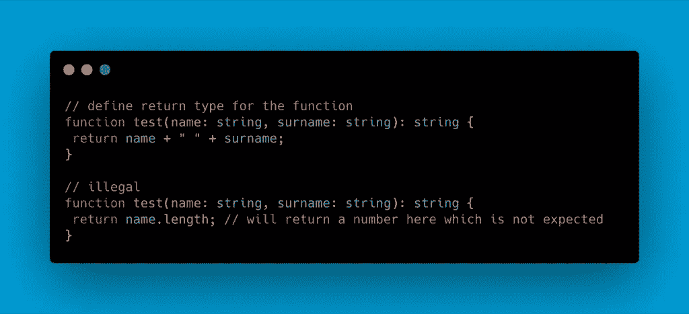

# #5 面向对象部分

自从 ECMAScript 6 发布以来，Javascript 程序员已经能够使用面向对象的方法构建他们的程序。Typescript 也支持这种方法，所以让我们通过一些例子来分析我们将如何使用它:

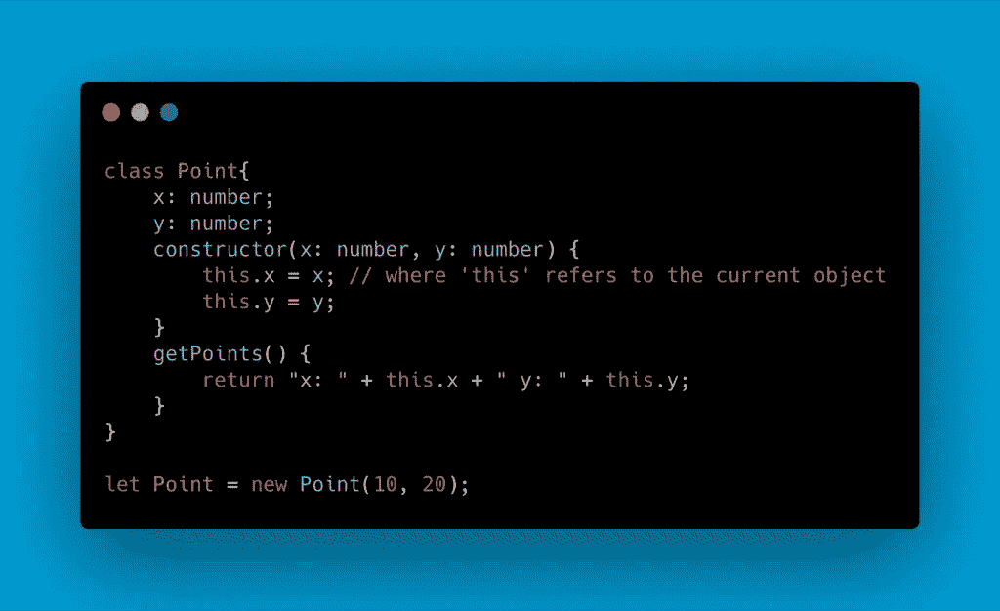

对于大多数使用过 C#或 Java 等语言的人来说，这看起来非常熟悉，我们有一个名为 Point 的类，它有两个成员 x 和 y，我们可以自由地访问它们(稍后会详细介绍)，我们还调用了一个名为 getPoints()的类方法。然后，我们可以使用 new 关键字创建 Point 类型对象的实例。

# 使用访问修饰符

因为这是一个完全不同的主题，所以不要对此进行太多的详细描述，但是请记住，在 Typescript 中，您还可以像这样为您的类变量定义访问修饰符:

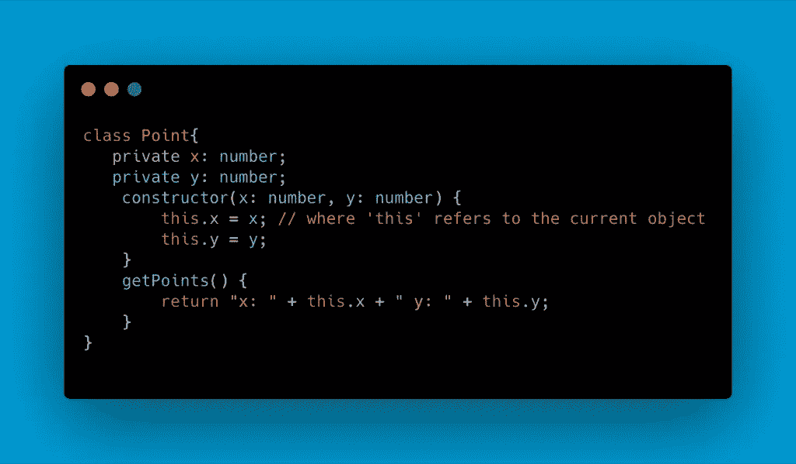

如同基本上所有面向对象的编程语言一样，我们可以使用访问修饰符来确定谁能够访问我们的类数据。默认情况下，public 被设置为成员默认修饰符，当您希望成员在其类(private)之外不可访问时，以及当您希望成员仅在其类或派生类之内可访问时，分别使用 private 和 protected。

# 遗产

如前所述，Typescript 支持最常用的面向对象模式，包括继承。因此，使用 Typescript，您将能够定义一个类，然后定义它的子类，该子类将继承超类的基本方法和成员:

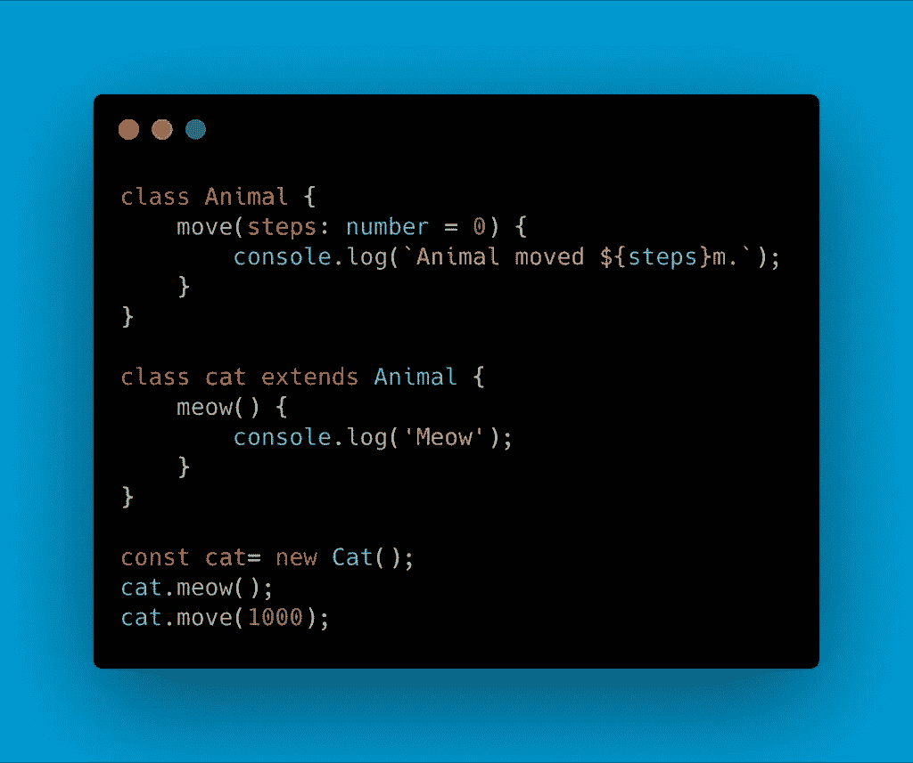

# 接口

另一种常见的面向对象技术，你可以用它来创建一个接口。这在 Typescript 中是可能的，在那里主要的焦点是类型检查，我们可以使用接口给这些类型命名。所以基本上在使用它们的时候，我们会创建一组相关的方法和成员来描述一个特定的对象:

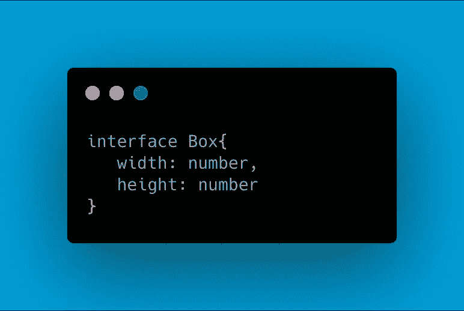

# 结论

这篇文章背后的想法只是为了能够给你一个快速入门，告诉你可以用 Typescript 做什么，它如何帮助我们解决常见的问题，以及它与 Javascript 的不同方法。希望它能让你对一些有用的东西有新的认识！