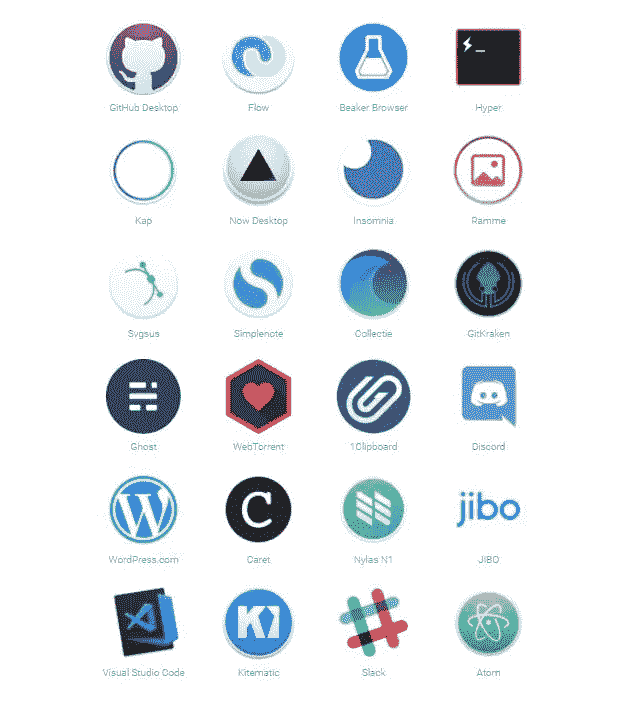
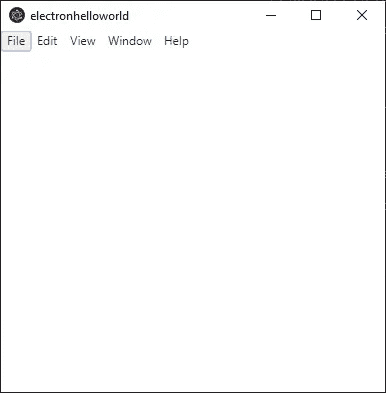
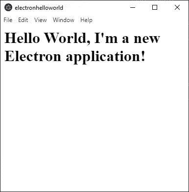

# 你的第一个电子应用

> 原文：<https://javascript.plainenglish.io/your-first-electron-application-84f0bc64ea60?source=collection_archive---------7----------------------->


## 利用 web 技术制作混合桌面应用程序

你听说过混合应用吗？

混合应用程序开发是当今热门讨论的话题，通过这种方式制作应用程序，我们看到了**令人眩目的增长。**

当然，大家已经听说过在移动环境中使用 **Cordova** 和**ion**等框架构建的混合应用，但今天我想向大家介绍一个框架，它可以让你使用桌面操作系统构建完全相同的东西，并创建跨平台桌面应用:**electronic**。

**electronic**是一个由 **GitHub** 开发的开源库，用于用 **HTML** 、 **CSS** 和 **JavaScript 构建跨平台桌面应用**接下来我们将看到如何创建您的**第一个电子应用**，它可以在不同的操作系统上运行，并且只需要对它进行一次编码**。**

## 那么，什么是混合应用？

*“混合应用程序是使用网络技术编写的程序，只需对其进行一次编码，即可针对不同的操作系统进行编译”。*

所以我们要用 HTML、CSS 和 JavaScript 之类的语言来创建一个应用程序，它不会在网络环境中运行，在我们的具体例子中是**，但会在桌面环境**中运行。

**“混合动力车”**是指描述不同领域和技术的组合的特性。

当我们制作一个应用程序时，也就是 web、移动或桌面，我们使用一组技术，这些技术可以是所有类型的语言、框架、库等。

**当这些技术来自“网络”时，我们并不是在制造网络应用，而是在制造“混合动力”**。

有很多用于网络和桌面应用程序开发的语言并不被称为“混合”语言，比如 **Java** 或 **Python** ，但使用 electronic 进行应用程序开发则略有不同。

主要原因很简单:

> 电子不是一种语言，是一个框架。

作为一个框架，电子是由一些工具构成的，这些工具使一切变得神奇，主要有两种:

*   **NodeJS** (进入系统)
*   **铬** (Windows 渲染)

我们可以说，JavaScript 是一个强大的组件，但它仍然不是核心语言。

我们不会创建“JavaScript 二进制文件”，因为像 HTML 和 CSS 一样，也不是为了创建桌面应用程序而设计的。
有了这些，再加上 HTML、CSS、JavaScript 和 NodeJs 等基础知识，你就可以开始制作电子应用了。

# 用电子制造

Electron 有很多很棒的特性，它的流行使得一些著名的公司选择使用这个框架作为他们的应用程序



# 我们来编码吧！

> 我们现在做的是建立一个电子项目，并启动一个非常简单的窗口

让我们创建我们的第一个电子项目，我们现在正在做的是启动一个非常简单的窗口，标签上写着“你好，世界，我是一个新的电子应用程序！”

首先，你需要创建**应用文件夹**，打开 **CMD** 并输入

```
**mkdir electronHelloWorld****cd electronHelloWorld**
```

然后，我们使用一个有用的命令来创建关于我们的应用程序的基本信息，所有这些信息都将存储在一个 **package.json** 文件中

```
**npm init** 
```

打开 **package.json** 文件，确保你有如下内容，建议你插入**启动脚本**以便在控制台中轻松运行“npm start”

此时，您需要安装`electron`本身。

推荐的做法是将它作为一个**开发依赖项**安装在你的应用程序中，这样你就可以使用不同电子版本的多个应用程序

```
npm install --save-dev electron
```

现在，创建 **src 文件夹**，您将在其中放置项目的所有重要文件，创建 **index.js** 文件和一个名为 **src** 的文件夹，然后将该文件放置在该文件夹中。

*记得更新你的****package . JSON****文件中的主条目。*

```
...
main: "src/index.js",
...
```

## 首次测试

现在让我们检查你是否已经正确设置了项目，打开 **index.js** 并输入一个简单的

```
console.log(“Hi Electron!”)
```

然后打开 CMD 运行`npm start`，你应该会看到**“嗨电子！”**在你的 CMD 里面。

## 电子应用程序

现在让我们从真实的电子开始。

首先，我们需要驱动我们应用程序的**电子模块**

```
const electron = require(“electron”);
```

*在“电子”模块下，有一些* ***有趣的子模块*** *用于创建应用程序的不同部分。*

让我们使用 **app 模块**来声明一个电子申请

```
const app = electron.app;
```

app 变量包含我们的电子应用程序的**实例**，我们可以通过附加一个**就绪事件**来检查创建，该事件将在编译结束时触发

运行`**npm start**` 几秒钟后，你会看到消息“我准备好了！”打印在您的控制台上。

## 你的第一扇窗

现在我们已经创建了一个基本的电子应用程序，下一个目标是向用户显示一些东西，而不是在控制台中打印简单的消息，这是桌面应用程序的真正目的。

打开 **index.js** 并使用**浏览器窗口模块**创建一个基本窗口

启动 **npm start** ，你应该会在屏幕上看到你的第一个电子窗口



为了更熟悉桌面应用程序的构建，我们来听另一个事件，**窗口关闭**。

创建一个变量来更容易的管理窗口

然后在**主窗口**上声明**关闭事件**

## 用户界面

现在我们有一个空白窗口，我们正在监听一些事件，让我们创建一些基本的 UI，让用户与我们的应用程序进行交互。

正如我们在本文开始时所说的， **Electron 不仅将 web 技术**用于您的应用程序引擎，还通过使用 **HTML** 和 **CSS** 在屏幕上显示元素

在 **src 文件夹**中创建一个**electronHelloWorld.html**文件，并添加这个简单的代码片段

在应用程序中，我们需要导入这个文件，并告诉 Electron 在我们之前创建的窗口中显示它，我们将使用具有直观语法的 **loadUrl** 。

首先，导入**路径和 url 模块**

然后使用 **loadURL**

启动 **npm start** ，您应该会看到类似这样的内容



# 结论

这是我们到目前为止完成的全部代码

## 索引. js

## electronHelloWorld.html

祝贺你，你创建了你的第一个电子应用程序！

继续用这个框架学习和做事，它非常强大和灵活，让你今天就开始构建桌面应用程序，而不需要这个领域的具体知识。

*感谢阅读！*