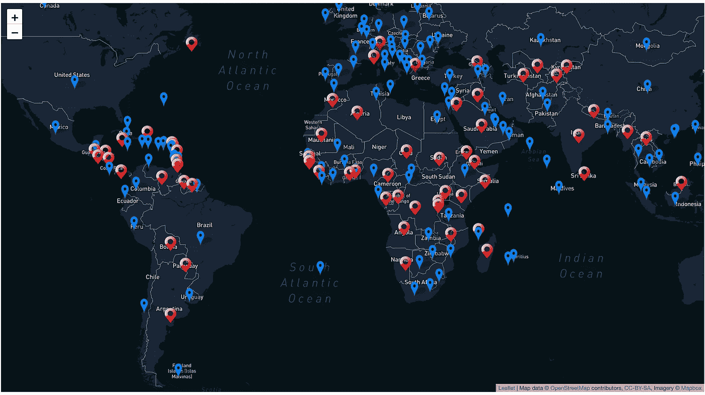

# 设置您的第一个 React 传单包

> 原文：<https://javascript.plainenglish.io/your-first-react-leaflet-package-8d9c7e28c85d?source=collection_archive---------10----------------------->

## 与 Mapbox API 配对的 React 传单是一个强大的软件包，它可能为谷歌地图 React 提供一个更强大的替代方案

虽然我不是一个经验丰富的专业人士，但我已经在我参与的两个 React 项目中尝试了 React-Leaflet 和 Google-Maps-React。

每个软件包都有自己的优点和缺点。谷歌地图很容易安装和运行，然而，我确实尝试了一些教程和指南，但效果并不太好。我的猜测是，这可能是因为有一个 Google-Maps-React 包，还有一个 React-Google-Maps 包(它们是不同的包)。

几乎所有的反应传单指南都是正确的。也很轻量级(114kbs！).Google Maps React 确实有一个地球上几乎每个人都知道并喜欢的底图(Google Maps with Imagery and street view)，但 React-Leaflet 更具可定制性。

与任何项目一样，选择取决于开发人员。



Follow along to create the above map! The above displays every countries’ Covid travel restrictions

要开始使用 React-Leaflet，请创建一个新的 React 应用程序并运行:

`npm i react-leaflet`

和

`npm install -s react react-dom leaflet`

为了生成地图，您需要这两个包。

我使用 react-leaflet 的第一个项目是在 2.7.0 版本上。当我写这篇博文时，3.0 版本刚刚发布(就像几天前)。我在启动 3.0 的时候遇到了一点麻烦，但是我猜这个版本的一些早期问题已经解决了，但是你可能也想试试:`npm i react-leaflet@2.7.0.`

将这两个包作为依赖项安装后，您将希望添加`MapView`作为组件，如下所示:

```
import React, { Component } from 'react';import MapView from './components/MapView';<Route path='/map'><MapView /></Route>
```

这可能最适合应用程序的 App.js 级别，但是您可以将它添加到任何需要放置地图的地方。然后，在 MapView.js 文件中:

您的 MapView 现在是您的应用程序的一个组件。两个必需的状态是`currentLocation`和`zoom.`我将我的地图视图设置为地球的中心，具有高级别的缩放(我认为 12 是你能放大到的最大值)。我从存储国家数据的后端获取数据。在 render 函数中，我将地图设置为抓取其他组件，包括一个 Mapbox 层，我认为这给了这个包一个急需的外观。

只使用上面的代码，将 MapView 作为一个组件放在 App.js 中，只应用以下 CSS 后，您应该会在屏幕上看到一个普通的视图地图:

```
.leaflet-container {margin: 1rem;width: 97vw;height: 97vh;}
```

接下来，创建以下三个文件:

```
MarkerPopup.js
VenueLocation.js
VenueMarkers.js
```

以下是您的场馆位置和场馆标记文件的代码:

使用上面的代码，我将国家(我从后端设置了状态)作为道具发送并进行析构。接下来，我需要用一张地图遍历所有的国家，这样每个国家都可以在我的地图上标出。我的数据中的经度/纬度坐标存储为一个数组([x，y])，但我也见过数据集存储每个 x/y 浮点数并作为它们单独的对象。图标三元是 React 的众多优点之一，在这里我使用了数据中的一个字段，并根据国家的状态使用不同的图标。js 文件给出了每个图标的描述，我存储了每个图标。svg 文件在本地的应用程序的资产文件夹。

最后，将以下内容添加到 MarkerPopup.js 文件中:

数据变量作为 prop 从 VenueLocationIcon.js 发送下来。现在每个窗口都将有一个弹出窗口，并根据字段数据显示文本。这些窗口可以根据您希望如何将数据传送给最终用户的偏好，按照您的意愿进行定制。

就是这样！如此简单，重量轻，功能强大。有了好的数据和易于使用的经纬度坐标，你可以做很多事情。绘制世界地图，我的朋友。

我之前提到过这一点，但我并不喜欢 React 传单(OpenStreetMap)附带的默认底图。它很好，但在我看来不是最棒的(在我看来，这是从谷歌地图的大规模降级)。要自定义底图，您可以在第三方地图(如 MapBox)中添加图层。我的地图框层可以在 TileLayer 的第 28 & 29 行找到(带有 URL 和属性变量)。要创建自己的地图框图层，请查看我关注的博客:

[](https://www.freecodecamp.org/news/how-to-set-up-a-custom-mapbox-basemap-with-gatsby-and-react-leaflet/) [## 如何使用 React 传单和传单 Gatsby Starter 设置自定义地图框底图样式

### 构建地图可能非常强大，但通常您会受困于地图影像的开源选项，这可能…

www.freecodecamp.org](https://www.freecodecamp.org/news/how-to-set-up-a-custom-mapbox-basemap-with-gatsby-and-react-leaflet/) 

随意检查这个项目的全部回购在这里:[https://github.com/estein1988/covid-travel-fe](https://github.com/estein1988/covid-travel-fe)

这就是你的第一张专业 React 传单地图。编码快乐！