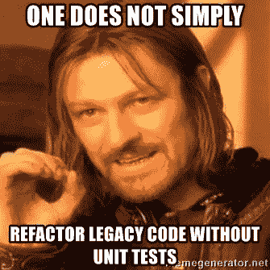

# 您的前端代码需要进行单元测试

> 原文：<https://javascript.plainenglish.io/your-front-end-code-needs-to-be-unit-tested-f998b016c448?source=collection_archive---------2----------------------->


[前端测试](https://www.testcraft.io/front-end-testing/)可以通过多种方式完成，比如单元测试、集成测试、系统测试和验收测试。今天，我们将探讨单元测试的重要性和测试前端代码的技巧。

# 介绍

在我 7 年多的前端开发经验中，我遇到过很少有人愿意为他们的代码编写单元测试用例。它通常是可选的；如果开发人员有多余的时间，他们会把它作为一项技术任务。很多人认为这是浪费时间、精力和资源。

但是，如果有什么不同的话，单元测试是对未来的投资。如果处理得当，从长远来看，单元测试可以节省大量的时间、精力和资源。

因此，我觉得现在需要更多地谈论它，并且像重视业务逻辑一样重视[测试驱动开发](https://en.wikipedia.org/wiki/Test-driven_development)。

# 什么是单元测试？

[单元测试](https://en.wikipedia.org/wiki/Unit_testing)意味着测试源代码的单个单元，并验证特定单元是否如预期那样工作。

这里，**单元**可以是应用程序/模块中可以被隔离测试的最小部分。

它可以是:

*   面向对象编程中的一个类，
*   程序设计中的一种功能，
*   反应、有角、脆弱、苗条等的组成部分。

单元测试的主要目的是验证我们代码的逻辑——代码应该在所有可能的场景下都能很好地工作。如果是的话，那么我们可以确定应用程序不会崩溃。


Image credits: [pcloudy.com](https://www.pcloudy.com/wp-content/uploads/2019/05/importance-of-unit-testing.png)

# 单元测试的好处

## 使流程[更加敏捷](https://www.agilealliance.org/agile101/)

随着应用程序的发展和附加功能的增加，可能需要重新审视早期的设计和代码。单元测试可以检测设计契约中的代码破坏变更，允许这些问题被及早发现，从而更快地解决。

## 有助于更安全的重构和更简单的调试

当我们重构代码时，我们只改变代码结构，而不是最终结果。重构后的代码应该像以前一样工作。因此，如果我们有适当的单元测试，任何引入代码重构的缺陷都可以很容易地被测试用例检测出来。如果任何一个测试用例失败了，我们也可以很容易地检测到在哪里调试。这也使得[调试](https://www.geeksforgeeks.org/software-engineering-debugging/)过程更加容易。

## 帮助我们创建一个健壮的、可理解的代码库

*编写逻辑测试用例*至关重要，这样，如果任何人对组件/功能进行任何设计变更，单元测试就应该失败。这就是任何不熟悉该代码库的开发人员能够理解该代码最初目的的方式。

## 帮助文档

好的单元测试用例可以作为未来的文档。当一个代码库被很好的记录和正确的单元测试，那么它就很容易维护。

现在我们已经知道了单元测试如何帮助开发周期，让我们来看看测试前端代码的一些技巧。

# 决定单元测试的前端代码

为了能够有效地单元测试我们的代码，我们应该知道测试什么。如果我们看看断言库，或者为编写单元测试用例而提供的 API，我们可能会被可以为一段代码编写的测试用例的可能性所淹没。

> *你的测试越像你的软件被使用的方式，他们就越能给你信心——肯特·多德的推特*

我们将通过基本的 JavaScript 示例探索一些重要的技巧，并看看可以编写什么断言。单元测试用例写在[笑话](https://jestjs.io/)中。

假设我们有一个输入框，应该只接受来自用户的字母数字值。为了验证用户的输入，我创建了一个名为“字母数字验证器”的验证器函数它接受一个字符串并返回一个布尔值(对于有效输入为真，对于无效输入为假)。代码如下:

```
export function alphanumericValidator (input) {    
  if (!input) {    
    return false;  
  }
  var alphanumericExp = /^[0-9a-z]+$/;
  if (input.match(alphanumericExp)) {
    return true;
  } else {
    return false;
  }
}
```

测试应该涵盖的基本场景是:

## 实现的业务逻辑应该被正确地测试

单元测试应该测试代码应该做什么。例如，我们将使用下面的断言来检查验证器是否正常工作:

```
// test if it returns true for valid input//TEST 1: for only alphabets expect(alphanumericValidator('onlyAlphabets')).toBe(true);// TEST 2: for only numbers expect(alphanumericValidator('123')).toBe(true);// TEST 3: for both numeric and alphabets together
expect(alphanumericValidator('alphabets123')).toBe(true);
```

这些测试确保了我们的前端代码如预期的那样工作。验证器确实正确地验证了字母数字值，因此，它工作正常，符合业务逻辑。

## 应测试代码中存在的所有条件和分支

代码中的所有 *if* 和*否则*开关情况都应该进行单元测试，以验证代码是否在所有可能的实时场景中按预期工作。

```
// TEST 4: testing the else path for invalid inputexpect(alphanumericValidator('alpha123@@@@@@')).toBe(false);// TEST 5: for special characters inputexpect(alphanumericValidator('#./')).toBe(false);
```

这些测试确保了我们的前端代码不允许用户输入任何不可接受的值，比如特殊字符。这是第一条规则的扩展，帮助我们防止由于用户错误地发送了不正确的值而可能发生的错误。

## 测试意外场景或负面用例

我们应该通过尝试中断代码来测试错误场景，并通过测试用例来验证代码不会在角落或者意外的输入场景中中断，比如 null/undefined 值。当我们有可选参数时，这一点尤其重要。

```
// TEST 6, 7: for null/undefined input valuesexpect(alphanumericValidator(null)).toBe(false);
expect(alphanumericValidator(undefined)).toBe(false);// TEST 8, 9: for empty strings or no input valuesexpect(alphanumericValidator('')).toBe(false);
expect(alphanumericValidator()).toBe(false);
```

这些测试使我们的前端代码健壮，并避免由于用户输入的意外输入而破坏应用程序和网站。

# 可跳过的场景

虽然有一些场景对于测试我们的代码是否健壮是必不可少的，但是也有一些场景对于通过单元测试用例进行测试来说是不那么必要的。

让我们来探索一些这样的使用案例:

1.  测试静态值、常量、枚举等。

这样的测试用例没有任何实质性的帮助，而只是增加了代码覆盖率(这与代码质量没有太大关系)。示例:

```
expect(1).toBe(1);
```

**2。测试外部依赖或库的功能**

术语“单元测试”是指测试*单元*，因此，测试该单元中使用的任何依赖项的实际功能不会给单元测试过程增加任何价值。这是因为外部依赖的功能已经通过单元测试时编写的单独测试用例进行了验证和测试。

# 单元测试工具

因为有多种编程语言可供我们编码，所以有多种工具、库和框架可用于对代码进行单元测试。PFB 使用普通 JavaScript 或 JavaScript 库/框架编写的前端代码的一些单元测试工具:

*   [摩卡](https://mochajs.org/)
*   [笑话](https://jestjs.io/)
*   [茉莉](https://jasmine.github.io/)
*   [React 测试库](https://github.com/testing-library/react-testing-library)
*   [Vue 测试库](https://vuejs.org/v2/guide/testing.html)
*   [苗条测试库](https://github.com/testing-library/svelte-testing-library)

# 结论

有很多次，我感谢过去的自己编写了一个测试用例，让我避免了一个巨大的错误，并防止了一个几乎肯定会出现的产品错误。

单元测试不应该被视为开销或负担，相反，我们应该将它们作为日常实践和健康的编码习惯。



image credits: [meme generator](https://www.google.com/url?sa=i&url=https%3A%2F%2Fmemegenerator.net%2Finstance%2F36483108%2Fone-does-not-simply-one-does-not-simply-refactor-legacy-code-without-unit-tests&psig=AOvVaw3ksrMMi97Y53Y2cu9Gi-Dk&ust=1606325242135000&source=images&cd=vfe&ved=0CA0QjhxqFwoTCNi-oLPam-0CFQAAAAAdAAAAABAD)

敬请期待，下篇再来抓你！！任何反馈都是非常值得的。

感谢您的阅读，祝您有美好的一天！！