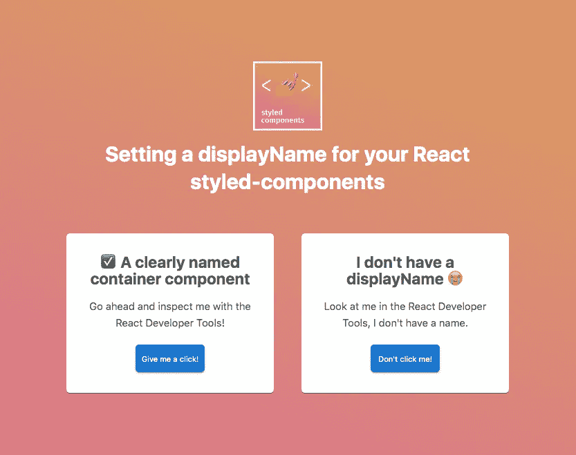
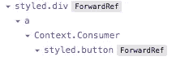
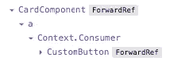

# 您错过了 React 中样式化组件的一个技巧

> 原文：<https://javascript.plainenglish.io/youre-missing-a-trick-with-your-styled-components-in-react-e3dfcd586f75?source=collection_archive---------4----------------------->

## 为组件添加显示名称以帮助识别它们



CodePen example [https://cdpn.io/kitsonbroadhurst/debug/xxGVBwV/bYrdyXRBoXpA](https://cdpn.io/kitsonbroadhurst/debug/xxGVBwV/bYrdyXRBoXpA)

React dev 工具对于检查您的组件、检查它们的属性或状态非常有用。也许您想确认事情是否按计划运行，或者帮助您进行调试。

但是当你检查你的代码时，没有对你的组件名称的引用，这可能会很棘手。

如果每个组件都有一个有意义的显示名称，那么检查起来就会容易得多。

他们可以。

React 开发人员工具中有一个简单的自定义卡组件和按钮(如上图所示):



这是同一个组件，这次用显示名称进行了标记:



在这样一个微不足道的例子中，这可能看起来不像是一个问题，但是随着应用程序的增长，导航只会变得更加困难。

组件越复杂，显示名称就越有用。

## 将. displayName 添加到组件中

JavaScript 函数有一个很容易定义的[“显示名称”属性](https://developer.mozilla.org/en-US/docs/Web/JavaScript/Reference/Global_Objects/Function/displayName):

```
someMethod.displayName = "Super special method!"
```

这对于普通的函数或方法来说并不十分有用，但是对于我们的样式化组件来说尤其有用。

在您的**样式化组件**声明之后，为组件上的显示名称属性设置一个字符串值:

```
const CustomButton = styled.button`
  background: palevioletred;
  border: none;
  border-radius: 5px;
  color: #fff;
  height: 40px;
  width: 100px;
  :focus {
    outline: none;
  }
`CustomButton.displayName = "CustomButton"
```

该显示名称现在将在 React Developer Tools 组件检查器中可见，并有助于使您的代码易于导航。

想自己看看吗？

点击查看真实的[代码笔示例。](https://codepen.io/kitsonbroadhurst/full/xxGVBwV)

干杯

装备