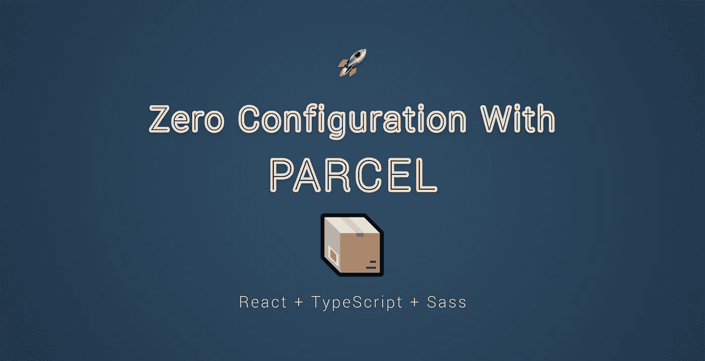

# Zero 使用 Parcel 配置您的 React-Typescript 应用程序

> 原文：<https://javascript.plainenglish.io/zero-configure-your-react-typescript-app-with-parcel-302688739758?source=collection_archive---------3----------------------->

从头开始设置一个新项目时，在开始发布特性之前进行所有必要的配置可能需要几天甚至几周的时间。

在你能够实现最终用户实际看到的东西之前，设置传输器、编译器、预处理器等等是一个漫长的步骤。为了加速重复的任务和过程，我们引入了一些工具。

在早期，我们有任务执行人。首先，我们咕哝了一声，然后咕噜咕噜地叫了起来。现在我们有像 Webpack 和 Rollup 这样的捆扎机。如果我们想在应用程序中配置每一步，它们有自己的位置，并且是很好的工具。但是如果我们没有呢？如果我们正在进行一个概念验证，或者正在进行一个小项目，并且希望尽可能快地启动，该怎么办？

幸运的是，有一个解决方案。[package](https://parceljs.org/)为我们提供零配置设置。也就是说，Parcel 没有配置文件，不像 Webpack 有一个`webpack.config`或者 Gulp 有一个`gulpfile`。这也意味着我们能做的定制量是有限的。但毕竟，这是我们所追求的，所以让我们开始设置一个支持 Typescript 的 React 项目。出于完整性的需要，让我们也添加 Sass，因为它不会花费任何额外的努力。

# 定义依赖关系

首先，让我们从`npm i parcel-bundler`拉进包裹开始，看看我们的`package.json`文件。在这个阶段，我的项目设置看起来是这样的:

在这个阶段，我们所拥有的是`package.json`文件，只有一个依赖项——包裹本身。我们不必担心其他包，因为包会为我们处理依赖关系。

正如您在浏览器中看到的，我创建了一个公共文件夹并将`index.html`文件放在那里。我还添加了一个启动脚本，它使用`parcel`命令来启动一个使用我们的索引文件的开发服务器。`--open`标志告诉 Parcel 一旦服务器启动就在浏览器中打开它。

# 创建条目文件

对于`index.html`，我们只需要包括最少的:

因为我们使用 React，并且整个应用程序将在客户端呈现，所以我们可以为用户提供一个容器和一条消息，以防 JavaScript 被禁用。

此外，我在 public 文件夹之外的一个单独的目录中添加了一个指向条目文件的 script 标记。这将负责渲染应用程序。确保给它一个扩展名`tsx`,告诉 package 我们想使用 TypeScript。为了简单起见，该文件的内容仅由 13 行代码组成:

一切就绪后，尝试用`npm run start`运行启动脚本，这是我们在`package.json`文件中定义的。package 将开始读取您的`index.html`文件，并将看到我们有一个对`index.tsx`的引用，因此它将开始自动下载 TypeScript。

一旦完成，它将开始读取`index.tsx`文件，并将看到我们已经导入了 React 和 React-dom。如果检测到缺少依赖项，它还会为它们启动安装过程。一旦所有东西都安装好了，您应该看到您的服务器启动并运行了。如果构建后出现任何错误，请尝试重新运行`npm run start`。

启动服务器后，Parcel 还会创建一些额外的文件夹:`dist`和`.cache`，这意味着您的文件夹结构应该如下所示:

现在，我们的项目中没有可供 TypeScript 检查的类型，我们还缺少相关的配置文件。为了引导你的应用，你可以使用这些模板用于`tsconfig.json`和`tslint.json`，并根据你自己的喜好修改它们:

*如果你想了解更多关于你可以使用的选项，你可以参考* [*文档*](https://www.typescriptlang.org/docs/handbook/compiler-options.html) *，内容相当广泛。*

# 设置 Sass

要为项目引入 Sass，我们所要做的就是创建一个`.scss`文件，并将其导入我们的应用程序组件:

一旦我们开始修改`index.scss`，Parcel 将检测到我们缺少 sass 包，因此它将为我们把它拉下来。借助 css 动画的魔力，打开浏览器，您将看到您的应用程序正在呈现:

# 构建项目

剩下要做的就是构建项目，这样我们就可以部署它了。为此，我们可以用一个额外的脚本来扩展`package.json`文件，这样我们就有了以下内容:

构建项目就像在我们的入口文件上调用`parcel build`一样简单。我们也可以传入可选的标志。对于这个设置，我想跳过源地图，所以我传入了`--no-source-maps`标志。

*有关 CLI 标志选项的完整列表，请参考其* [*CLI 文档*](https://parceljs.org/cli.html) *。*

您可能还注意到，我从每个依赖项的版本号前面移除了插入符号。这将确保每次我们的项目被拆除，我们运行`npm i`来设置一切，我们将总是有相同的精确版本。这样，如果一个依赖项被更新，它不会破坏我们的代码库。

如果您现在运行`npm run build`，它将构建项目并填充`dist`文件夹。

# 外卖食品

没有配置文件，我们仍然有一个项目设置了适当的技术堆栈。package 自动为我们拉入所需的依赖项，并在其核心中处理模块绑定、传输和开箱即用的预处理，而无需向开发人员公开任何配置文件。由于没有太多的配置选项，文档[很容易理解，所以如果你碰巧有一个错误，你很可能找到它的解决方案。](https://parceljs.org/getting_started.html)

这对其他打包者有利，每个硬币都有两面，包裹也不例外。如果您需要根据自己的需求定制捆绑和构建流程，那么包裹不是最佳选择。独自处理所有这些也意味着它将经常进行猜测。处理包裹时，请留意它拉进的包裹。如果您正在使用自己的定制 i18n 实现，并且它在您的文件中找到了对它的引用，那么它可能想要从 npm 中取出一个对您的项目来说不必要的 i18n 包。

包裹是一个很好的工具，对于那些希望切入正题并立即开始送货的人来说。如果你记住在使用它的时候要注意什么，它会很好地为你服务。🥂

